[<< Pathways](README.md)

## Additional AWS Setup

<!-- START doctoc generated TOC please keep comment here to allow auto update -->
<!-- DON'T EDIT THIS SECTION, INSTEAD RE-RUN doctoc TO UPDATE -->
**Table of Contents**

- [Backing up EC2 Instance Volumes via Snapshots](#markdown-header-backing-up-ec2-instance-volumes-via-snapshots)
    - [Prerequisites](#markdown-header-prerequisites)
    - [Background](#markdown-header-background)
    - [Creating a snapshot of an EC2 instance volume](#markdown-header-creating-a-snapshot-of-an-ec2-instance-volume)
    - [Creating snapshot lifecycle policies](#markdown-header-creating-snapshot-lifecycle-policies)
- [Restoring from a snapshot](#markdown-header-restoring-from-a-snapshot)
    - [Overview](#markdown-header-overview)
        - [Create a snapshot](#markdown-header-create-a-snapshot)
        - [Detach volume from the EC2 that needs restoring a new snapshot](#markdown-header-detach-volume-from-the-ec2-that-needs-restoring-a-new-snapshot)
        - [Create a volume out of the snapshot created](#markdown-header-create-a-volume-out-of-the-snapshot-created)
        - [Attach this new volume to the EC2](#markdown-header-attach-this-new-volume-to-the-ec2)
- [CloudWatch](#markdown-header-cloudwatch)
    - [Enabling EC2 Instance monitoring](#markdown-header-enabling-ec2-instance-monitoring)
    - [Creating Alarms](#markdown-header-creating-alarms)
        - [Example](#markdown-header-example)
- [GuardDuty](#markdown-header-guardduty)
- [Enable EC2 Termination Protection](#markdown-header-enable-ec2-termination-protection)
- [Restricting WorkSpaces using Certificates](#markdown-header-restricting-workspaces-using-certificates)
- [AWS Systems Manager Patch Manager](#markdown-header-aws-systems-manager-patch-manager)
    - [Prerequisites](#markdown-header-prerequisites_1)
    - [Install SSM Agents on your EC2s](#markdown-header-install-ssm-agents-on-your-ec2s)
    - [Configure Access to Systems Manager](#markdown-header-configure-access-to-systems-manager)
    - [Create a Patch Group](#markdown-header-create-a-patch-group)
    - [Create a Maintenance Window](#markdown-header-create-a-maintenance-window)
    - [Create a Patching Configuration](#markdown-header-create-a-patching-configuration)
        - [Using the AWS System Manager Console](#markdown-header-using-the-aws-system-manager-console)
        - [Using the AWS Command Line Tools](#markdown-header-using-the-aws-command-line-tools)
- [Pathways](#markdown-header-pathways)

<!-- END doctoc generated TOC please keep comment here to allow auto update -->
# Backing up EC2 Instance Volumes via Snapshots

## Prerequisites

1.  You must have launched an EC2 instance

## Background

The volume of an EC2 instance is the memory associated with that
instance (the installed OS, software etc). Backing up an EC2 instance is
known as taking a 'Snapshot' - this is a copy of the volume associated
with the EC2 at the moment the snapshot is taken. Snapshot Lifecycle
Policies allow you to manage different backup cycles for groups of
related volumes (e.g. daily backups for all tool servers e.g. Atlassian
Tools). Snapshots are stored in S3 and can be exported to a long-term
data archive.

## Creating a snapshot of an EC2 instance volume

1.  From the AWS management console, navigate to the EC2 Dashboard

2.  From the left-hand menu, under "Elastic Block Store," select
    Snapshots

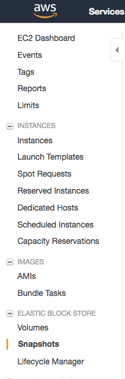

3.  Click the "Create Snapshot" button

4.  Fill in the form

    a. Select the desired Volume

    b. Enter a description that conforms to the appropriate naming
    conventions

    c. You can manage multiple Snapshots using the same Snapshot
    Lifecycle Policy if desired, which is achieved by adding Tags to 
    the Snapshot. In the picture below, we chose "Backup Frequency"
    as the key and "24 hours" as the value.

5.  Click "Create Snapshot" once complete.

## Creating snapshot lifecycle policies

1.  From the left-hand side menu, under "Elastic Block Store," select
    "Lifecycle Manager"

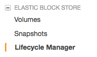

2.  Click the "Create Snapshot Lifecycle Policy" button

3.  Fill in the form

    a. Description as desired

    b. Target volumes with tags. You can use this option to select volumes 
    with tags you created previously. If you add new volumes with these tags, 
    the policy will automatically flag these volumes and take snapshots at the 
    defined creation time.

    c. Schedule name

    d. Create snapshots every 12 or 24 hours

    e. Select a time to start automated snapshot process.

    f. Retention rule. Based on the number of snapshot cycles. For
    Snapshot cycles every 24 hours and a retention rule of 7,
    snapshots will be kept for a week before being deleted.

    g. You can also add tags to the snapshots created by the policy

    h. Select "IAM role" - the default role is ample for general use.

    i. Enable or disable Policy after creation -- use this to switch
    the policy on or off until a later time.

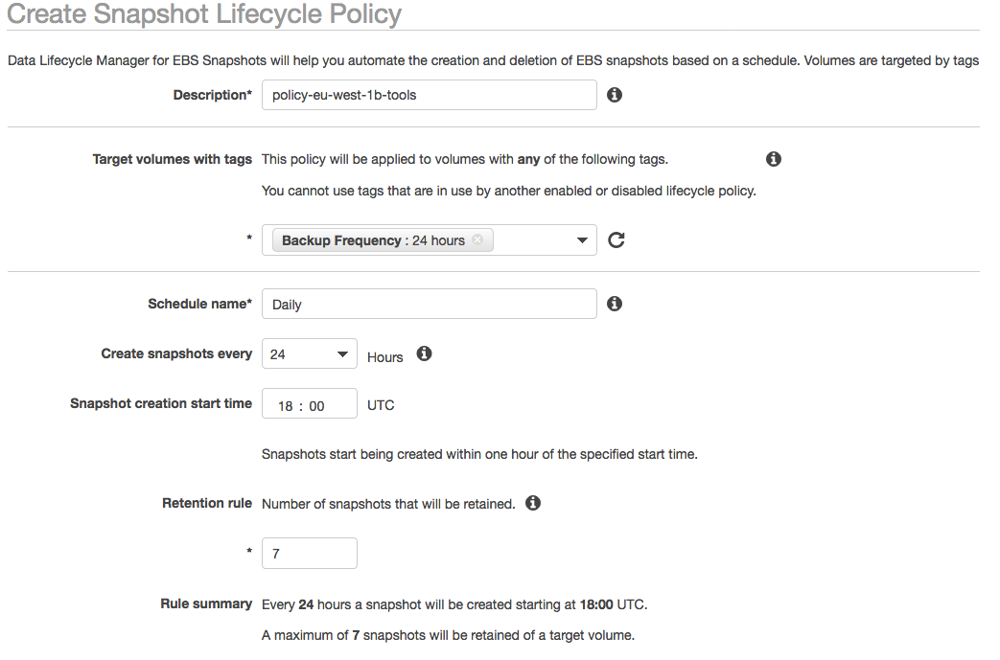

4.  Click "Create Policy" once complete. You have successfully set up an
    automated backup policy.

# Restoring from a snapshot

## Overview

- Create a snapshot
- Detach volume from the EC2 that needs restoring a new snapshot
- Create a volume out of the snapshot created
- Attach this new volume to the EC2

### Create a snapshot

Creating a snapshot is already covered in the user guide

### Detach volume from the EC2 that needs restoring a new snapshot

- To detach the volume from the EC2, you need to first stop the EC2 that the volume is attached to.
- Navigate to volumes page and select the volume that you would like to detach from EC2. For this, you will need the know which volume the EC2 is linked to.
- To find the volume ID that given EC2 is attached to, use the screenshot below.


- Once volume ID is found, navigate to volumes page, search for the volume using its ID and select that volume. Click on Action and choose option Detach Volume.

### Create a volume out of the snapshot created

- Navigate to 'Snapshots' page on AWS console.
- Select the snapshot that you would like to restore from
- Click on the Actions button and select option 'Create Volume'
- On the next screen make sure you select the **same availability zone** that your EC2 instance is in.
- Add a 'Name' tag so that you can identify this volume once it is created
- Click 'Create Volume'

### Attach this new volume to the EC2

- First, make sure the EC2 that you will be attaching this volume to is turned off
- Navigate to 'Volumes' page and find the volume that we created above
- Select that volume and click on 'Actions' and choose the option 'Attach Volume'
- This will bring a popup window in which you will need to select the correct EC2 instance to which this volume needs to be attached to
  
- Once correct instance is selected, click on attach volume.

# CloudWatch

CloudWatch is a utility that lets you monitor and manage your different resources including EC2 instances and WorkSpaces through setting restrictions and warnings through alarms.

You can view the different alarms in the AWS console by going to Services -> CloudWatch.

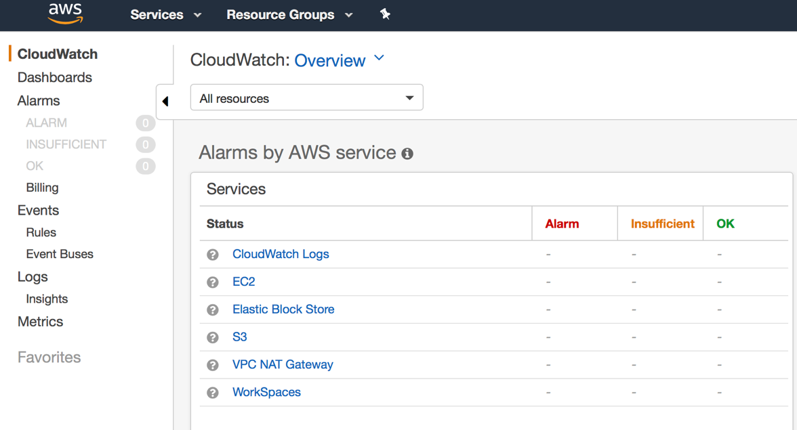

## Enabling EC2 Instance monitoring

1. Services -> EC2.
2. Select the EC2 you want to monitor.
3. Click “Actions” and then in “CloudWatch Monitoring” select “Enable Detailed Monitoring”

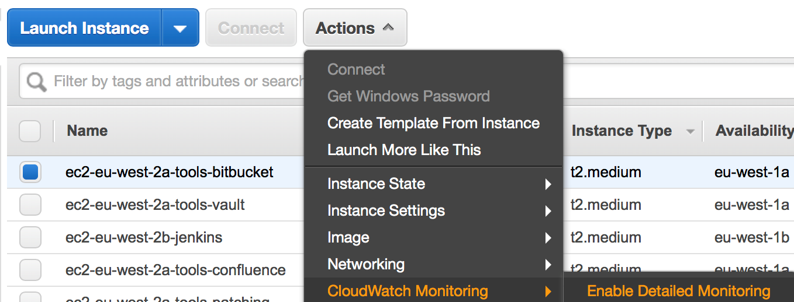

4. You will get a confirmation message. Click “Close”.

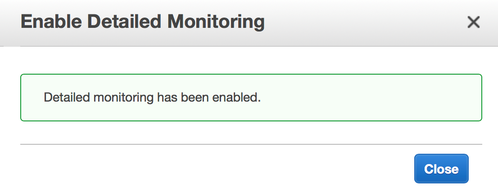

## Creating Alarms

Alarms can be created against EC2 instances that will send out a
notification based on the event. The alarms are created based on metric
data and a notification is triggered whenever metric data reaches a
level you define.

1.  Click "Create Alarm" button under the monitoring section.

2.  From the new prompt that appears, you can:

    a. Select to send a notification out by email

    b. Take an action on the instance such as reboot/shutdown, etc

    c. Select a metric such as CPU utilisation and set to trigger the
    alarm based on when CPU usage is over 90% in a given period.

    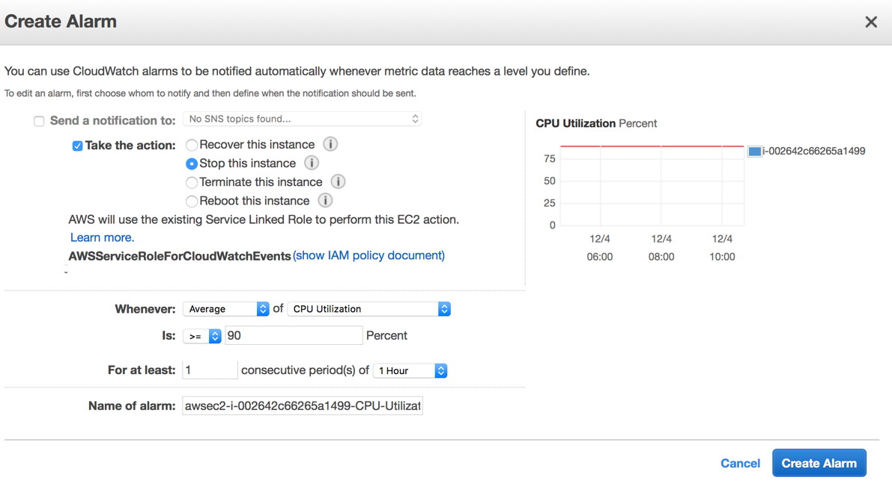

### Example

This example shows how to create a notification for when CPU is
under-utilised for long periods

1.  On the "Create Alarm" prompt tick a box to "send a notification to"

2.  Click "create topic" if the email address is not populated

3.  Tick "Take the action" and select an appropriate action

4.  Fill details in to trigger the alarm based on your preference. In
    the screenshot below the alarm would be triggered when CPU
    utilisation is less than 0.5 percent for at least 6 hours.

5.  Name the alarm appropriately

6.  Click "Create Alarm"

# GuardDuty

GuardDuty is a threat detection utility that protects your AWS account and workloads.

To enable:

1. Services -> GuardDuty.
2. Click “Get Started”.

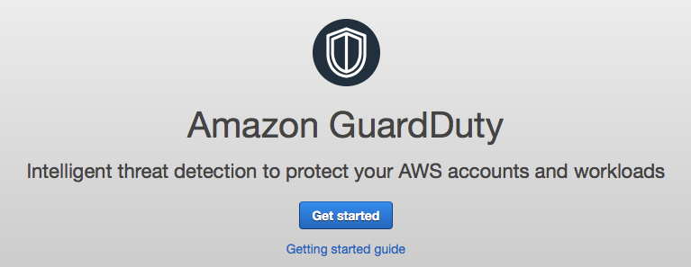

3. Click “Enable GuardDuty”.

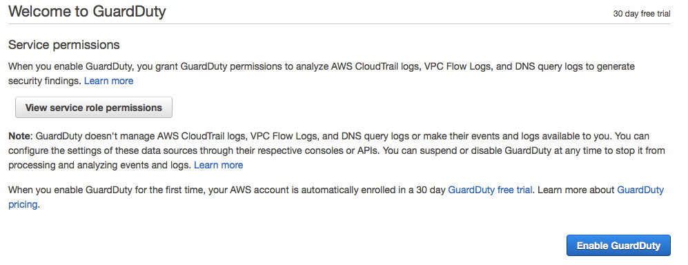

# Enable EC2 Termination Protection

1. On the EC2 dashboard, select the EC2 you wish to enable termination protection on.

2. Click "Actions".

3. Hover over "Instance Settings" and select "Change Termination Protection"

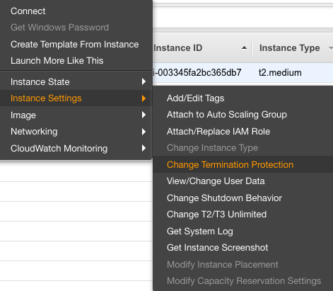

4. Click "Enable" on the pop-up window.

# Restricting WorkSpaces using Certificates

By default, anybody with your WorkSpace registration can access your WorkSpace using their user 
ID and password. To make signing into WorkSpace even more secure you can lock them down using 
certificates. If you are using the automated Ansible scripts to set up your tools it by defaults 
creates all the necessary certificate files for the users you define. However, some manual steps 
still need to be done to enable this feature from within AWS. Follow the steps below to enable 
this feature:

1. Log onto the AWS Management Console
2. From the Services menu select "WorkSpaces"
3. From the left-hand menu select "Directories"
4. Check the checkbox next to your directory
5. From the "Actions" drop-down select "Update Details"
6. Expand the "Access Control Options"
7. Check both of the checkboxes that say "Only Allow Trusted Windows Devices to Access WorkSpaces" and "Only Allow Trusted MacOS Devices to Access WorkSpaces"

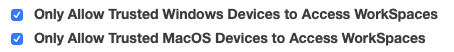

8. Click "Import" next to "Root Certificate 1"
9. Paste in your root CA. This is the file labelled "CA_cert.crt" in the S3 bucket which the automated script's output
10. Click "Import"
11. Go to the bottom of the page and click "Update and Exit"

That's it. Now when your users try to log into their WorkSpaces if they do not have the root, intermediate and .p12 files 
imported they will not be able to enter their username or passwords. To find out how to import these files please read 
this [section](./first-time-workspaces-setup.md#Secure-Access)

# AWS Systems Manager Patch Manager

AWS Systems Manager Patch Manager automates the process of patching
managed instances with security-related updates. For Linux-based
instances, you can also install patches for non-security updates. You
can patch fleets of Amazon EC2 instances or your on-premises servers and
virtual machines (VMs) by operating system type. You can scan instances
to see only a report of missing patches, or you can scan and
automatically install all missing patches. 

Patch Manager uses *patch baselines*, which include rules for
auto-approving patches within days of their release, as well as a list
of approved and rejected patches. You can install patches on a regular
basis by scheduling patching to run as a Systems Manager Maintenance
Window task. You can also install patches individually or to large
groups of instances by using Amazon EC2 tags. 

## Prerequisites
- Make sure your [Operating Systems are supported by the System Manager](https://docs.aws.amazon.com/systems-manager/latest/userguide/systems-manager-prereqs.html#prereqs-os-windows-server)

- The IAM user account, group, or role which will work with the systems manager should have the following permissions: 

    a. To access Resource Groups: resource-groups: \* permissions entity is needed
    
    b. To access Actions and Shared Resources: either the AmazonSSMFullAccess policy or the AmazonSSMReadOnlyAccess policy is needed

- The Patch Manager capability does not support all the same operating systems supported by other AWS Systems Manager.
   See a [detailed list of supported versions here](https://docs.aws.amazon.com/systems-manager/latest/userguide/patch-manager-prerequisites.html).  
   
- Decide whether you need your own custom Patch Baseline or if you can use one of the 
  [Pre-Defined Baselines](https://docs.aws.amazon.com/systems-manager/latest/userguide/sysman-patch-baselines.html#patch-manager-baselines-pre-defined) 
  which are already provided but cannot be customised.
    
- Keep the following in mind if you create a custom patch baseline:

    a. If a patch is listed as both approved and rejected in the same patch baseline, the patch is rejected.

    b. An instance can have only one patch baseline defined for it.

    c. The way package names are formatted depends on the type of operating system you are patching.
    
    d. You can find out more about [how patches are categorised and can be auto-approved here](https://docs.aws.amazon.com/systems-manager/latest/userguide/sysman-patch-baselines.html#patch-manager-baselines-custom).

## Install SSM Agents on your EC2s

SSM Agent is the tool that processes Systems Manager requests and
configures your machine as specified in the request. SSM Agent must be
installed on each instance you want to use with Systems Manager. On some
instance types, SSM Agent is installed by default. On others, you must
install it manually

#### Windows Operating system

SSM Agent is installed by default on Windows Server 2016 and 2019
instances, as well as on instances created from Windows Server 2003-2012
R2 AMIs published in November 2016 or later.  You don\'t need to install
SSM Agent on these instances. 

To manually download and install the latest version of SSM Agent

1.  Log in to your instance by using, for example, Remote Desktop or
    Windows PowerShell.

2.  Download the latest version of SSM Agent to your instance:

> [*https://s3.amazonaws.com/ec2-downloads-windows/SSMAgent/latest/windows\_amd64/AmazonSSMAgentSetup.exe*](https://s3.amazonaws.com/ec2-downloads-windows/SSMAgent/latest/windows_amd64/AmazonSSMAgentSetup.exe)
>
> This URL lets you download SSM Agent from any AWS region. If you want
> to download the agent from a specific region, use a region-specific
> URL instead:
>
> *https://amazon-ssm-region.s3.amazonaws.com/latest/windows\_amd64/AmazonSSMAgentSetup.exe*
>
> The region represents the Region identifier for an AWS Region supported by
> AWS Systems Manager, such as us-east-2 for the US East (Ohio) Region.

3.  Start or restart SSM Agent (AmazonSSMAgent.exe) using the Windows
    Services Control Panel or by sending the following command in
    PowerShell:

> Restart-Service AmazonSSMAgent

You can view SSM Agent log files on Windows instances in the following
locations.

-   \%PROGRAMDATA%\\Amazon\\SSM\\Logs\\amazon-ssm-agent.log

-   \%PROGRAMDATA%\\Amazon\\SSM\\Logs\\errors.log

#### CentOS 7 Operating System

Connect to your CentOS instance and perform the following steps to
install the SSM Agent. Perform these steps on each instance that will
run commands using Systems Manager.

Use the following commands to download and run the SSM Agent installer.
```
sudo yum install -y https://s3.amazonaws.com/ec2-downloads-windows/SSMAgent/latest/linux_amd64/amazon-ssm-agent.rpm
```
Execute the following commands to ensure the SSM Agent has started.
The final command should return the message amazon-ssm-agent is running.

```
sudo systemctl enable amazon-ssm-agent

sudo systemctl start amazon-ssm-agent

sudo systemctl status amazon-ssm-agent
```

You can view SSM Agent logs on Linux instances in the following
locations.

-   /var/log/amazon/ssm/amazon-ssm-agent.log

-   /var/log/amazon/ssm/errors.log

## Configure Access to Systems Manager

#### Create an Instance Profile

By default, Systems Manager doesn\'t have permission to perform actions
on your instances. You must grant access by using an IAM instance
profile. An instance profile is a container that passes IAM role
information to an Amazon EC2 instance at launch.

1.  Open the IAM console at <https://console.aws.amazon.com/iam/>.

2.  In the navigation pane, choose Roles, and then choose Create role.

3.  On the Select type of trusted entity page, under AWS Service,
    choose EC2.

4.  On the Attached permissions policy page, verify
    that AmazonEC2RoleforSSM is listed, and then choose Next: Review.

5.  On the Review page, type a name in the Role name box, and then type
    a description.

6.  Choose Create role. The system returns you to the Roles page.

#### Add instance profile instances to an existing role

You can also add the needed permissions to an existing role

1.  Open the IAM console at <https://console.aws.amazon.com/iam/>.

2.  In the navigation pane, choose Roles, and then choose the existing
    role you want to associate with an instance profile for Systems
    Manager operations.

3.  On the Permissions tab, choose Attach policy.

4.  On the Attach policy page, select the checkbox next
    to AmazonEC2RoleforSSM, and then choose Attach policy.

#### Create an Amazon EC2 Instance that Uses the Systems Manager Instance Profile

This procedure describes how to launch an Amazon EC2 instance that uses
the instance profile you created in the previous topic.

1.  Open the Amazon EC2 console
    at <https://console.aws.amazon.com/ec2/>.

2.  In the navigation bar at the top of the screen, the current region
    is displayed. Select
    the [region](https://docs.aws.amazon.com/general/latest/gr/rande.html#ssm_region) for
    the instance.

3.  Choose Launch Instance.

4.  On the Choose an Amazon Machine Image (AMI) page, locate the AMI for
    the instance type you want to create, and then choose Select.

5.  Choose Next: Configure Instance Details.

6.  On the Configure Instance Details page, in the IAM role drop-down
    list, choose the instance profile you created in previous the step.

7.  Complete the wizard.

#### Attach an instance profile to an existing EC2 instance,

This procedure describes how to attach an instance profile to an
existing Amazon EC2 instance.

1.  Open the Amazon EC2 console at <https://console.aws.amazon.com/ec2/>.

2.  In the navigation bar at the top of the screen, the current region is displayed.

3.  Choose the EC2 instance for which the instance profile needs to be attached.

4. From the Actions, select instance setting and then Attach/Replace IAM Role

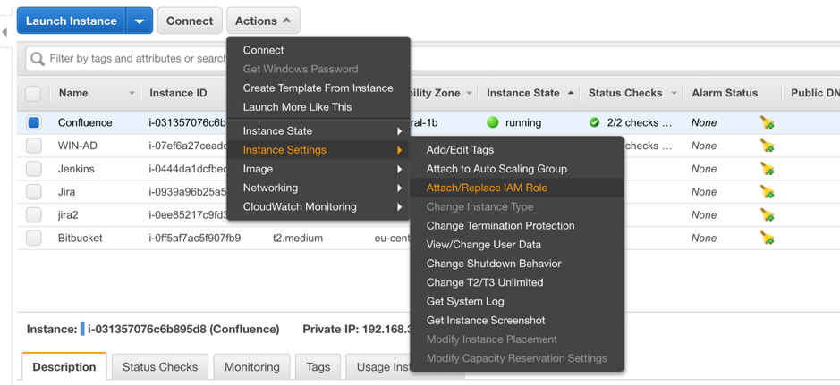

5. From the IAM role dropdown select the IAM role created in the previous step and select Apply.

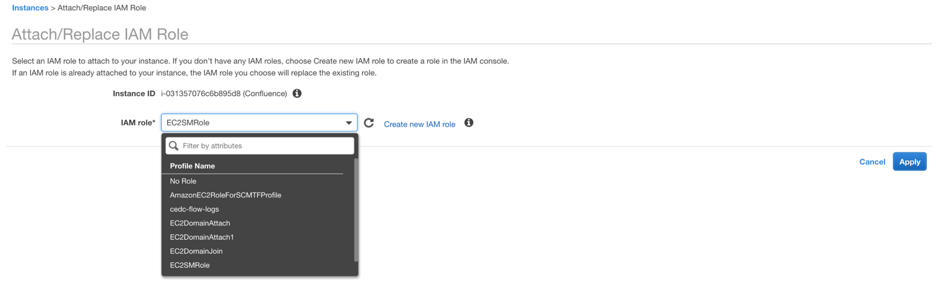

####  Create a default patch baseline 

1.  Open the [Amazon EC2 console](https://console.aws.amazon.com/ec2/),
    expand Systems Manager Services in the navigation pane, and then
    choose Patch Baselines.

    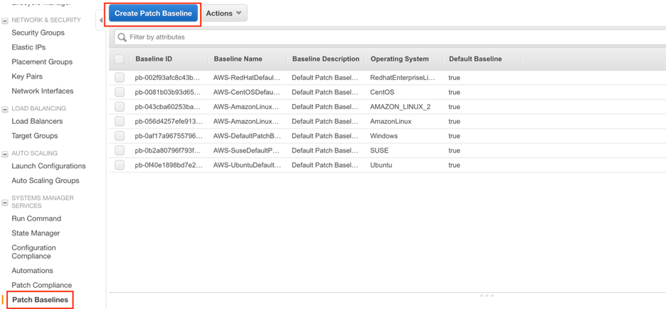

2. In the patch baselines list, choose a patch baseline for the operating system you want to patch.

3. With a default baseline selected, choose the Approval Rules tab. If
    the auto-approval rules are acceptable for your instances, then you
    can skip to the next procedure, [Create a Patch
    Group](https://docs.aws.amazon.com/systems-manager/latest/userguide/sysman-patch-tagging-console.html).

    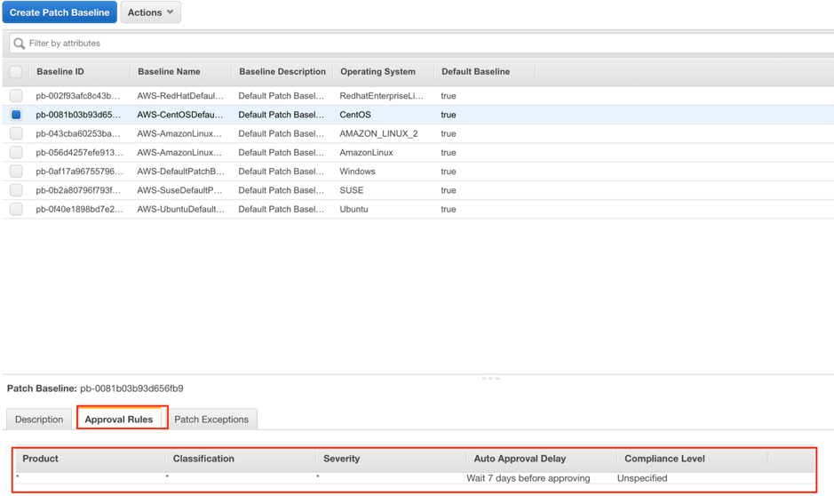

4. To create your own default patch baseline, choose Create Patch
    Baseline.

5.  In the Name field, enter a name for your new patch baseline, for
    example, RHEL-Default.

6. (Optional) Enter a description for this patch baseline.

7. In the Operating System field, choose an operating system, for
    example, RedhatEnterpriseLinux.

8. In the Approval Rules section, use the fields to create one or more
    auto-approval rules.

9. (Optional) In the Patch Exceptions section, enter comma-separated
    lists of patches you want to explicitly approve and reject for the baseline. For approved patches, choose a corresponding compliance severity level.

    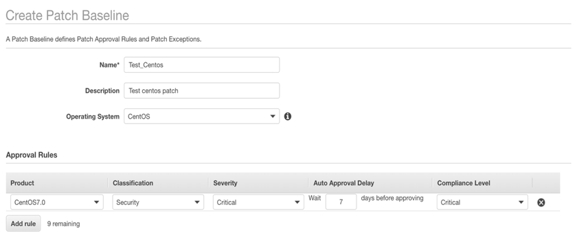

    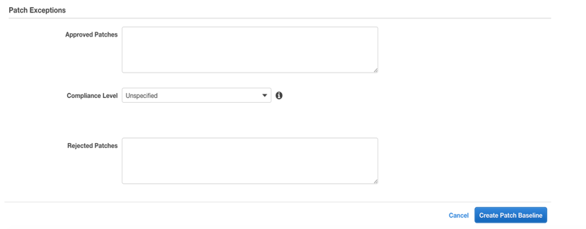

10. Choose Create Patch Baseline, and then choose Close.

11. In the list of patch baselines, choose the baseline you want to set
    as the default.

12. Choose Actions, and then choose Set Default Patch Baseline.

    

13.  Verify details in the Set Default Patch Baseline confirmation
    dialog, and then choose Set Default Patch Baseline.

## Create a Patch Group

To organize patching efforts, it is recommended to add instances to
patch groups by using Amazon EC2 tags. Patch groups require the use of the
tag key Patch Group. You can specify any value, but the tag key must
be Patch Group

1.  Open the [Amazon EC2 console](https://console.aws.amazon.com/ec2/),
    and then choose Instances in the navigation pane.

2. In the list of instances, choose an instance that you want to
    configure for patching.

3. From the Actions menu, choose Instance Settings, Add/Edit Tags.

    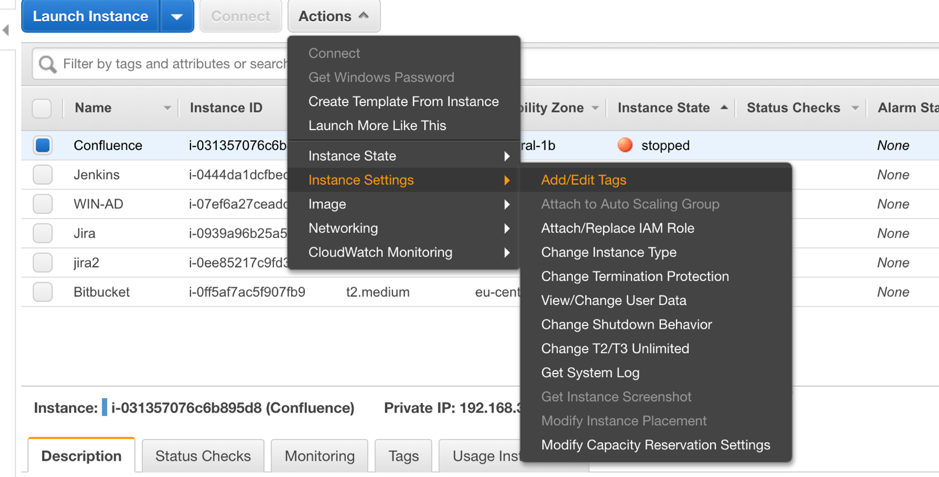

4. If the instance already has one or more tags applied, choose Create
    Tag.

5. In the Key field, type **Patch Group**.

6. In the Value field, enter a value that helps you understand which
    instances will be patched.

    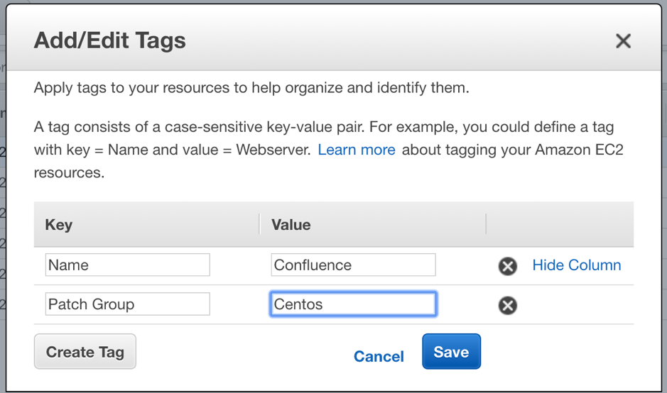

7. Choose Save.

8. Repeat this procedure to add other instances to the same patch group.

## Create a Maintenance Window 

AWS Systems Manager Maintenance Windows let you define a schedule for
when to perform potentially disruptive actions on your instances such as
patching an operating system, updating drivers, or installing software
or patches. Each Maintenance Window has a schedule, a maximum duration,
a set of registered targets (the instances that are acted upon), and a
set of registered tasks. You can also specify dates that a Maintenance
Window should not run before or after, and you can specify the
international time zone on which to base the Maintenance Window
schedule.

#### Create a Custom Service Role for Maintenance Windows (Optional)

A custom service role is not required if you choose to use a Systems
Manager service-linked role to let Maintenance Windows run tasks on your
behalf instead. To create a custom service role

9. Open the IAM console at <https://console.aws.amazon.com/iam/>.

10. In the navigation pane, choose Roles, and then choose Create role.

11. Mark the following selections:

    1.  Select the type of trusted entity area: AWS service

    2.  Choose the service that will use this role area: EC2

    3.  Select your use case area: EC2

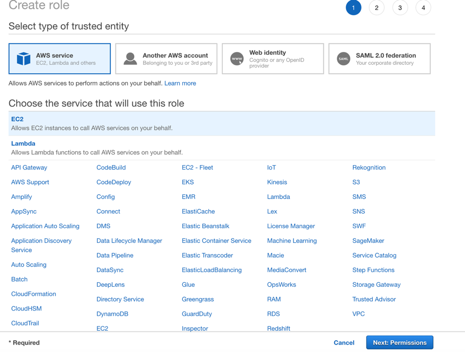

12. Choose Next: Permissions.

13. In the list of policies, select the box next
    to **AmazonSSMMaintenanceWindowRole**, and then choose Next: Review.

> 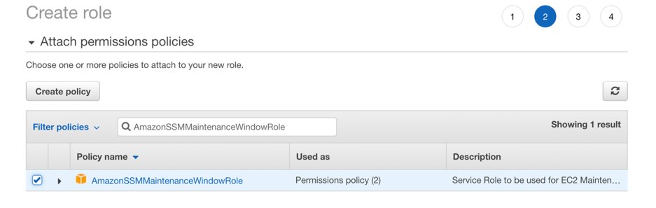

14. In Role name, enter a name that identifies this role as a
    Maintenance Windows role; for example my-maintenance-window-role.

> 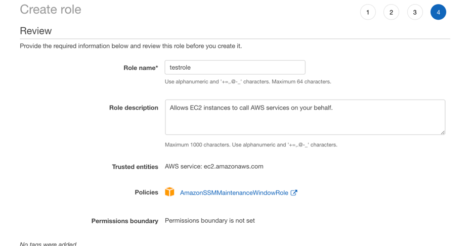

15. Choose Create role. The system returns you to the Roles page.

16. Choose the name of the role you just created.

17. Choose the Trust relationships tab, and then choose Edit trust
    relationship.

18. Delete the current policy, and then copy and paste the following
    policy into the Policy Document field:

```
{
  "Version": "2012-10-17",
  "Statement": [
    {
      "Sid": "",
      "Effect": "Allow",
      "Principal": {
        "Service": [
          "sns.amazonaws.com",
          "ssm.amazonaws.com"
        ]
      },
      "Action": "sts:AssumeRole"
    }
  ]
}
```
**Note:** \"sns.amazonaws.com\" is required only if you will use Amazon SNS to send notifications related to Maintenance Window tasks run through Run Command.

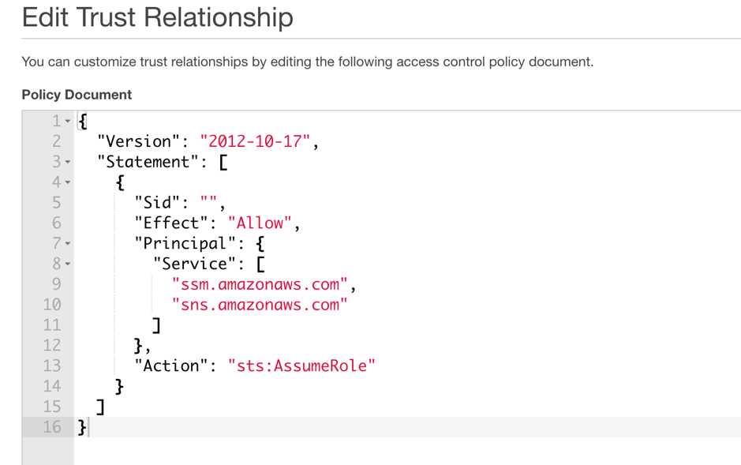

19. Choose Update Trust Policy, and then copy or make a note of the role
    name and the Role ARN value on the Summary page. You will specify
    this information when you create your Maintenance Window.

20. Choose the Permissions tab.

21. Choose Add inline policy, and then choose the JSON tab.

22. In Policy Document, paste the following:

```    
{
  "Version": "2012-10-17",
  "Statement": [
    {
      "Effect": "Allow",
      "Action": "iam:PassRole",
      "Resource": "sns-access-role-arn"
    }
  ]
}
```

> Please note *sns-access-role-arn* represents the ARN of the existing
> IAM role to be for sending SNS notifications related to the
> Maintenance Window, in the format
> of arn:aws:iam::account-id:role/role-name. For example:
> arn:aws:iam::111222333444:role/my-sns-access-role.

23. Choose Review policy.

> 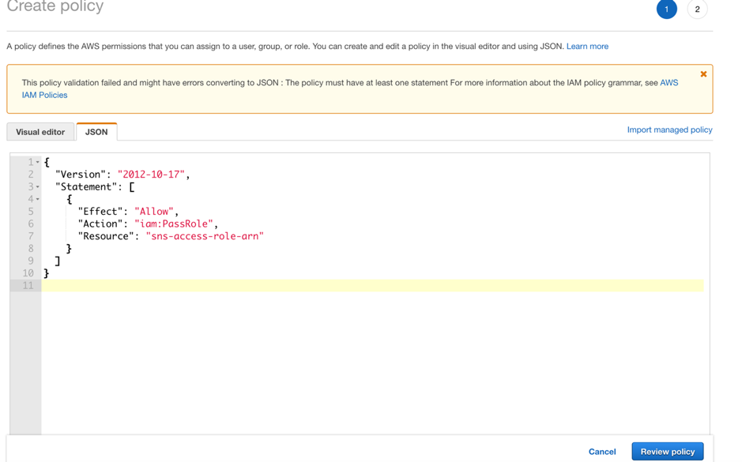

24. In the Name box, enter a name to identify this as a policy to allow
    sending Amazon SNS notifications.

25. Choose Create policy.

#### Assign the IAM PassRole Policy to an IAM User

When you register a task with a Maintenance Window, you specify either a
custom service role or a Systems Manager service-linked role to run the
actual task operations. This is the role that the service will assume
when it runs tasks on your behalf. Before that, to register the task
itself, you must assign the IAM PassRole policy to an IAM user account
or an IAM group.

1. Open the IAM console at <https://console.aws.amazon.com/iam/>.

2. Choose Users, and then choose the name of the user account you want
    to update.

3. On the Permissions tabs, in the policies list, verify that
    the AmazonSSMFullAccess policy is listed, or that there is a comparable policy that gives the IAM user permission to call the
    Systems Manager API.

 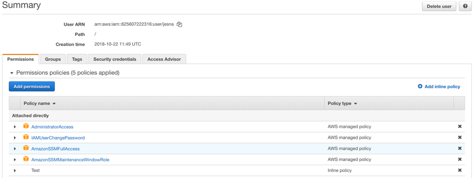

4.  Choose Add inline policy.

5.  On the Create policy page, on the Visual editor tab, in the Select a
    service area, choose IAM.

6.  In the Actions area, choose PassRole.

7.  Choose the Resources line, and then choose Add ARN.

8.  In the Specify ARN for role field, paste the role ARN you created in
    the previous procedure, and then choose Save changes.

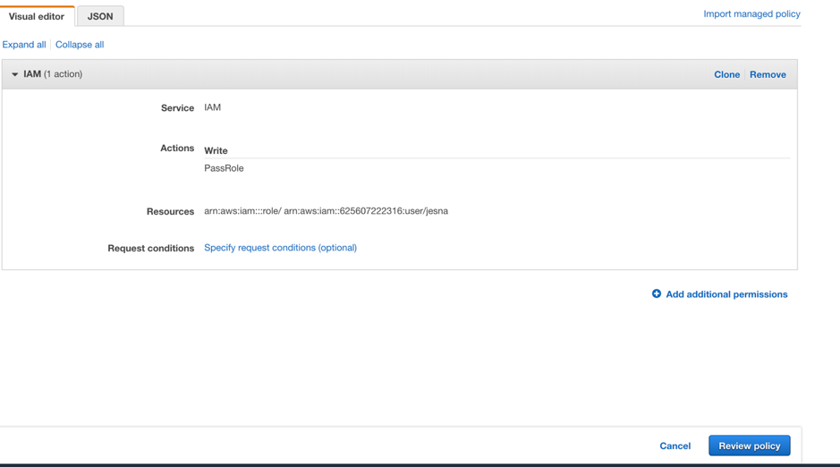

9.  Choose Review policy.

10.  On the Review policy page, enter a name in the Name box to identify
    this PassRole policy, and then choose Create policy.

#### Create the Maintenance Window 

1.  Open the [Amazon EC2 console](https://console.aws.amazon.com/ec2/).

2. In the navigation pane, choose Maintenance Windows, and then
    choose Create maintenance window.

    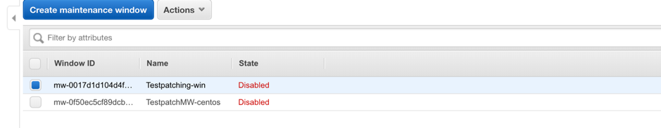

3. In the Name field, enter a name that designates this as a
    Maintenance Window for patching critical and important updates.

4. In the Specify schedule area, choose the schedule options you want.

5. In the Duration field, type the number of hours you want the
    Maintenance Window to be active.

6. In the Stop initiating tasks field, type the number of hours before
    the Maintenance Window duration ends that you want the system to
    stop initiating new tasks.

    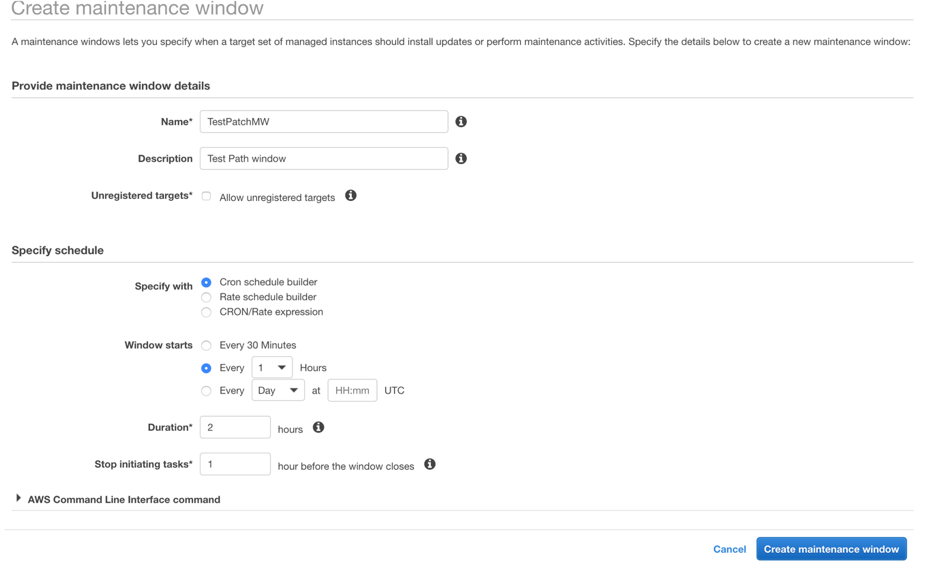

7. Choose Create maintenance window.

8. In the Maintenance Window list, choose the Maintenance Window you
    just created, and then choose Actions, Register targets.

    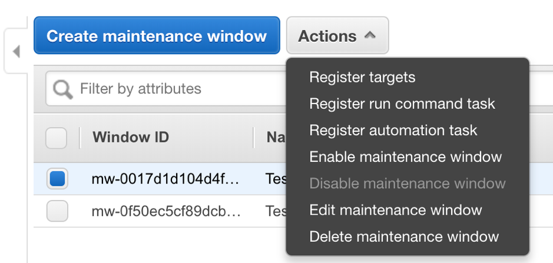

9. (Optional) Near the top of the page, specify a name, description,
    and owner information (your name or alias) for this target.

10. Next to Select targets by, choose Specifying Tags.

11. Next to Tag, use the lists to choose a tag key and a tag value.

    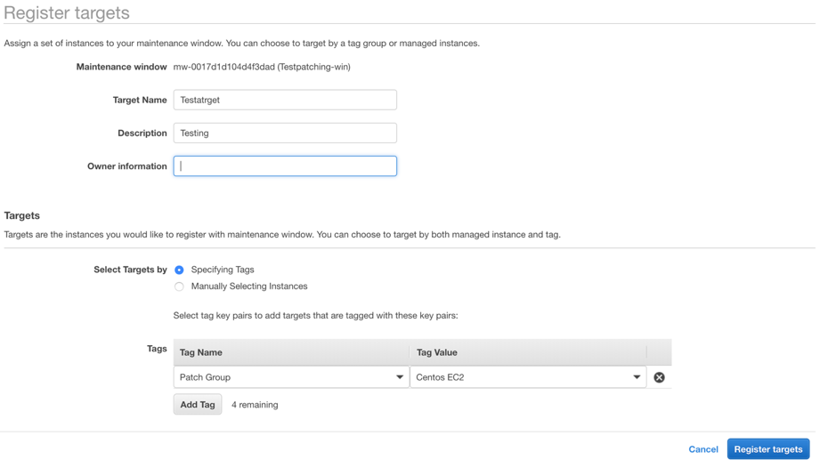

12. Choose Register targets. The system creates a Maintenance Window
    target.

13. In the Maintenance Window list, choose the Maintenance Window you
    created with the procedure, and then choose Actions, Register run
    command task.

    

14. In the Command Document section of the Register run command
    task page, choose AWS-RunPatchBaseline.

15. In the Task Priority section, specify a priority. One is the highest
    priority.

    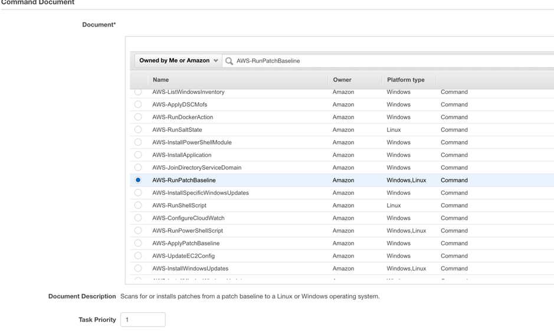

16. In the Targets section, choose Select, and then choose the
    Maintenance Window target you created earlier in this procedure.

17. In the Role field, enter the ARN of a role which has
    the AmazonSSMMaintenanceWindowRole policy attached to it.

18. In the Execute on field, choose either Targets or Percent to limit
    the number of instances where the system can simultaneously perform
    patching operations.

19. In the Stop after field, specify the number of allowed errors before
    the system stops sending the patching task to other instances.

20. In the Operation list, choose Scan to scan for missing patches, or
    choose Install to scan for and install missing patches.

21. You don\'t need to specify anything in the Snapshot Id field. The
    system automatically generates and provides this parameter.

    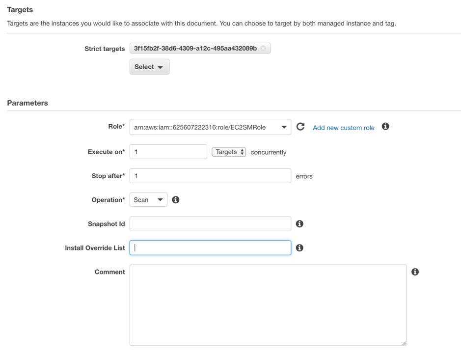
    In the Advanced section:

22. If you want to write command output and results to an Amazon S3
    bucket, choose Write to S3. Type the bucket and prefix names in the
    boxes.

23. If you want notifications sent about the status of the command
    execution, select the Enable SNS notifications checkbox.

    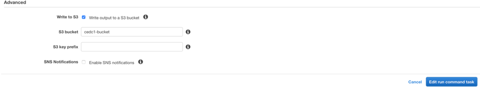

24. Choose Register task.

    After the Maintenance Window task completes, you can view patch
    compliance details in the Amazon EC2 console on the Managed
    Instances page.

    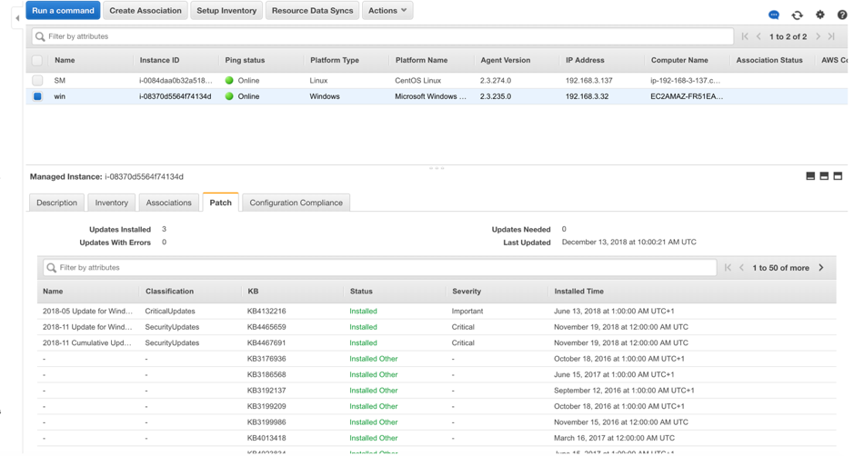

## Create a Patching Configuration

### Using the AWS System Manager Console

A patching configuration defines a unique patching operation. The
configuration specifies the instances for patching, which patch baseline
is to be applied, the schedule for patching, and the Maintenance Window
that the configuration is to be associated with.

If you plan to add the patching configuration to a Maintenance Window,
you must first configure roles and permissions for Maintenance Windows
before beginning this procedure. 

To create a patching configuration

1.  Open the AWS Systems Manager console
    at <https://console.aws.amazon.com/systems-manager/>.

2.  In the navigation pane, choose Patch Manager.

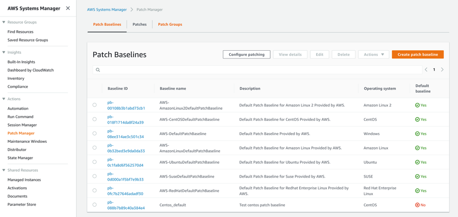

3.  Choose Configure patching.

4.  In the Instances to patch section, choose one of the following:

    -   Enter instance tags: Enter a tag key and optional tag value to
        specify the tagged instance to patch. Click Add to include
        additional tagged instances.

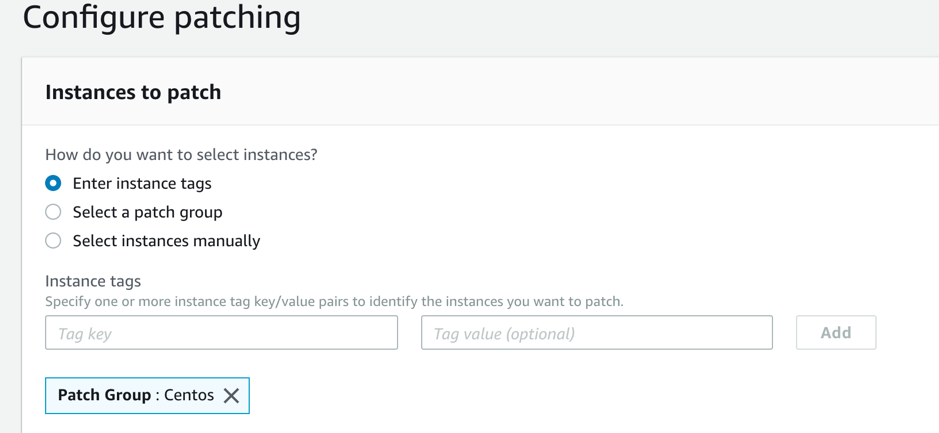

-   Select a patch group: Choose the name of an existing patch group
    that includes the instances you want to patch. The Select a patch
    group list displays only those patch groups that are attached to, or
    registered with, a patch baseline.  you can view a patch baseline in
    the Systems Manager console and select Modify patch groups from the
    Actions menu.

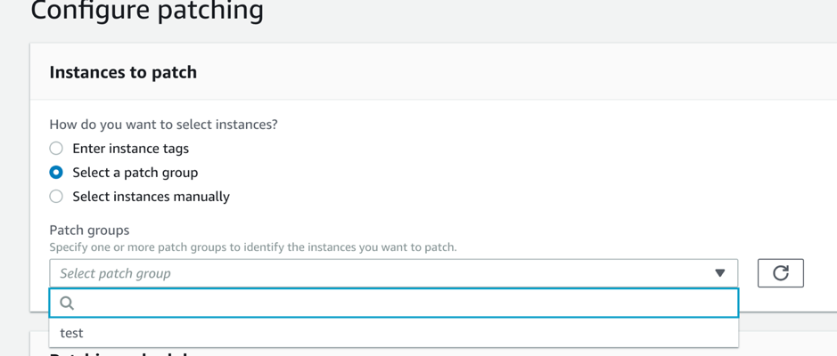

-   Select instances manually: Select the checkbox next to the name of
    each instance you want to patch.

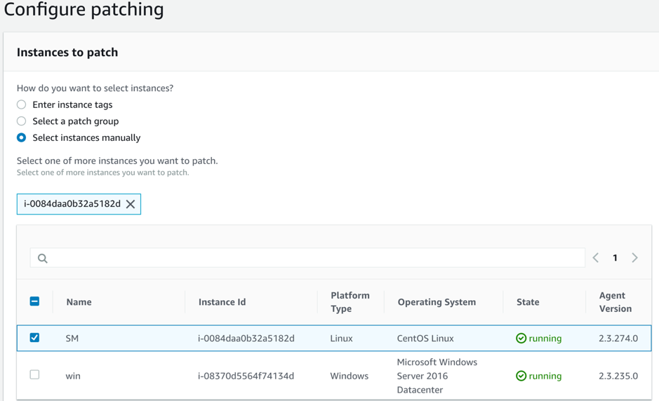

5.  In the Patching schedule section, choose one of the following:

    -   Select an existing Maintenance Window: From the list, select a
        Maintenance Window you have already created, and then continue
        to step 7.

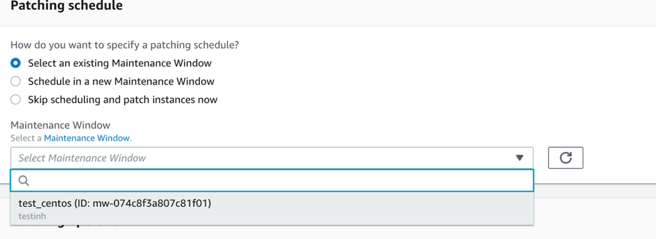

-   Schedule in a new Maintenance Window: Create a new Maintenance
    Window to associate with this patching configuration. Refer section
    4.4 for more information.


-   Skip scheduling and patch now: Run a one-time manual patching
    operation without a schedule or Maintenance Window. Continue to
    step 7.

6.  If you chose Schedule in a new Maintenance Window in step 5, then
    under How do you want to specify a patching schedule?, do the setup
    in the [Create a Maintenance Window section](#markdown-header-create-a-maintenance-window).

7.  In the Patching operation area, choose whether to scan instances for
    missing patches and apply them as needed, or to scan only and
    generate a list of missing patches.

8.  (Optional) In the Additional settings area, if any target instances
    you selected belong to a patch group, you can change the patch
    baseline that is associated with the patch group. To do so, follow
    these steps:

    a.  Choose the button beside the name of the associated patch
        > baseline.

    b.  Choose Change patch baseline registration.

    c.  Choose the patch baselines you want to specify for this
        > configuration by clearing and selecting check boxes beside the
        > patch baseline names.

    d.  Choose Close.

9.  Choose Configure patching.

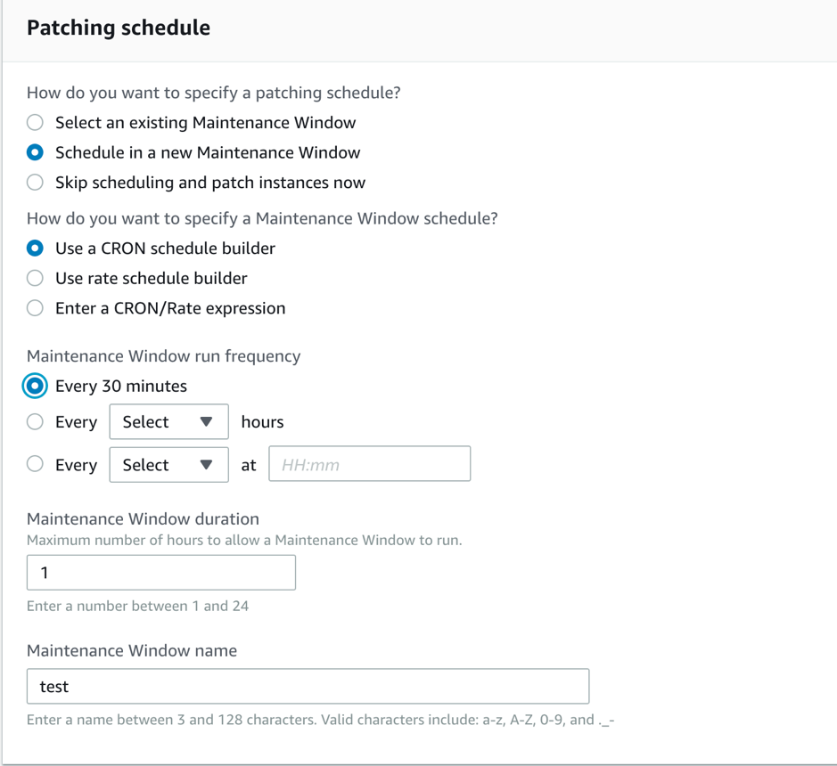

### Using the AWS Command Line Tools

The following procedure illustrates how a user might patch a server
environment by using a custom patch baseline, patch groups, and a
Maintenance Window using AWS CLI.

**Configuring using the AWS CLI**

1.  Download the latest version of the AWS CLI to your local machine.

2.  Open the AWS CLI and run the following command:
```
aws configure
```

The system prompts you to specify the following.

```
AWS Access Key ID [None]: key_name
AWS Secret Access Key [None]: key_name
Default region name [None]: region
Default output format [None]: ENTER
````

3.  Run the following command to create a patch baseline named
    \"Production-Baseline\" that approves patches for a production
    environment seven days after they are released, including both
    security and non-security patches included in the source repository.

    **a. Linux**
    ```
    aws ssm create-patch-baseline --name "Production-Baseline" --operating-system "AMAZON_LINUX" --approval-rules  "PatchRules=[{PatchFilterGroup={PatchFilters=[{Key=PRODUCT,Values=[AmazonLinux2016.03,AmazonLinux2016.09,AmazonLinux2017.03,AmazonLinux2017.09]},{Key=SEVERITY,Values=[Critical,Important]},{Key=CLASSIFICATION,Values=[Security]}]},ApproveAfterDays=7,EnableNonSecurity=true}]" --description "Baseline containing all updates approved for production systems"
    ```
    
    **b. Windows**
    ```
    aws ssm create-patch-baseline --name "Production-Baseline" --operating-system "WINDOWS" --product "WindowsServer2012R2" --approval-rules "PatchRules=[{PatchFilterGroup={PatchFilters=[{Key=MSRC_SEVERITY,Values=[Critical,Important]},{Key=CLASSIFICATION,Values=[SecurityUpdates,Updates,UpdateRollups,CriticalUpdates]}]},ApproveAfterDays=7}]" --description "Baseline containing all updates approved for production systems"
    ```

4.  Run the following commands to register the 
```
{
   "BaselineId":"pb-0c10e65780EXAMPLE"
}
```

```
aws ssm register-patch-baseline-for-patch-group --baseline-id pb-0c10e65780EXAMPLE --patch-group "Production"
```

The system returns information like the following.

```
The system returns information like the following.
{
   "PatchGroup":"Production",
   "BaselineId":"pb-0c10e65780EXAMPLE"
}
```

5.  Run the following commands to create a Maintenance Window for the
    production servers. The window run every Tuesday at 10 PM. You can
    change the schedule by changing the cron expression

```
aws ssm create-maintenance-window --name "Production-Tuesdays" --schedule "cron(0 0 22 ? * TUE *)" --duration 1 --cutoff 0 --no-allow-unassociated-targets
```

The system returns information like the following.

```
{
   "WindowId":"mw-0c66948c711a3b5bd"
}
```

6.  Run the following commands to register the Production servers with the production Maintenance Windows.

```
aws ssm register-target-with-maintenance-window --window-id mw-0c66948c711a3b5bd --targets "Key=tag:Patch Group,Values=Production" --owner-information "Production servers" --resource-type "INSTANCE"
```

The system returns information like the following.

```
{
   "WindowTargetId":"557e7b3a-bc2f-48dd-ae05-e282b5b20760"
}
```

7.  Run the following commands to register a patch task that only scans
    the production servers for missing updates in the first production
    Maintenance Window.

```
aws ssm register-task-with-maintenance-window --window-id mw-0c66948c711a3b5bd --targets "Key=WindowTargetIds,Values=557e7b3a-bc2f-48dd-ae05-e282b5b20760" --task-arn "AWS-ApplyPatchBaseline" --service-role-arn "arn:aws:iam::12345678:role/MW-Role" --task-type "RUN_COMMAND" --max-concurrency 2 --max-errors 1 --priority 1 --task-parameters “{\"Operation\":{\"Values\":[\"Scan\"]}}”
```

The system returns information like the following.

```
{
   "WindowTaskId":"968e3b17-8591-4fb2-932a-b62389d6f635"
}
```

8.  Run the following commands to register a patch task that installs
    missing updates on the productions servers 

```
aws ssm register-task-with-maintenance-window --window-id mw-09e2a75baadd84e85 --targets "Key=WindowTargetIds,Values=557e7b3a-bc2f-48dd-ae05-e282b5b20760" --task-arn "AWS-ApplyPatchBaseline" --service-role-arn "arn:aws:iam::12345678:role/MW-Role" --task-type "RUN_COMMAND" --max-concurrency 2 --max-errors 1 --priority 1 --task-parameters ”\"Operation\":{\"Values\":[\"Install\"]}}”
```

The system returns information like the following.

```
{
   "WindowTaskId":"968e3b17-8591-4fb2-932a-b62389d6f635"
}

```

9.  Run the following command to get the high-level patch compliance summary for a patch group

```
aws ssm describe-patch-group-state --patch-group "Production"
```
The system returns information like the following.

```
{
   "InstancesWithNotApplicablePatches":0,
   "InstancesWithMissingPatches":0,
   "InstancesWithFailedPatches":1,
   "InstancesWithInstalledOtherPatches":4,
   "Instances":4,
   "InstancesWithInstalledPatches":3
}
```

10. Run the following command to get patch summary states per-instance for a patch group.

```
aws ssm describe-instance-patch-states-for-patch-group --patch-group "Production"
```

The system returns information like the following.

```
{
   "InstancePatchStates":[
      {
         "OperationStartTime":1481259600.0,
         "FailedCount":0,
         "InstanceId":"i-08ee91c0b17045407",
         "OwnerInformation":"",
         "NotApplicableCount":2077,
         "OperationEndTime":1481259757.0,
         "PatchGroup":"Production",
         "InstalledOtherCount":186,
         "MissingCount":7,
         "SnapshotId":"b0e65479-79be-4288-9f88-81c96bc3ed5e",
         "Operation":"Scan",
         "InstalledCount":72
      },
  {
         "OperationStartTime":1481259602.0,
         "FailedCount":0,
         "InstanceId":"i-0fff3aab684d01b23",
         "OwnerInformation":"",
         "NotApplicableCount":2692,
         "OperationEndTime":1481259613.0,
         "PatchGroup":"Production",
         "InstalledOtherCount":3,
         "MissingCount":1,
         "SnapshotId":"b0e65479-79be-4288-9f88-81c96bc3ed5e",
         "Operation":"Scan",
         "InstalledCount":1
      }
}
```

<h1>Pathways</h1>

|         |  |  |
| :-------------: |:--:|:-------------:|
||[Before you begin](before-you-begin.md) | |
||[Conventions Guide](conventions-guide.md) | |
||[Quick Reference](quick-reference.md) | |
||[AWS Overview](aws-overview.md) | |
| **Manual** |  | **Auto** |
|**&#8595;**| |**&#8595;**
| [AWS Manual Setup](aws-manual-infrastructure.md) | | [AWS Automatic Setup](aws-automatic-infrastructure.md)
| [Create a WorkSpace (AD setup)](create-a-workspace.md) | | [Create a WorkSpace (AD setup) ](create-a-workspace.md) 
| [Setup Single Sign on](setup-single-sign-on.md) | | [Setup Single Sign on](setup-single-sign-on.md) <br> [ - Import Users](setup-single-sign-on.md#Import-Users-and-Groups-to-the-Active-Directory) <br> [ - Configuring the AWS Management Console and AD](setup-single-sign-on.md#Configuring-the-AWS-Management-Console-and-AD)   
| [Tools Manual Installation](tools-manual-installation.md)   | | [Tools Automatic Install](tools-automatic-installation.md)
| [Create a WorkSpace (team workspaces)](create-a-workspace.md##create-additional-workspaces)  | | [Create a WorkSpace (team workspaces)](create-a-workspace.md##create-additional-workspaces)
||**&#8595;**
||***Additional AWS Setup***| |
||[First time setup of tools](first-time-tools-setup.md)
||[First time setup of workspaces](first-time-workspaces-setup.md)

[<< Create a WorkSpace (team workspaces)](create-a-workspace.md##create-additional-workspaces)

[First time setup of tools >>](first-time-tools-setup.md)