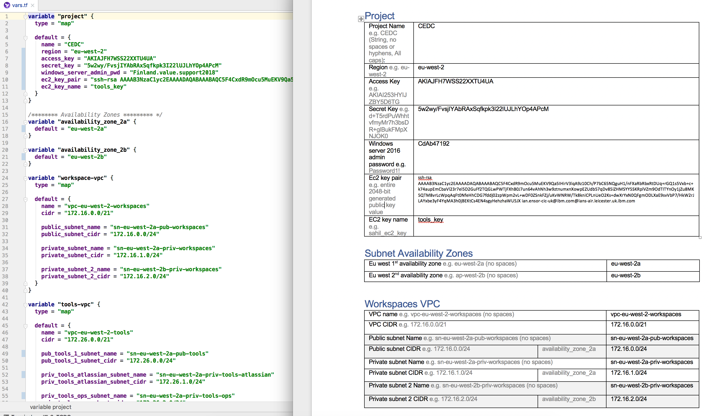

[<< Pathways](README.md)

[< Overview of AWS](aws-overview.md)

## Manual Installation Option

If you would prefer to create the AWS infrastructure manually then follow the
[Manual Installation of AWS Infrastructure](aws-manual-infrastructure.md) section. This is recommended if you wish to build an environment that differs from the Environment Diagram on the [AWS Overview](aws-overview.md) page.

Terraform is a tool for building, changing, and versioning infrastructure safely and efficiently.
It can create, manage and destroy an AWS environment for you. We have created a script that will create
the environment shown in the [Overview of AWS](aws-overview.md) section.

<!-- START doctoc generated TOC please keep comment here to allow auto update -->
<!-- DON'T EDIT THIS SECTION, INSTEAD RE-RUN doctoc TO UPDATE -->

**Table of Contents**

- [Key Occurrences](#markdown-header-key-occurrences)
- [Managing IAMS](#markdown-header-managing-iams)
  - [Setting up a user](#markdown-header-setting-up-a-user)
  - [Setting Permissions](#markdown-header-setting-permissions)
- [Prepare User Account Credentials for the Active Directory](#markdown-header-prepare-user-account-credentials-for-the-active-directory)
  - [UserAccounts.xlsx (Spreadsheet)](#markdown-header-useraccountsxlsx-spreadsheet)
  - [GroupAccounts.xlsx (Spreadsheet)](#markdown-header-groupaccountsxlsx-spreadsheet)
  - [ADSetup.ps1 (Powershell script)](#markdown-header-adsetupps1-powershell-script)
- [Terraform](#markdown-header-terraform)
  - [Background](#markdown-header-background)
  - [Download Terraform](#markdown-header-download-terraform)
    - [For Linux/Mac OS](#markdown-header-for-linuxmac-os)
    - [For Windows OS](#markdown-header-for-windows-os)
  - [Download the Terraform scripts](#markdown-header-download-the-terraform-scripts)
  - [Prepare Terraform for Deployment](#markdown-header-prepare-terraform-for-deployment)
    - [Update the Script for your environment](#markdown-header-update-the-script-for-your-environment)
  - [Run Terraform](#markdown-header-run-terraform)
  - [Destroying an Environment](#markdown-header-destroying-an-environment)
  - [Troubleshooting SSM](#markdown-header-troubleshooting-ssm)
- [Pathways](#markdown-header-pathways)

<!-- END doctoc generated TOC please keep comment here to allow auto update -->

# Key Occurrences

1.  Please ensure the user has adequate permissions that allow them to access the WorkSpaces. You can see [which policies are
    needed for WokSpace related tasks here](https://docs.aws.amazon.com/workspaces/latest/adminguide/workspaces-access-control.html).

2.  The environment manager must also have appropriate permissions to create, attach and modify the various AWS components.
    If there are any issues with permissions, then the Terraform script provides detail on exactly what policy needs to change.

3.  You must accept/subscribe to the terms and conditions of any AMI's you will use. For example, if you want to
    use Centos 7 EC2s then you would have to go to this [page](https://aws.amazon.com/marketplace/pp?sku=aw0evgkw8e5c1q413zgy5pjce).
    Terraform will give you a very useful error message with a link to the page where you can subscribe if you do need to do this.

4.  Refer to the Terraform Variable Front Sheet when filling in the vars.tf file.

5.  If you are creating a new environment, be sure to delete any files that end with .tfstate or .tfstate.backup

6.  There is a known bug in Terraform, if you run the "terraform apply" command an EVEN number of times, the VPC peering connection will become detached from the route tables. This means you cannot access EC2s from your WorkSpace. To fix this run "`terraform apply`" again.

7.  On rare occasions, the AD Manage EC2 and Active Directory will not be associated correctly. This can be corrected by following [this guide](#troubleshooting-ssm). When the AD Manage EC2 and Active Directory are _not_ associated, you will see the option to log in as "SSM-Agent" when RDPing to the AD Manage EC2.

8.  When destroying the environment:

    - Take care if manually deleting components in an environment built by Terraform. Terraform will throw errors if components have been manually deleted, and may struggle to destroy your entire environment.
    - Typically, you will need to manually deregister a directory and remove all application dependencies (e.g. AWS Management Console and IAMs Roles associated with the AD). These should be the only components not deleted by Terraform.

# Managing IAMS

Identity & Access management is a resource which allows the access
control of AWS resources. All management of users will be done through
the Active Directory, however, to do the initial set up of the AWS environment it is
necessary to set up at least one IAMs user in AWS.

If you have already been provided with an environment manager account, skip to [provisioning a VPC](./aws-manual-infrastructure.md#provisioning-a-virtual-private-cloud-vpc).

## Setting up a user

1.  From the service menu select "IAM"

2.  From the navigation panel on the right of the page select "Users"

3.  Click the "Add user" button

4.  Fill out the form

    a. Set the username for the user.

    b. Select the "AWS Management Console access" checkbox.

    c. Select the "Custom password" radio button.

    d. Enter a password for the user.

    e. Select the "Require password reset" checkbox **if the account is
    being made for another user**. This will require the user to
    change their password when they first log in. This will also give
    the user permission to change their password in the future.

    f. The completed form should look similar to the image below


5.  Click "Next Permissions"

## Setting Permissions

1.  Select "Attach existing policies directly"

2.  Select the "AdministratorAccess" checkbox. This will give this user
    full access to AWS.

    **NB: This policy should only be used for the admin
    account that will be used to make the AWS environment. It should
    not be used for _any_ other user.**


3.  Click "Next: Review"

4.  Review the details and click "Create user"

# Prepare User Account Credentials for the Active Directory

Items you should have:

- UserAccounts.xlsx
- GroupAccounts.xlsx
- ADSetup.ps1

You will need to edit these files as follows

## UserAccounts.xlsx (Spreadsheet)

| Column             | Comment                                                                                |
| ------------------ | -------------------------------------------------------------------------------------- |
| **sAMAccountName** | Usernames that your users will log on with.                                            |
| **FirstName**      | First name of the user.                                                                |
| **LastName**       | Surname / Last Name of the user.                                                       |
| **DisplayName**    | Do not change, should be exactly equal to the sAMAccountName.                          |
| **Email**          | User's email address.                                                                  |
| **Description**    | An appropriate description.                                                            |
| **Password**       | The first password for the user, this should be changed by the user at the next login. |

Once complete, save the file as UserAccounts.csv

## GroupAccounts.xlsx (Spreadsheet)

| Column             | Comment                                                                                                                                                                                                                                                          |
| ------------------ | ---------------------------------------------------------------------------------------------------------------------------------------------------------------------------------------------------------------------------------------------------------------- |
| **sAMAccountName** | The explicit name of the group you are creating, this name must be unique.                                                                                                                                                                                       |
| **Member**         | The **sAMAccountName** of the **user** you wish to add to the group. One user per column. If you wish to add more members than there are Member columns, feel free to create new columns with the heading Member# (with no space between Member and the Number). |

## ADSetup.ps1 (Powershell script)

In the next steps, you will need to enter your AD domain in component form.

The domain **hello.world.com**, when split into its components looks like:

```txt
dc=hello,dc=world,dc=com
```

Note how the full stop '.' has been removed.

Open `ADSetup.ps1` in a text editor of your choice, scroll to the bottom of the file where you will see these two lines:

```powershell
Create-ADAccountsFromCSV -CSVPath "C:\Users\admin\Desktop\ADSetup\UserAccounts.csv" -ADName "ad" -TeamName "cedc" -Type "User" -Domain "DC=ad,DC=cedc,DC=cloud"

Create-ADAccountsFromCSV -CSVPath "C:\Users\admin\Desktop\ADSetup\GroupAccounts.csv" -ADName "ad" -TeamName "cedc" -Type "Group" -Domain "DC=ad,DC=cedc,DC=cloud"
```

Change the following to suit your needs:

- ADName (should be 'ad')
- TeamName
- Domain **(in component form)**

  If your domain of choice is team.com, ensure you add 'ad' - so your active directory domain is `dc=ad,dc=team,dc=com`

Save these files on your local machine. You will need to upload them to an S3 bucket once Terraform has finished running.

# Terraform

## Background

Terraform is a tool that is used for building, modifying, managing and destroying cloud environments. For this project, Terraform is configured to the AWS Cloud infrastructure.

Terraform uses the .tf file extension for its configuration files. These are used to create and modify the environment.

Terraform uses the .tfstate file extension for its **state configuration** files, these are used to manage and destroy the environment. **Ensure you keep this file safe for your environment as you will not be able to manage your environment without this**

The file `vars.tf` houses the variables used for all other Terraform files. **ALL CHANGES MADE BY THE USER SHOULD BE IN THIS FILE ONLY.**

## Download Terraform

For Terraform to work on your machine, you must first install Terraform and add it to your terminal \$PATH.

### For Linux/Mac OS

1. Download the Terraform .zip file from the HashiCorp website.

   ```
   wget https://releases.hashicorp.com/terraform/0.11.10/terraform_0.11.10_darwin_amd64.zip
   ```

2. Unzip the folder.

   ```
   unzip terraform_0.11.10_darwin_amd64.zip
   ```

3. Move the Terraform file to your terminal path

   ```
   sudo mv terraform /usr/local/bin
   ```

4. Ensure Terraform has installed correctly by running the following command which should return
   something similar "Terraform v0.11.10"

   ```
   terraform --version
   ```

### For Windows OS

1. Download installation .exe file from the [Terraform website](www.terraform.io/downloads.html).
2. Extract the zip file to a folder at an easy to access location e.g. **C:\tools\terraform**.
3. Add this directory to your PATH environment variable:

   a. In Search, search for and then select "System Control Panel".

   b. Click "Advanced system settings".

   c. Click "Environment Variables".

   d. In the section System Variables, find the PATH environment variable and select it. Click "Edit".

   e. In the Edit System Variable (or New System Variable) window, specify the value of the PATH environment
   variable (**C:\tools\terraform** in this example) and click "OK".

   f. Close all remaining windows by clicking "OK".

4. Verifying the Installation by running the following command in a new terminal window which
   should result in something similar to "Terraform v0.11.10".
   ```
   terraform -v
   ```

## Download the Terraform scripts

1. You can either clone using git or manually download the Terraform scripts from GitHub.

   ```
   git clone <git_repository_here>
   ```

2. In the terminal/command line you will need to move into the cloned directory and download the necessary Terraform tools using terraform init. The init command checks for updates, and the -upgrade flag upgrades Terraform to the latest version.

   ```
   cd {cloned_terraform_directory}
   ```

   ```
   terraform init -upgrade
   ```

## Prepare Terraform for Deployment

Items you should have:

- Terraform Zip
- Ansible Scripts Zip
- Active Directory User Credentials Zip (made yourself)
- Terraform Variable Front Sheet.docx
- List of users with their groups and roles

### Update the Script for your environment

1. We have supplied a file called [Terraform Variable Front sheet](./documents/Terraformvariablefrontsheet.docx) where you can plan the names and
   the details you want the AWS components to have. It will also provide a copy of the details for you to
   hold onto if needed later. This way you can plan your environment and all its components before making the environment.

2. Edit this file and once you have done this you can put all the details from the variable Front Sheet into the `vars.tf` file where
   appropriate. An example is given below for some of the components.

   

3. To create EC2 instances through Terraform we need to create a public and private SSH key to use. To do this run the
   following with {name_of_your_key} replaced with what you would like your key to be called:

   ```
   ssh-keygen -f {name_of_your_key}
   ```

   This will create a public and private key file. You will need to save these for later use.

4. You must determine your OpenShift deployment pipeline configuration at this stage. Open the Terraform vars.tf file.

You will see the following

```txt
# You must select one okd configuration, all-in-one or cluster setup.
    okd_aio     = 1 # boolean, 1 = true, 0 = false. Set value = 1 for all-in-one OKD setup, set as 0 for multiple-server OKD setup
    okd_cluster = 0 # boolean, 1 = true, 0 = false.  Set value = 1 for multiple-server OKD setup, set as 0 for all-in-one OKD setup

For an all-in-one, non-production, low availability configuration, set `okd_aio` = 1. For a multi-machine, production style and high availability configuration, set `okd_cluster` = 1. Note you should only set one of these values equal to 1.

## Run Terraform

---

1. Now that all the variables are updated and you have the necessary tools installed you can run Terraform
   plan.

   This will let you know if there are any issues you need to sort before running the Terraform script
   to actually build the environment.

   ```
   terraform plan
   ```

2. Once you have fixed any issues run the following command to build the environment. When prompted enter "yes".

   ```
   terraform apply
   ```

## Destroying an Environment

---

In the event that you wish to delete the environment, you can run the following command.

```
    terraform destroy
```

This will not delete everything. Some components like WorkSpaces aren't supported through Terraform yet.

Active Directories, if registered, must be 'deregistered' first.

These components must be deleted manually, **BEFORE** running "terraform destroy".

## Troubleshooting SSM

1. From the AWS Management Console, search "SSM"

2. Click "State Manager" from the left-hand side menu.

3. You should see a table with a command entry that has status "Pending" - select the radio button next to the entry, then click "Refresh Association" or "Rerun Command" in the top right-hand corner.

4. This may take up to 5 minutes to complete.

<h1>Pathways</h1>

|                                                                                             |                                                                  |                                                                                                                                                                                                                                                                                |
| :-----------------------------------------------------------------------------------------: | :--------------------------------------------------------------: | :----------------------------------------------------------------------------------------------------------------------------------------------------------------------------------------------------------------------------------------------------------------------------: |
|                                                                                             |             [Before you begin](before-you-begin.md)              |                                                                                                                                                                                                                                                                                |
|                                                                                             |            [Conventions Guide](conventions-guide.md)             |                                                                                                                                                                                                                                                                                |
|                                                                                             |              [Quick Reference](quick-reference.md)               |                                                                                                                                                                                                                                                                                |
|                                                                                             |                 [AWS Overview](aws-overview.md)                  |                                                                                                                                                                                                                                                                                |
|                                         **Manual**                                          |                                                                  |                                                                                                                                    **Auto**                                                                                                                                    |
|                                         **&#8595;**                                         |                                                                  |                                                                                                                                  **&#8595;**                                                                                                                                   |
|                      [AWS Manual Setup](aws-manual-infrastructure.md)                       |                                                                  |                                                                                                                           **_AWS Automatic Setup_**                                                                                                                            |
|                   [Create a WorkSpace (AD setup)](create-a-workspace.md)                    |                                                                  |                                                                                                            [Create a WorkSpace (AD setup) ](create-a-workspace.md)                                                                                                             |
|                       [Setup Single Sign on](setup-single-sign-on.md)                       |                                                                  | [Setup Single Sign on](setup-single-sign-on.md) <br> [ - Import Users](setup-single-sign-on.md#Import-Users-and-Groups-to-the-Active-Directory) <br> [ - Configuring the AWS Management Console and AD](setup-single-sign-on.md#Configuring-the-AWS-Management-Console-and-AD) |
|                  [Tools Manual Installation](tools-manual-installation.md)                  |                                                                  |                                                                                                           [Tools Automatic Install](tools-automatic-installation.md)                                                                                                           |
| [Create a WorkSpace (team workspaces)](create-a-workspace.md##create-additional-workspaces) |                                                                  |                                                                                          [Create a WorkSpace (team workspaces)](create-a-workspace.md##create-additional-workspaces)                                                                                           |
|                                                                                             |                           **&#8595;**                            |
|                                                                                             |         [Additional AWS Setup](additional-aws-setup.md)          |                                                                                                                                                                                                                                                                                |
|                                                                                             |      [First time setup of tools](first-time-tools-setup.md)      |
|                                                                                             | [First time setup of workspaces](first-time-workspaces-setup.md) |

[<< Overview of AWS](aws-overview.md)

[Creating a WorkSpace (AD Setup) >>](create-a-workspace.md)
