[<< Pathways](README.md)

# Before proceeding

- If you would prefer to create the AWS infrastructure automatically, then
  follow the [Automatic Installation of AWS Infrastructure](aws-automatic-infrastructure.md)
  section instead.

# Manually create AWS infrastructure

This section instructs the user on how to provision individual AWS components and connect them to one another. This section **does not** instruct the user how to build the environment pictured in the Environment Diagram on the [AWS Overview page](aws-overview.md).

<!-- START doctoc generated TOC please keep comment here to allow auto update -->
<!-- DON'T EDIT THIS SECTION, INSTEAD RE-RUN doctoc TO UPDATE -->
**Table of Contents**

- [Key Occurrences](#markdown-header-key-occurrences)
- [Managing IAMS](#markdown-header-managing-iams)
    - [Setting up a user](#markdown-header-setting-up-a-user)
    - [Setting Permissions](#markdown-header-setting-permissions)
- [Provisioning a Virtual Private Cloud (VPC)](#markdown-header-provisioning-a-virtual-private-cloud-vpc)
- [Creating subnetworks (subnets)](#markdown-header-creating-subnetworks-subnets)
- [Making the first private subnet](#markdown-header-making-the-first-private-subnet)
- [Making the second private subnet](#markdown-header-making-the-second-private-subnet)
- [Creating an Internet Gateway](#markdown-header-creating-an-internet-gateway)
- [Adding an Internet Gateway](#markdown-header-adding-an-internet-gateway)
- [Attaching the Internet Gateway to your VPC](#markdown-header-attaching-the-internet-gateway-to-your-vpc)
- [Creating a NAT Gateway](#markdown-header-creating-a-nat-gateway)
- [Updating route tables](#markdown-header-updating-route-tables)
- [Public -\> Internet Gateway route](#markdown-header-public-%5C-internet-gateway-route)
- [Private -\> Public route](#markdown-header-private-%5C-public-route)
- [Creating an EC2 instance](#markdown-header-creating-an-ec2-instance)
- [Route 53](#markdown-header-route-53)
- [VPC Peering](#markdown-header-vpc-peering)
    - [Creating the Peering Connection](#markdown-header-creating-the-peering-connection)
    - [Updating the Route Tables](#markdown-header-updating-the-route-tables)
    - [Testing the VPC Peering Connection](#markdown-header-testing-the-vpc-peering-connection)
- [Setting up a Microsoft Active Directory](#markdown-header-setting-up-a-microsoft-active-directory)
- [Pathways](#markdown-header-pathways)

<!-- END doctoc generated TOC please keep comment here to allow auto update -->

# Key Occurrences

- If a connection is not working as expected, verify that Route Tables are correct, VPC Peering connections are configured (added to the route tables) and that [appropriate ports are opened](./conventions-guide.md#recommended-security-groups) in an EC2's security group.

- When destroying an Active Directory, you must deregister the Directory, disable any application dependencies (e.g. AWS Management Console) and remove termination protection.

- When destroying EC2 instances, ensure you have disabled termination protection.

- When creating an S3 Bucket:

  - Use a unique name, Bucket's can be public facing.
  - Encrypt it, so that the data is secure.

# Managing IAMS

Identity & Access management is a resource which allows the access
control of AWS resources. All management of users will be done through
the Active Directory, however, to do the initial set up of the AWS environment it is
necessary to set up at least one IAMs user in AWS.

If you have already been provided with an environment manager account, skip to [provisioning a VPC](#provisioning-a-virtual-private-cloud-vpc).

## Setting up a user

1.  From the service menu select "IAM"

2.  From the navigation panel on the right of the page select "Users"

3.  Click the "Add user" button

4.  Fill out the form

    a. Set the username for the user.

    b. Select the "AWS Management Console access" checkbox.

    c. Select the "Custom password" radio button.

    d. Enter a password for the user.

    e. Select the "Require password reset" checkbox **if the account is being made for another user**. This will require the user to change their password when they first log in. This will also give
    the user the permission to change their password in the future.

    f. The completed form should look similar to the image below

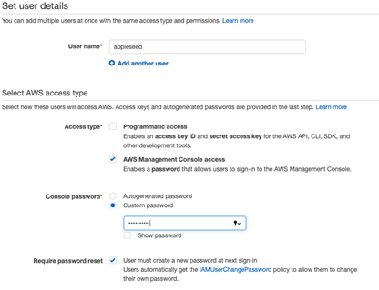

5.  Click "Next Permissions"

## Setting Permissions

1.  Select "Attach existing policies directly"

2.  Select the "AdministratorAccess" checkbox. This will give this user
    full access to AWS.

    **NB: This policy should only be used for the admin
    account that will be used to make the AWS environment. It should
    not be used for another user.**

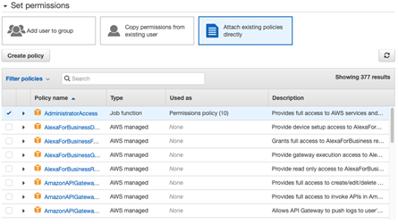

3.  Click "Next: Review"

4.  Review the details and click "Create user"

# Provisioning a Virtual Private Cloud (VPC)

1.  From the services menu at the top of the page search "VPC" and select "VPC"

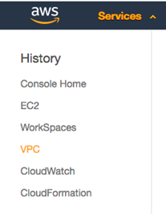

2.  Click "Launch VPC wizard"

3.  Select "VPC with a Single Public Subnet"

4.  Fill in the form:

    a. Name the vpc according to the [Conventions guide](./conventions-guide.md)
    e.g.`vpc-eu-west-2-WorkSpaces`.

    b. Set the IPv4 address and the Public IPv4 address for public CIDR block.

    IP address for VPC's should start at `176.16.0.0/21` and the
    3rd octet (the first '0' after '16' in this example) should increase by 10 for all subsequent VPC's. This is displayed [here](./conventions-guide.md#cidr-block).

    c. Set London as the region.

5.  The completed form should look similar to the image below:

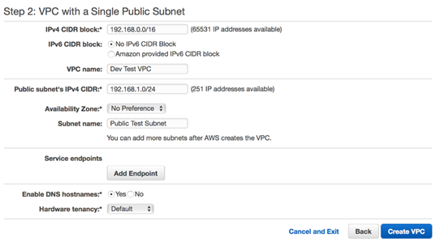

# Creating subnetworks (subnets)

In order to create a WorkSpace, you need to have set up 3 subnets. One of
these will be a public subnet and the other two will be private subnets.
By using the method [above](<#Provisioning-a-Virtual-Private-Cloud-(VPC)>) to create a VPC, the public subnet is already created by default.

Therefore, it is only necessary to create two private
subnets.

# Making the first private subnet

1.  From the services panel at the top of the console page, select "VPC".

2.  From the navigation panel on the left, select "Subnets".

3.  From the top of the page select "Create subnet".

4.  Fill in the form:

    a. Give the subnet an appropriate name, according to the
    [Conventions guide](./conventions-guide.md). For example, `sn-eu-west2a-pub-WorkSpaces`.

    b. Choose the VPC you would like the subnet to reside in.

    c. Choose the Availability Zone you would like the subnet to be
    hosted in.

    d. Give your subnet an appropriate IP - it cannot be in the same
    IP range as another subnet. It must also be in the range of your VPC
    assigned address pool. You can find more information on [how IP
    addressing works
    here](https://docs.aws.amazon.com/vpc/latest/userguide/vpc-ip-addressing.html).

    e. The completed form should look similar to the image below.

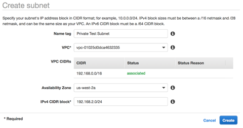

5.  Click "Create".

# Making the second private subnet

The creation of this subnet is the same as [above](#Making-the-first-private-subnet), however, you need to change the
name of the subnet according to the [Conventions guide](./conventions-guide.md).

Once you have created the two subnets, you can view them by clicking
"Subnets" from the navigation panel on the left-hand side. This takes you to the "subnet dashboard" and looks like the image below:

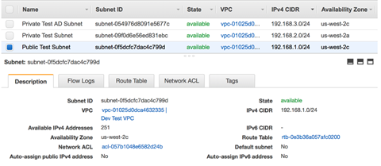

# Creating an Internet Gateway

This may have already been created if you provisioned your VPC with the "VPC with a Single Public Subnet" option in the VPC Wizard.

You can check to
see if an Internet Gateway has been added to your VPC by going to
Services -\> VPC -\> Internet Gateways, selecting any available entries and checking the Attached VPC ID matches your VPCs.

# Adding an Internet Gateway

1.  From the services menu at the top of the page, select "VPC".

2.  From the navigation panel on the left-hand side, select "Internet Gateway".

3.  Click "Create Internet Gateway"

4.  Fill out the form

    a. Add a name tag.

    b. Click "Create".

# Attaching the Internet Gateway to your VPC

1.  On the Internet Gateway dashboard, select the Internet Gateway you just created.

2.  Once selected, click the actions button above the dashboard.

3.  From the drop-down, click "Attach to VPC".

4.  Select your VPC from the drop-down menu and click
    "Attach".

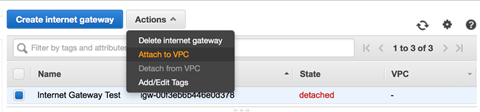

5.  You should now see your Internet Gateway with the appropriate VPC
    specified in the _Attached VPC ID_ field.

6.  Once attached, the Internet Gateway should look something like the
    image below:

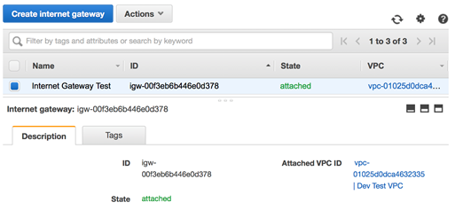

# Creating a NAT Gateway

1.  From the services menu at the top of the console, select "VPC".

2.  From the navigation panel on the left select "NAT Gateway".

3.  Click "Create NAT Gateway".

4.  Fill out the form

    a. For the subnet select your **Public Subnet** which you created
    in the first section.

    **NB: You will have to go to: Services -\>
    VPC -\> Subnets if you need to find the Subnet ID**

    b. Click "Create New EIP" to assign an elastic IP.

5.  The form should look similar to the image below:

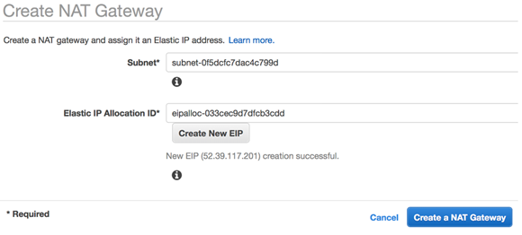

6.  Click "Create a NAT Gateway". This may take a few minutes to create.

    Once it is up and running the status will be set to _available_. You
    will need to refresh the page to check this as the page does not
    automatically update.

7.  Once available the console should look like the image below:

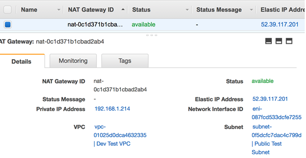

# Updating route tables

You need routes to allow the components to communicate. The private
subnets need to be able to communicate with the public subnet and the
public subnet needs to communicate with the Internet Gateway.

The private and public subnets are interfaced by the NAT Gateway. The public subnet and the internet are interfaced by the Internet Gateway.

# Public -\> Internet Gateway route

This allows all **outbound traffic** to be routed to the Internet.

If you used the VPC wizard then you can skip this step. The VPC wizard
will have configured this for you. You may wish to take this opportunity
to add a name tag.

1.  From the services menu at the top of the console select "VPC"

2.  From the navigation panel on the left select "Route Tables"

3.  Click "Create Route Table"

    a. Name your Route Table according to the [Conventions guide recommended security groups](./conventions-guide.md#recommended-security.groups).

    b. Select your VPC.

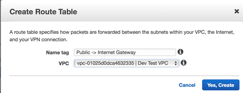

1.  Select the Route Table you just created, go to the "Routes" tab.

    c. Click "Edit" and then "Add another route".

    d. For the _Destination_ enter "0.0.0.0/0" and set the _Target_ as
    the **Internet Gateway** you created in the [section](#Creating-an-Internet-Gateway) above.

    e. Click "Save" and you should have something similar to the image
    below:

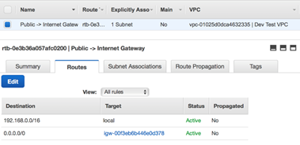

5.  Go to the "Subnet Associations" tab and click "Edit".

6.  Select your public subnet and click "Save".

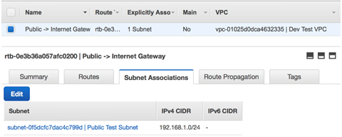

# Private -\> Public route

If you used the VPC wizard, then you can skip to the 3rd step in this
stage. The wizard will have added, **BUT NOT** configured this
route for you.

1.  Follow the same steps as above to create the route table.

2.  Once created, select the Route Table you just created and go to the
    "Routes" tab.

3.  Select "Edit" and then "Add another route".

4.  For the _Destination_ enter "0.0.0.0/0" and set the Target as the
    NAT Gateway you created in section 6.

5.  Click "Save" and you should have something similar to the image
    below:

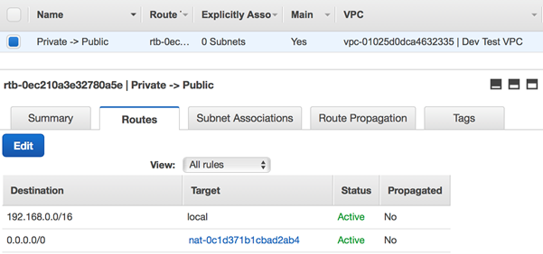

6.  Go to the "Subnet Associations" tab and click "Edit".

7.  Select your two private subnets and click "Save".

8.  You should have something similar to the image below:

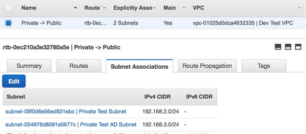

# Creating an EC2 instance

Elastic Compute Cloud (EC2) is _a web service that provides secure,
resizable compute capacity in the cloud_. EC2 instances are servers that allow you to run applications.

1.  From the services menu, select "EC2".

2.  Click "Launch Instance".

3.  Search for or select the OS you would like installed on the
    instance.

    Throughout this guide, applications will be installed on
    CentOS 7.

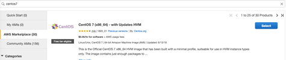

4.  Select the type of instance you require.

    Most of the applications in this documentation will function on `t2.medium` or `t2.large`.

    **NB: The instance type cannot be changed after the instance has
    been created. If a more powerful instance is required at a later date, you must create a new instance. **

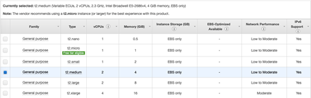

5.  Click "Next: Configure Instance Details"

6.  Fill out the form

    a. Enter the number of instances you require. If you require
    multiple of the same type of instance then enter how many you
    would like here

    b. Select the VPC where you would like to situate the EC2.

    c. Select the subnet where you would like the EC2 to be located.

    d. Leave the rest of the settings as their default values.

7.  Click "Next: Add Storage"

8.  Select an appropriate storage volume as per your requirements. Ensure you check hardware requirements of any applications you will install on the EC2.

9.  Click "Next: Add Tags".

10. Click "Add Tag".

11. For the "Key" enter "Name" and for "Value" enter a name for your
    EC2.

12. Click "Next: Configure Security Group".

13. Select the "create new security group" radio button.

14. Create security groups for your EC2 that are appropriate for the instance you are creating. The minimum required security groups can be found in the [conventions guide](./conventions-guide.md#recommended-security-groups).

15. Review all the details, then click the "Launch" button

Once you have clicked the "Launch" button you will see another window
regarding Pem keys. These are RSA Keys which are used to initially
connect to the EC2.

16. From the drop-down, select "Create a new key pair"

17. Enter a key pair name.

18. Click the "Download Key Pair" button.

**NB: This is the only time you can download the key. Keep it safe as
after this step, you will not recover this key and if it is lost then you
will have to delete the EC2 and recreate it.**

19. Click "Launch Instances".

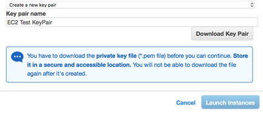

**Please note, it may take a few minutes for the EC2 to become available.**

# Route 53

Route 53 is a DNS resolver service for your network and removes the need to
memorise IP addresses and replaces them with a more readable format.

**NB: You must have set up your complete environment before enabling and
applying route 53.**

**NB: When creating route tables and security groups, you will still
need to use IP addresses.**

1.  From the services menu search for or select "Route 53"

2.  From the navigation panel on the left side of the page, click
    "Hosted zones"

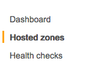

3.  Click the "Create Hosted Zone" button

4.  On the right-hand side of the page, the "Create Hosted Zone" window
    will appear. Fill in the details as follows:

    a. Domain Name: a domain name that will replace your IP addresses.
    Follow the [Conventions guide](conventions-guide.md) for naming.

    b. Comment: a descriptive comment.

    c. Type: Private Hosted Zone for Amazon VPC -- this is the free
    option and is designed for private clouds.

    d. VPC ID: Select the VPC you wish to create the Hosted Zone for.

    e. Click create once complete. You will be directed to the Hosted
    Zone's dashboard.

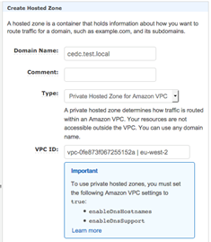

5.  AWS automatically creates two Record Sets for you. To add custom DNS
    names to particular instances, you must click "Create Record Set"

6.  The Create Record Set window will open on the right-hand side of the
    page, fill in the fields as follows:

    f. Name: the name of the instance you are creating a DNS name for
    e.g. jenkins\[**.cedc.test.local** is added automatically\]

    g. Value: the IP address of the instance

7.  Click create.

That's it. You will be able to access the instance using the DNS name,
_as well_ as the IP address. If software requires you to set a "Base
URL" - use the DNS name.

# VPC Peering

VPC peering allows two VPCs and the components within those VPCs to
communicate with each other. In this small example, we will explain how
to use a WorkSpace in one VPC to connect to an EC2 instance within
another VPC.

To achieve VPC Peering we will need at least the following:

- Two VPC's

- A private subnet in each VPC

- Correct routing and security groups for all of these components

## Creating the Peering Connection

1.  From the services menu search for or select "VPC"

2.  From the navigation panel on the left select "Peering Connections"

3.  Click the "Create Peering Connection" button

4.  Fill in the form for "Create Peering Connection"

    a. Enter an appropriate name tag according to the [Conventions guide](./conventions-guide.md)

    b. Select a requester VPC. This is the VPC requesting the
    connection. In this case, it would be the Dev Test VPC as that
    has our WorkSpace on, which we want to connect to our EC2
    through

    c. Select the region where your other VPC is based in

    d. Select the VPC who will be the acceptor. In this case, it will be
    the EC2 Test VPC

The form should look similar to the image below:

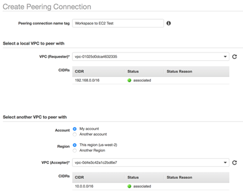{

5.  Click "Create Peering" button

6.  This will create a pending connection. You then need to "Accept
    Request" to activate it.

7.  From the "Actions" drop-down select "Accept Request"

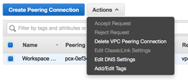

## Updating the Route Tables

The route tables then need updating so that the traffic is routed
through the Peering Connection

1.  From the navigation panel on the left select "Route Tables"

2.  We need to add a new route to both VPC's sending traffic through the
    peering connections to the other.

    a. Dev Test VPC Routes - Need to add a route to the Private subnet where we want to forward data from. Make sure the private route is associated.

    b. EC2 Test VPC Routes and subnets - Need to add a route to pass traffic to the first subnet. Need to make sure we have our subnet associated with the route too.

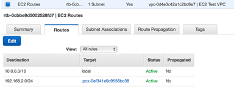

3.  Save these route tables

## Testing the VPC Peering Connection

To test that your two VPCs can communicate we will test logging into the
WorkSpace and pinging the EC2 that lives on the other VPC.

Once you know that pinging works, you can reach your instance. You can then connect using SSH or RDP to the EC2 - the protocol you use will depend on your
WorkSpaces and EC2 operating systems.

Go to the quick reference section to see [how to access an EC2 instance from a WorkSpace](./quick-reference.md#accessing-an-ec2-instance-from-a-workspace).

# Setting up a Microsoft Active Directory

A Microsoft Active Directory (AD) is a collection of services which help
manage users, groups and devices on a network.

We will be using the AD to enable Single Sign-On (SSO) throughout our network. A guide on SSO can be found in section [Setup Single Sign on](./setup-single-sign-on.md)

1.  From the services menu, select "WorkSpaces".

2.  From the navigation panel on the left-hand side of the page select
    "Directories".

3.  Click "Set up directory".

4.  Click "Create Microsoft AD".

5.  Fill out the form using the [Conventions guide](./conventions-guide.md)

    a. Organisation Name - A unique organization name for your
    directory that will be used to register client devices.

    b. Directory DNS -- A domain used to resolve your directory's
    location inside the VPC.

    c. NetBIOS name -- This will be the name of your domain which users
    will use to connect to when logging into other EC2's.

    The value of the NetBIOS name should be '`ad`'

    d. Administrator Password -- The admin password for your directory.
    You must remember this as this will be required when making any
    changes to your directory.

    e. Select the correct VPC in which you would like the directory to
    reside in. Please see the environment diagram in section [Automatic Pathway](./pathways.md#automatic-pathway) to
    understand where to locate the AD.

    f. Subnets -- Select the two private subnets you created earlier
    from the drop-down menus.

6.  You should have filled out the form like in the image below.

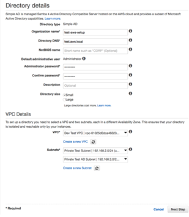

7.  Click "Next Steps"

8.  Review configuration and click "Create Microsoft AD"

**NB: It may take up to 30 minutes for the AD to become "Active". Please wait for
the AD to become "Active" before continuing. **

9.  Once the AD has become active the console should be like the image
    below:

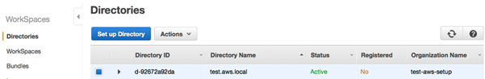

<h1>Pathways</h1>

|         |  |  |
| :-------------: |:--:|:-------------:|
||[Before you begin](before-you-begin.md) | |
||[Conventions Guide](conventions-guide.md) | |
||[Quick Reference](quick-reference.md) | |
||[AWS Overview](aws-overview.md) | |
| **Manual** |  | **Auto** |
|**&#8595;**| |**&#8595;**
| ***AWS Manual Setup*** | | [AWS Automatic Setup](aws-automatic-infrastructure.md)
| [Create a WorkSpace (AD setup)](create-a-workspace.md) | | [Create a WorkSpace (AD setup)](create-a-workspace.md) 
| [Setup Single Sign on](setup-single-sign-on.md) | |  [Setup Single Sign on](setup-single-sign-on.md)   [ - Import Users](setup-single-sign-on.md#Import-Users-and-Groups-to-the-Active-Directory)   [ - Configuring the AWS Management Console and AD](setup-single-sign-on.md#Configuring-the-AWS-Management-Console-and-AD)   
| [Tools Manual Installation](tools-manual-installation.md)   | | [Tools Automatic Install](tools-automatic-installation.md)
| [Create a WorkSpace (team workspaces)](create-a-workspace.md##create-additional-workspaces)  | | [Create a WorkSpace (team workspaces)](create-a-workspace.md##create-additional-workspaces)
||**&#8595;**
||[Additional AWS Setup](additional-aws-setup.md) | |
||[First time setup of tools](first-time-tools-setup.md)
||[First time setup of workspaces](first-time-workspaces-setup.md)

[<< Overview of AWS](aws-overview.md)

[Creating a WorkSpace (AD Setup) >>](create-a-workspace.md)
