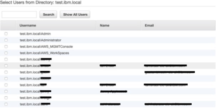
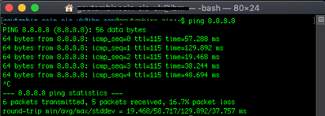

[<< Pathways](README.md)

# Create a WorkSpace

<!-- START doctoc generated TOC please keep comment here to allow auto update -->
<!-- DON'T EDIT THIS SECTION, INSTEAD RE-RUN doctoc TO UPDATE -->
**Table of Contents**

- [Background](#markdown-header-background)
- [Prerequisites](#markdown-header-prerequisites)
- [Create your first WorkSpace.](#markdown-header-create-your-first-workspace)
- [Create Additional WorkSpaces](#markdown-header-create-additional-workspaces)
- [Accessing a WorkSpace](#markdown-header-accessing-a-workspace)
    - [Downloading the WorkSpace Client](#markdown-header-downloading-the-workspace-client)
    - [Loging into the WorkSpace](#markdown-header-loging-into-the-workspace)
- [Pathways](#markdown-header-pathways)

<!-- END doctoc generated TOC please keep comment here to allow auto update -->

# Background

WorkSpaces are Virtual Machines (VM's) hosted in the cloud. These VM's
can have various OS's installed on them however the setup process
remains the same for all.

# Prerequisites

You need to register the directory once it has been set up, before creating any WorkSpaces and setting up single sign-on.

1. From the WorkSpaces dashboard, select Directories from the left-hand side.

2. Select the directory you wish to register.

3. Click Actions

4. Select "Register"

# Create your first WorkSpace.

The first WorkSpace user you create should be created on the AWS Management Console. For best practice, all additional WorkSpaces should be created using users from the Active Directory.

1.  From the services menu select "WorkSpaces"

2.  Click "Launch Workspaces"

3.  Select the directory you created in section [Setting up a Microsoft Active Directory](./aws-manual-infrastructure.md#setting-up-a-microsoft-active-directory)

4.  Click "Next Steps"

5.  Fill in the forms

    i. Enter the user's username

    ii. Enter the user's first name and last name and their email
    address

    iii. Click "Create Users"

**NB: Once the WorkSpace has been created it is not possible to change
the users. A new WorkSpace will need to be created.**

6.  Click "Next Steps"

7.  Select the appropriate Linux or Windows bundle for the WorkSpace.

8.  Click "Next Step"

9.  Ensure "AutoStop" is enabled. This will stop the WorkSpace if not
    used for more than 1 hour

10. Review the setting of the WorkSpace

11. Click "Launch WorkSpace"

**NB: It can take up to 20 minutes for a WorkSpace to launch. If steps
were followed the user will receive an email with other steps to follow
to set up their passwords.**

# Create Additional WorkSpaces

Complete this step when you have created users in the Active Directory, and you are ready to create WorkSpaces for those users.

1.  From the services menu select "WorkSpaces"

2.  Click "Launch Workspaces"

3.  Select the directory you created in section [Setting up a Microsoft Active Directory](./aws-manual-infrastructure.md#setting-up-a-microsoft-active-directory)

4.  Click "Next Steps"

5.  Fill in the forms

    If you are setting up WorkSpaces for users that have already been created in the Active Directory, follow steps **5.a** onwards.

    a. If you need to create a user that _does not exist in the Active Directory_, please skip to part **5.b.** for guidance on setting up your Setup WorkSpace.

    i. Under the heading "Select Users from Directory:" click "Show all Users". This should display all the users in the AD.

    

    ii. Select all the users you would like to make WorkSpaces for. You can
    select up to 20 users at a time

    iii. Click "Add Selected"

    b. Please follow the below steps to add additional users and add them to Active Directory.

    Under the heading "Create New Users and Add Them to Directory: " Fill in the forms

    i. Enter the user's username

    ii. Enter the user's first name and last name and their email
    address

    iii. Click "Create Users"

**NB: Once the WorkSpace has been created it is not possible to change
the users. A new WorkSpace will need to be created.**

6.  Click "Next Steps"

7.  Select the appropriate Linux or Windows bundle for the WorkSpace.

8.  Click "Next Step"

9.  Ensure "AutoStop" is enabled. This will stop the WorkSpace if not
    used for more than 1 hour

10. Review the setting of the WorkSpace

11. Click "Launch WorkSpace"

**NB: It can take up to 20 minutes for a WorkSpace to launch. If steps
were followed the user will receive an email with other steps to follow
to set up their passwords.**

# Accessing a WorkSpace

## Downloading the WorkSpace Client

In order to log into a WorkSpace, you need to have the client installed
on your machine. The download for the client can be found
[here](https://clients.amazonworkspaces.com/). Download the correct
client for your machine and install it.

## Loging into the WorkSpace

Depending on which steps you followed in section [Create Additional WorkSpaces](#create-additional-workspaces), the user will have
either received an email from AWS explaining how to set up their account
along with the registration code they will need to log on with. If the
LDAP route was followed then supply the user their username and
temporary password. The registration code, in this case, will be the same
for all WorkSpaces in the same region.

The logging in process is the same for both types of user creation.

1.  Enter the registration code

2.  Enter the username

3.  Enter the password

If the environment was set up correctly then you should have access to
the internet. This can be confirmed by either using the browser to
access any website or through the CLI by using the following command

ping 8.8.8.8

This will ping google. You should receive output similar to the image
below if the connection is successful:

<h1>Pathways</h1>

|         |  |  |
| :--: |:--:|:--:|
||[Before you begin](before-you-begin.md) | |
||[Conventions Guide](conventions-guide.md) | |
||[Quick Reference](quick-reference.md) | |
||[AWS Overview](aws-overview.md) | |
| **Manual** |  | **Auto** |
|**&#8595;**| |**&#8595;**
| [AWS Manual Setup](aws-manual-infrastructure.md) | | [AWS Automatic Setup](aws-automatic-infrastructure.md)
| ***Create a WorkSpace (AD setup)*** | | ***Create a WorkSpace (AD setup)***
| [Setup Single Sign on](setup-single-sign-on.md) | | [Setup Single Sign on](setup-single-sign-on.md)   [ - Import Users](setup-single-sign-on.md#Import-Users-and-Groups-to-the-Active-Directory)   [ - Configuring the AWS Management Console and AD](setup-single-sign-on.md#Configuring-the-AWS-Management-Console-and-AD)   
|[Tools Manual Installation](tools-manual-installation.md)   | | [Tools Automatic Install](tools-automatic-installation.md)
| ***Create a WorkSpace (team workspaces)***  | | ***Create a WorkSpace (team workspaces)***
||**&#8595;**
||[Additional AWS Setup](additional-aws-setup.md)
||[First time setup of tools](first-time-tools-setup.md)
||[First time setup of workspaces](first-time-workspaces-setup.md)

[<< AWS Manual Setup](aws-manual-infrastructure.md)

[Setup Single Sign on >>](setup-single-sign-on.md)