[<< Pathways](README.md)

# First Time Tools Setup

<!-- START doctoc generated TOC please keep comment here to allow auto update -->
<!-- DON'T EDIT THIS SECTION, INSTEAD RE-RUN doctoc TO UPDATE -->
**Table of Contents**

- [Setting up Jira, Bitbucket and Confluence](#markdown-header-setting-up-jira-bitbucket-and-confluence)
    - [Finding Base DN detail through command line](#markdown-header-finding-base-dn-detail-through-command-line)
- [Setting up Jira](#markdown-header-setting-up-jira)
    - [Configuring Jira Mail Server](#markdown-header-configuring-jira-mail-server)
    - [Connecting Jira to Microsoft Active Directory](#markdown-header-connecting-jira-to-microsoft-active-directory)
        - [Prerequisites](#markdown-header-prerequisites)
        - [Setting Jira up with the AD](#markdown-header-setting-jira-up-with-the-ad)
    - [Setting permissions and roles in Jira](#markdown-header-setting-permissions-and-roles-in-jira)
        - [Allow groups access](#markdown-header-allow-groups-access)
        - [Assign a group to a role](#markdown-header-assign-a-group-to-a-role)
        - [Manage role permissions by creating Permission Schemes](#markdown-header-manage-role-permissions-by-creating-permission-schemes)
    - [Additional Security](#markdown-header-additional-security)
- [Setting up Bitbucket](#markdown-header-setting-up-bitbucket)
    - [Configuring Bitbucket Mail Server](#markdown-header-configuring-bitbucket-mail-server)
    - [Connecting Bitbucket to Microsoft Active Directory](#markdown-header-connecting-bitbucket-to-microsoft-active-directory)
        - [Prerequisites](#markdown-header-prerequisites_1)
        - [Setting Bitbucket up with the AD](#markdown-header-setting-bitbucket-up-with-the-ad)
    - [Setting permissions and roles in Bitbucket](#markdown-header-setting-permissions-and-roles-in-bitbucket)
        - [Assign groups to roles](#markdown-header-assign-groups-to-roles)
        - [Assign project repository permissions](#markdown-header-assign-project-repository-permissions)
    - [Additional Security](#markdown-header-additional-security_1)
- [Setting up Confluence](#markdown-header-setting-up-confluence)
    - [Configure Confluence Mail Server](#markdown-header-configure-confluence-mail-server)
    - [Connecting Confluence to Microsoft Active Directory](#markdown-header-connecting-confluence-to-microsoft-active-directory)
    - [Setting Confluence up with the AD](#markdown-header-setting-confluence-up-with-the-ad)
        - [Assign Global Permissions](#markdown-header-assign-global-permissions)
        - [Assign Space Permissions](#markdown-header-assign-space-permissions)
    - [Additional Security](#markdown-header-additional-security_2)
- [Setting up Jenkins](#markdown-header-setting-up-jenkins)
    - [Default login details:](#markdown-header-default-login-details)
    - [Connecting Jenkins to Microsoft Active Directory](#markdown-header-connecting-jenkins-to-microsoft-active-directory)
        - [Create Local Roles](#markdown-header-create-local-roles)
        - [Assign AD Groups to Jenkins Roles](#markdown-header-assign-ad-groups-to-jenkins-roles)
    - [Setting up Jenkins Mail Server](#markdown-header-setting-up-jenkins-mail-server)
    - [Additional Security](#markdown-header-additional-security_3)
- [Setting up Nexus OSS](#markdown-header-setting-up-nexus-oss)
    - [Connecting Nexus OSS to Microsoft Active Directory](#markdown-header-connecting-nexus-oss-to-microsoft-active-directory)
        - [Map Active Directory Groups to Nexus Roles](#markdown-header-map-active-directory-groups-to-nexus-roles)
    - [Setting up Nexus Mail Server](#markdown-header-setting-up-nexus-mail-server)
    - [Additional Security](#markdown-header-additional-security_4)
- [Setting up Vault](#markdown-header-setting-up-vault)
    - [Connecting Vault to the LDAP server](#markdown-header-connecting-vault-to-the-ldap-server)
    - [Assigning Policies and Groups to LDAP users](#markdown-header-assigning-policies-and-groups-to-ldap-users)
    - [Additional Security](#markdown-header-additional-security_5)
- [Integrating Bitbucket with Jenkins](#markdown-header-integrating-bitbucket-with-jenkins)
    - [Prerequisites](#markdown-header-prerequisites_2)
    - [Set up](#markdown-header-set-up)
- [Linking Atlassian tools](#markdown-header-linking-atlassian-tools)
    - [Linking Jira with other Atlassian Tools](#markdown-header-linking-jira-with-other-atlassian-tools)
        - [Prerequisite](#markdown-header-prerequisite)
        - [Example - Linking Jira and Bitbucket](#markdown-header-example-linking-jira-and-bitbucket)
- [Add a certificate authority to the browser](#markdown-header-add-a-certificate-authority-to-the-browser)
    - [Prerequisites](#markdown-header-prerequisites_3)
    - [Clear browser cookies](#markdown-header-clear-browser-cookies)
    - [Add certificate to the browser](#markdown-header-add-certificate-to-the-browser)
- [Generate a SSH key pair](#markdown-header-generate-a-ssh-key-pair)
- [Access Bitbucket Repos from Jenkins over SSH](#markdown-header-access-bitbucket-repos-from-jenkins-over-ssh)
    - [Prerequisites:](#markdown-header-prerequisites)
    - [Add a public access key to Bitbucket](#markdown-header-add-a-public-access-key-to-bitbucket)
    - [Add your SSL credentials to Jenkins](#markdown-header-add-your-ssl-credentials-to-jenkins)
- [Manually Connecting EC2's to AD](#markdown-header-manually-connecting-ec2s-to-ad)
    - [Connecting the EC2 instance to the AD](#markdown-header-connecting-the-ec2-instance-to-the-ad)
    - [Allowing SSH to use password authentication](#markdown-header-allowing-ssh-to-use-password-authentication)
    - [Restricting Account Login Access](#markdown-header-restricting-account-login-access)
- [Manually Schedule EC2 instance(s) to auto turn off and turn on](#markdown-header-manually-schedule-ec2-instances-to-auto-turn-off-and-turn-on)
    - [Download ec2-schedular template:](#markdown-header-download-ec2-schedular-template)
    - [CloudFormation Stack](#markdown-header-cloudformation-stack)
    - [Implementing this schedule on an EC2 instance](#markdown-header-implementing-this-schedule-on-an-ec2-instance)
- [Pathways](#markdown-header-pathways)

<!-- END doctoc generated TOC please keep comment here to allow auto update -->

# Setting up Jira, Bitbucket and Confluence

## Finding Base DN detail through command line

1.  In the CMD prompt on your AD Server (or EC2 that connects to your AD
    server) enter:

```
dsquery user -name \<known username\>
```

2.  **DC** = **D**omain **C**omponent -- in the example: test.ibm.local,
    the domain components are **test**, **ibm** and **local.** Hence
    they are written in the **Base DN** as **DC=test,DC=ibm,DC=local**


3.  **OU** = **O**rganisational **U**nit -- this is the tree of your
    Organisational Units. In the tree test.ibm.local.**test.Users** (top
    down), the Organisational Units are t**est** and **Users**. In the
    Additional User DN field, the OU's are written from right to left,
    hence in this example: **ou=Users,ou=test**

4.  **CN = C**ommon **N**ame -- for when specifying specific _users_ or
    _groups_ from an organisational unit. In the example image below, one user is specified, so only that user and it's group association will be pulled from the Active Directory.

    To specify a group of users (Organizational Unit) you must specify the OU in the user DN.

    The User DN should be set as follows:

    OU=Users,OU={TeamName},OU={ADName}

    The Group DN should be set as follows:

    OU=Groups,OU={TeamName},OU={ADName}

# Setting up Jira

Once Jira has been installed and confirmed to be running it can be set
up for the first time.

1.  From your workspace, go to a web browser and visit
    \<EC2ipaddress\>:8080. You should see the Jira setup screen.

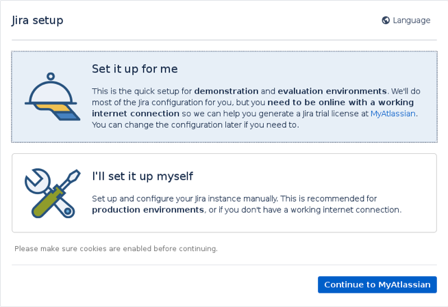

1.  On the setup page, select "I'll set it up myself" and click next

2.  On the next page. Select the "My Own Database" radio button and
    enter the details for the database you prepared earlier.

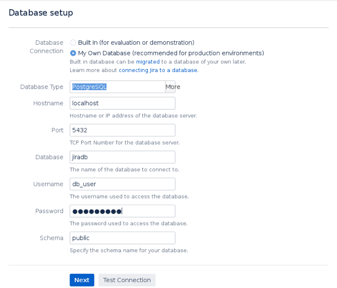

1.  Test the connection. Ensure you changed the permissions in the
    pg_hba.conf file and restarted the postgresql-11 service

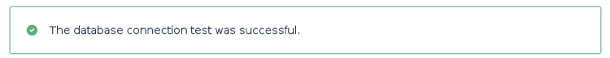

1.  Click "Next". The database will take some time to set up.

2.  Enter an appropriate application title and click Next. The base URL
    will be the IP address of the EC2 instance by default

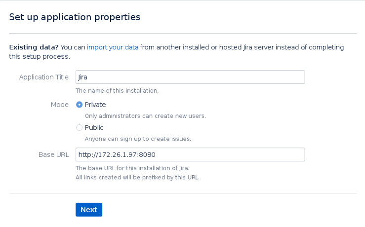

1.  Enter your license key. For initial setup purposes, you can request a
    Trial Key from Atlassian which expires after 30 days.

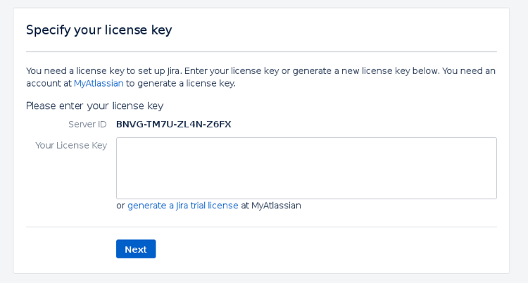

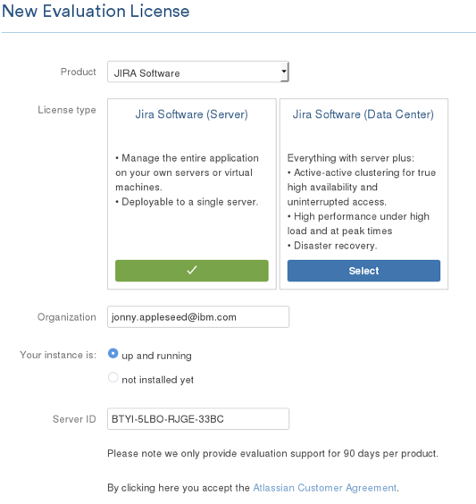

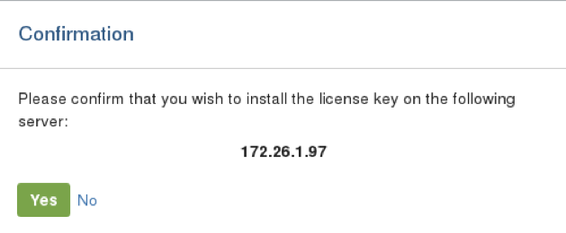

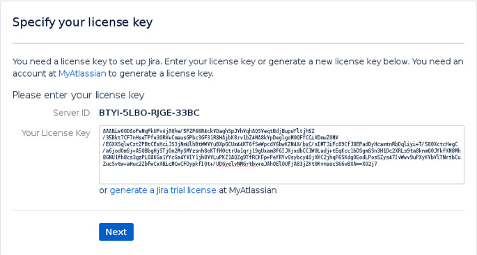

2.  Click Next

3.  Set up an administrator account

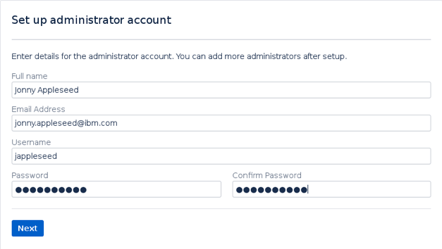

4.  Click Next

5.  Configure your email notifications server later and click Finish.

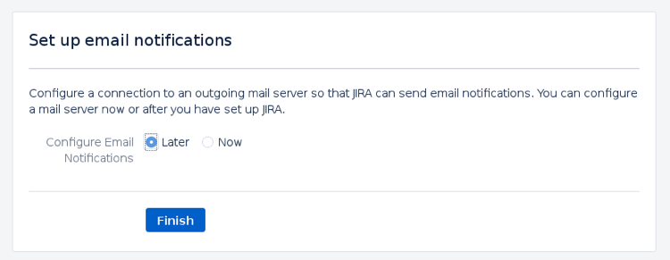

6.  Choose your language settings and click continue

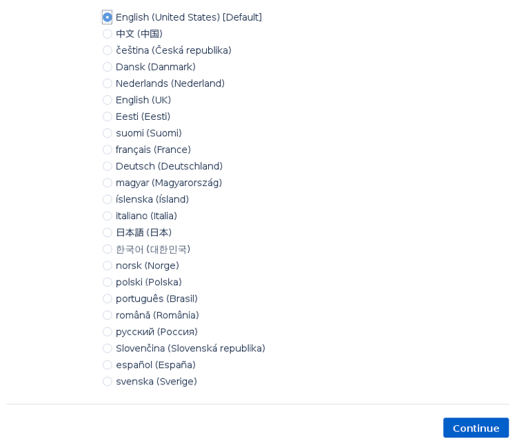

7.  OPTIONAL: Choose your admin user avatar and click next

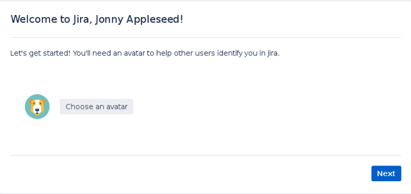

8.  You have now deployed Jira successfully

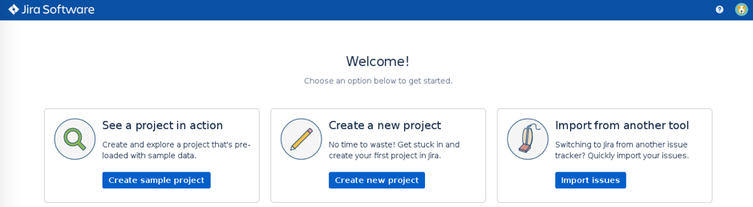

## Configuring Jira Mail Server

**NB: Common issues:**

- **Not entering a username or password will yield a successful test
  connection, due to security restrictions you will not be able to
  send emails. This will result in authentication exceptions in the
  logs.**

- **Timeout errors are typically due to the default SMTP port 25 being
  used, amazon purposefully throttles this port. Use ports 587 or 2587
  instead. This will result in timeout exceptions in the logs.**

- **You do not need to verify a domain before verifying an email
  address.**

1.  From the Jira dashboard, click the Settings cog and select System

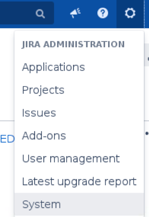

2.  Enter your administrator credentials if prompted

3.  From the left-hand menu, select "Outgoing Mail" underneath the
    "Mail" heading

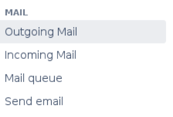

4.  Select "Configure New SMTP Mail Server"

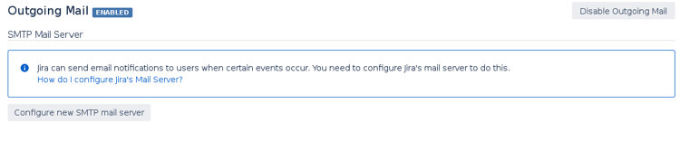

5.  Fill out the Name fields as follows

    a. Name -- a name for the mail server

    b. Description -- a description for the mail server

    c. From address: a verified email address that will be displayed as
    the sender

    d. Email prefix: a prefix for all email subjects

6.  Fill out the Server Details as follows

    e. Service Provider -- CUSTOM

    f. Protocol -- SMTP

    g. Host Name for EU (Ireland): email-smtp.eu-west-1.amazonaws.com

    h. SMTP Port -- MUST BE 587 or 2587

    i. Timeout -- keep the default value (10000)

    j. TLS -- Tick this checkbox as AWS will only accept emails sent
    via TLS

    k. Username -- your SMTP username

    l. Password -- your SMTP password

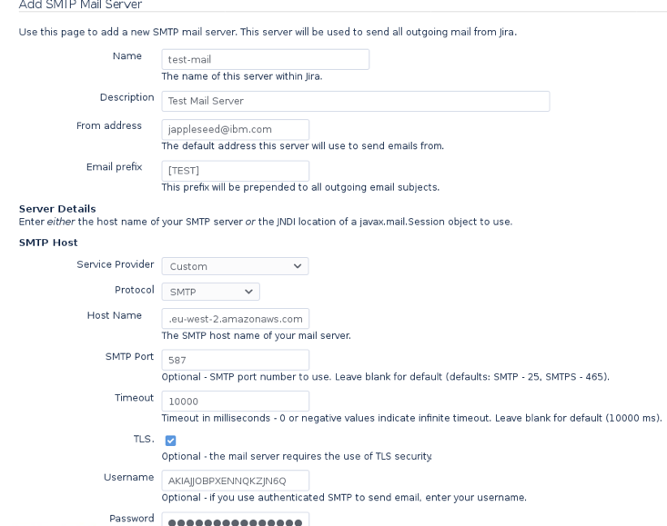

7.  Test the connection

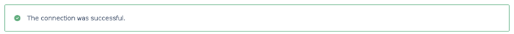

8.  Click "Add" if the test was successful

9.  Back on the Outgoing Mail dashboard, click on the "Send a Test Email"
    option under your new Mail Server

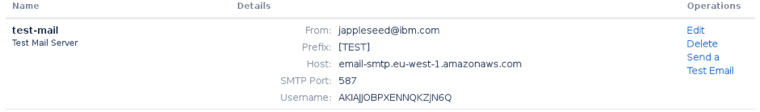

10. Click the "Send" button

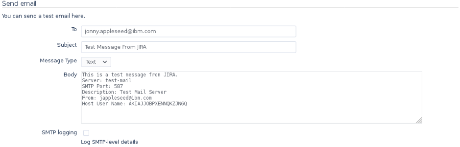

11. You should see a message in the log file beneath

## Connecting Jira to Microsoft Active Directory

### Prerequisites

You must have Jira installed and running to continue.

### Setting Jira up with the AD

1.  From the Jira dashboard, click the Settings cog in the top
    right-hand corner and select User management.

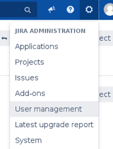

2.  Enter your credentials if prompted.

3.  From the left-hand side menu, select "User Directories"


4.  Click the "Add Directory" button

5.  Fill out the Server Settings fields as follows

    a. Name: descriptive name in accordance with conventions.

    b. Directory type: the type of directory you're using. For
    Microsoft AD chooses Microsoft Active Directory. For Simple AD,
    select Generic Directory Service.

    c. Hostname: the directory name e.g. test.ibm.local

    d. Port: 389 by default

    e. Username: <username@directory.name.here>

    f. Password: password for the user

    g. Base DN - can be found by following [this section](#finding-base-dn-detail-through-command-line)

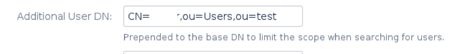

6.  LDAP Permissions

    h. Set to "Read Only" so that users, groups and memberships
    received from the LDAP server cannot be modified in Jira.

7.  The Advanced, User Schema, Group Schema and Membership Schema should
    already be filled out for you. You need to change "Upgrade group
    memberships when logging in" from "for new added users only" to
    "Every time the user logs in"

8.  Advanced

    a. Upgrade group memberships when logging in: **Every time the user
    logs in**

    b. Synchronisation Interval (minutes): 60

    c. Read timeout (seconds): 120

    d. Search timeout (s): 60

    e. Connection timeout (s): 10

9.  User Schema

    a. User object class: user

    b. User object filter: (&(objectCategory=Person)(sAMAccountName=\*)

    c. Username attribute: sAMAccountName

    d. User name RDN attribute: cn

    e. User first name attribute: givenName

    f. User last name attribute: sn

    g. User display name attribute: displayName

    h. User email attribute: mail

    i. User password attribute: unicodePwd

    j. User unique ID attribute: objectGUID

10. Group Schema


    a.  Group object class: group

    b.  Group object filter: (objectCategory=Group)

    c.  Group name attribute: cn

    d.  Group description attribute: description

11. Membership Schema


    a.  Group members attribute: member

    b.  User membership Attribute: memberOf

    c.  You can leave the checkboxes blank

12. Select "Quick Test" to check you can connect to the directory


13. Click "Save and Test" - you will see a page that says several tests
    were not performed

14. Enter your username and password that you used to connect to the
    LDAP server in the box below, and select "Test Settings"

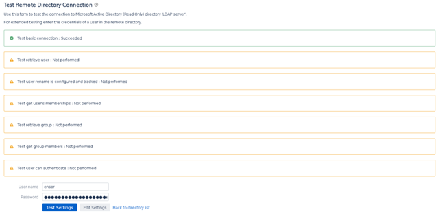

15. At the time of writing "Test user can authenticate" was not
    performed because the example did not authenticate via SSL

16. Navigate back to the user directories dashboard, you will see your
    LDAP server

17. Select synchronise on the right-hand side to sync Jira and the LDAP
    server

18. Navigate to the Users section under "User Management" - you will now
    see all users from your active directory


19. You should verify the groups and permissions that individual roles
    will require. Users should not be given total administrative access.

## Setting permissions and roles in Jira

### Allow groups access

1.  From the Jira administration dashboard, select "Application access"
    on the left-hand side menu.

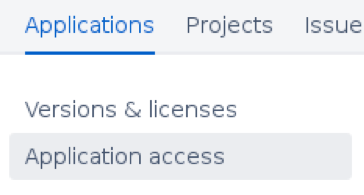

2.  In the drop-down box, search the group you wish to grant access
    privileges to

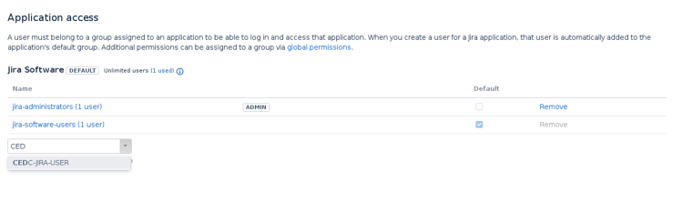

3.  This group now has access to Jira

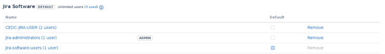

### Assign a group to a role

1.  From the Jira dashboard, select the Settings cog and click System

    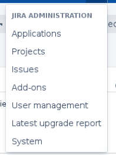

2.  Select "Project Roles" from the left-hand side menu

    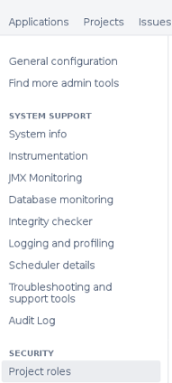

3.  Under "Add Project Role" enter a name and description of the role.
    Click Add Project Role when complete.

    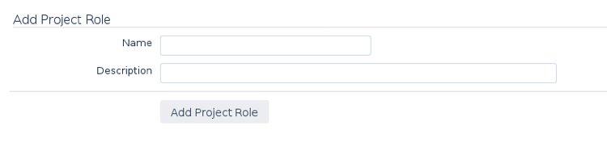

    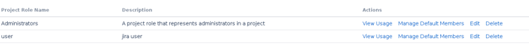

4.  Open the project you wish to add users to

5.  On the left-hand side, select the Project settings cog

    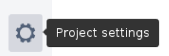

6.  Select "Add users to a role" search for the group you want to add,
    then select the role. Click "Add"

    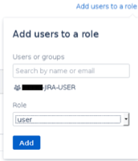

### Manage role permissions by creating Permission Schemes

1.  From the Administration dashboard, select Issues. Scroll down the
    left-hand side menu to "Permission Schemes"

    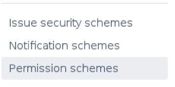

2.  Select "Add permission scheme"

    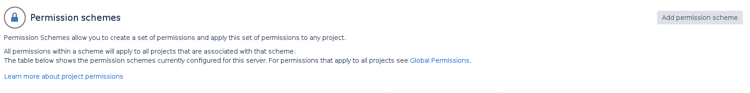

3.  Fill in the fields and click "Add"

    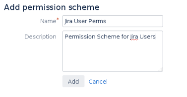

4.  Back on the dashboard, click "Permissions"
    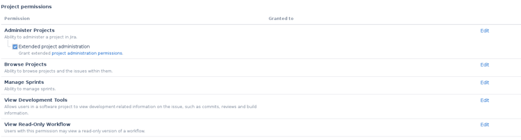

5.  General users should not have full administration settings. If you
    are configuring permissions for general users, uncheck the "Extended
    project administration" under the Administer Projects permission.

6.  Go through each permission and set the desired privileges for each
    user group. You do not need to save this page, Jira will
    automatically update the permission scheme.

    a. Project role: the role you created in the step before.

    b. Application access: if a user can access Jira, they will be able
    granted the permission you are editing.

    c. Group: here you can delegate to groups from the Active Directory

    d. Click "Show More" for additional options.

    e. Click grant when you are finished with that specific permission.

    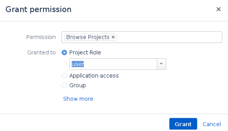

    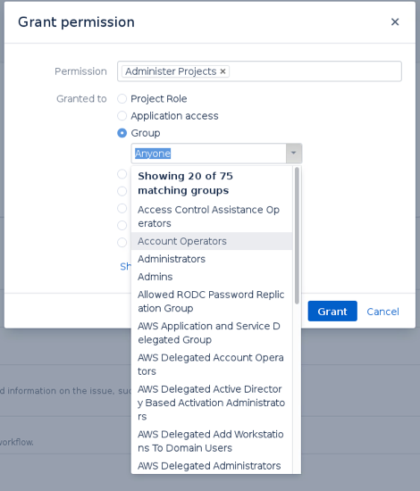

## Additional Security

#### Configure Automatic Updates
You can configure Jira to automatically update add-ons. This is recommended to ensure software used is up
date and reduce risk from unpatched vulnerabilities.

1. Log into Jira as an admin user.

2. Click on **Settings** icon in top right of screen (if it's not there talk to the system admin) and selece **Add-ons**

    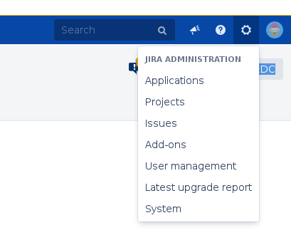

3. Scroll to bottom of page and click **Settings**

    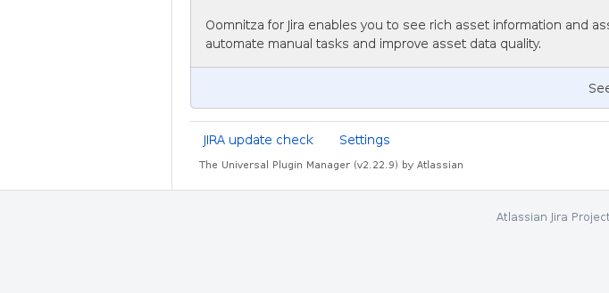

4.  Enable the Automatically Update Atlassian-Selected Apps option.

    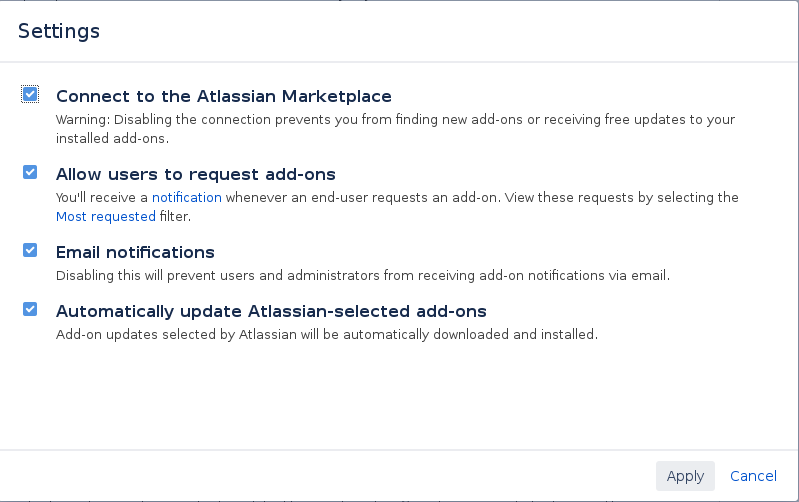

5. Click Apply
   


#### Disable port 8080

If you haven't done so already then make sure that there is no inbound traffic on port 8080 allowed. Jira
once secured with a SSL certificate will listen on port 8443, so there is no need to have 8080 inbound open.
You can remove this security rule if it exists in the AWS console.

1. Login to the AWS console

2. Select **Services** -> **EC2**

3. Click on your Jira EC2 and find it's security groups. Click "view inbound rules" to see if there is a rule
    allowing traffic over port 8080. The picture below shows that we are allowing 8080 and which security 
    group is allowing this. 
    
    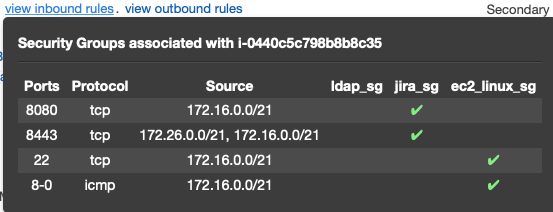 
    
    You either need to remove that security group from the Jira EC2 or delete the rule from the security
    group. If the security group is used by other EC2s then it would be best not to edit the security group,
    and instead remove it from the Jira EC2 as you may brake something on a different EC2 by removing the
    8080 rule.
    
#### Keep updated
Make sure the version of Jira being run is regularly updated. 


# Setting up Bitbucket

1.  Through the WorkSpace browser navigate to the ip address of the
    Bitbucket server followed by the 7990 port number

2.  Select "External" Database and enter the database details you
    created

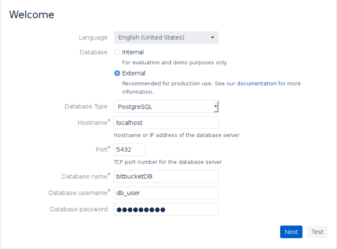

3.  Test the connection

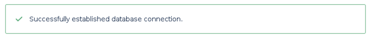

4.  Click Next

5.  Enter your license key or obtain an evaluation license.

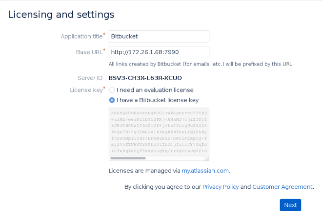

6.  Click Next

7.  Create an administrator account

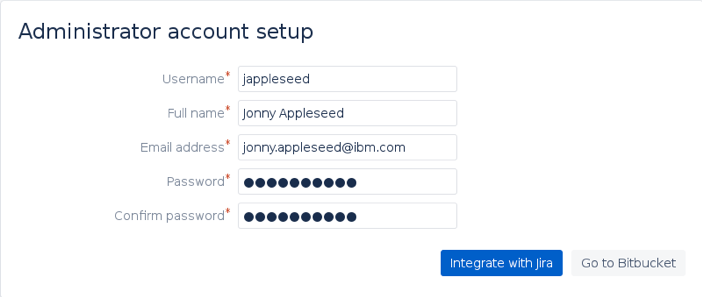

8.  Log in with your administrator credentials

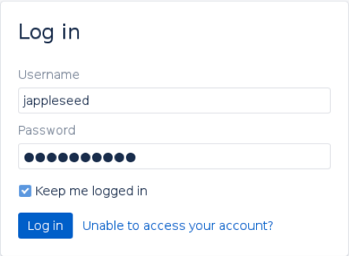

## Configuring Bitbucket Mail Server

9.  From the Bitbucket dashboard, click the Settings cog


10. From the left-hand menu, select "Mail Server"

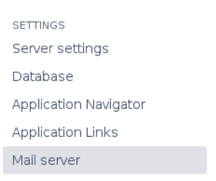

11. Fill in the fields as follows:


    a.  Hostname - EU (Ireland): email-smtp.eu-west-1.amazonaws.com

    b.  Port: 587 or 2587

    c.  Username: Your SMTP Username

    d.  Password: Your SMTP Password

    e.  Tick "Use SSL/TLS if available" AND "Always use SSL/TLS"

    f.  Email from: The email address you want the email to come from
        (must be verified).

    g.  Click Save.

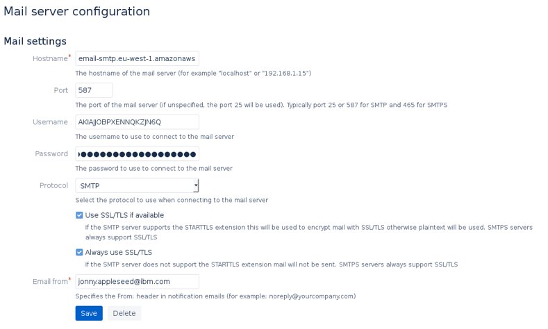

## Connecting Bitbucket to Microsoft Active Directory

### Prerequisites

- Have Bitbucket set up and running

### Setting Bitbucket up with the AD

1.  From the Bitbucket dashboard, click the Settings cog in the top
    right-hand corner and select User management.

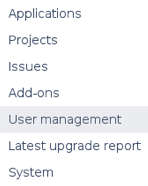

2.  Enter your credentials if prompted.

3.  From the left-hand side menu, select "User Directories"


4.  Click the "Add Directory" button

5.  Fill out the Server Settings fields as follows

    a. Name: descriptive name in accordance with conventions.

    b. Directory type: the type of directory you're using. For
    Microsoft AD chooses Microsoft Active Directory. For Simple AD,
    select Generic Directory Service.

    c. Hostname: the directory name e.g. test.ibm.local

    d. Port: 389 by default

    e. Tick use SSL if you have configured the Hashicorp Vault CA.

    f. Username: <username@directory.name.here>

    g. Password: password for the user

    h. Base DN - can be found by following [this section](#finding-base-dn-detail-through-command-line)


6. LDAP Permissions

   h. Set to "Read Only" so that users, groups and memberships
   received from the LDAP server cannot be modified in Jira.

7. The Advanced, User Schema, Group Schema and Membership Schema should
   already be filled out for you. You need to change "Upgrade group
   memberships when logging in" from "for new added users only" to
   "Every time the user logs in"

8. Advanced

   a. Upgrade group memberships when logging in: **Every time the user
   logs in**

   b. Synchronisation Interval (minutes): 60

   c. Read timeout (seconds): 120

   d. Search timeout (s): 60

   e. Connection timeout (s): 10

9. User Schema

   a. User object class: user

   b. User object filter: (&(objectCategory=Person)(sAMAccountName=\*)

   c. User name attribute: sAMAccountName

   d. User name RDN attribute: cn

   e. User first name attribute: givenName

   f. User last name attribute: sn

   g. User display name attribute: displayName

   h. User email attribute: mail

   i. User password attribute: unicodePwd

   j. User unique ID attribute: objectGUID

10. Group Schema

    a. Group object class: group

    b. Group object filter: (objectCategory=Group)

    c. Group name attribute: cn

    d. Group description attribute: description

11. Membership Schema

    a. Group members attribute: member

    b. User membership Attribute: memberOf

    c. You can leave the checkboxes blank

12. Select "Quick Test" to check you can connect to the directory


13. Click "Save and Test" - you will see a page that says several tests
    were not performed

14. Enter your username and password that you used to connect to the
    LDAP server in the box below, and select "Test Settings"


15. At the time of writing "Test user can authenticate" was not
    performed because the example did not authenticate via SSL


16. Navigate back to the user directories dashboard, you will see your
    LDAP server

17. Select synchronise on the right-hand side to sync Jira and the LDAP
    server

18. Navigate to the Users section under "User Management" - you will now
    see all users from your active directory


19. You should verify the groups and permissions that individual roles
    will require. Users should not be given total administrative access.

## Setting permissions and roles in Bitbucket

### Assign groups to roles

1.  From the bitbucket administration panel, select "Global Permissions"
    on the left-hand side menu


2.  Under "Group Access" - start typing the name of a group in the
    search field. Select the desired group from the list and click the
    "Add" button


3.  For each user, check the appropriate permissions scheme.

### Assign project repository permissions

1.  From the Bitbucket dashboard, select a project and open a
    repository.

2.  From the left-hand send menu, select the Repository Settings cog.


3.  Select "Repository Permissions" from the left-hand menu


4.  Scroll down to "Group access" and search for groups in the "Add
    Groups" field, select the appropriate permissions for those groups.

    

## Additional Security

#### Configure Automatic Updates
  
1. Log into Bitbucket as an admin user and click **Settings** cog in top right hand corner

2. Select **Manage apps** within the Add-ons section of the Administration menu
    

3. Click **Settings** at bottom of page
    

4. Enable Automatically update Atlassian-selected apps
    

5. Click apply

#### Disable port 7990

If you haven't done so already then make sure that there is no inbound traffic on port 7990 allowed. Bitbucket
once secured with a SSL certificate will listen on port 8443, so there is no need to have 7990 inbound open.
You can remove this security rule if it exists in the AWS console.

1. Login to the AWS console

2. Select **Services** -> **EC2**

3. Click on your Bitbucket EC2 and find it's security groups. Click "view inbound rules" to see if there is a rule
    allowing traffic over port 7990. The picture below shows that we are allowing 7990 and which security 
    group is allowing this. 
    
     
    
    You either need to remove that security group from the Bitbucket EC2 or delete the rule from the security
    group. If the security group is used by other EC2s then it would be best not to edit the security group,
    and instead remove it from the Bitbucket EC2 as you may brake something on a different EC2 by removing the
    7990 rule.
    
    
#### Keep updated
Make sure the version of Jira being run is regularly updated. 


# Setting up Confluence

1.  Open, through your workspace's browser by entering the ip address of
    your Confluence EC2 followed by the 8090 port number.

2.  Select "Product Installation" and click Next.


3.  Select any apps you wish to install on top of Confluence and click
    Next


4.  Enter your license key or get an evaluation license, click Next


5.  Select "my own database"


6.  Enter your database credentials. Ensure you have edited the
    permissions in pg_hba.conf and restarted the postgresql-9.6 server


7.  Click "Next" and select "Empty site"


8.  Configure user management by selecting "Manage users and groups
    within Confluence" as we will be connecting Confluence to the AD
    later.

9.  All done


## Configure Confluence Mail Server

Prerequisites:

- You must have created SMTP credentials in AWS Simple Email Service to proceed.

1.  From the Confluence dashboard, click the Settings cog and select
    "General Configuration"


2.  From the left-hand menu, select Mail Servers


3.  Select "Add a new SMTP mail server"

4.  Fill in the SMTP server details as follows:

    a. Name -- SMTP Server is the default value

    b. From address -- the verified email address you want the emails
    to come from.

    c. From name -- leave as default

    d. Subject prefix -- a prefix that appears before the start of
    email subjects.

5.  Fill in the Server hostname as follows:

    a. Server hostname -- EU (Ireland):
    email-smtp.eu-west-1.amazonaws.com

    b. Server port: 587 or 2587

    c. Username: Your SMTP User

    d. Password: Your SMTP Password

    e. Select "Use TLS"

6.  Click "Submit"

7.  From the Mail Servers dashboard, click "Send test email"

8.  Click "Send"

## Connecting Confluence to Microsoft Active Directory

## Setting Confluence up with the AD

1.  From the Confluence dashboard, click the Settings cog in the top
    right-hand corner and select User management.

    

2.  Enter your credentials if prompted.

3.  From the left-hand side menu, select "User Directories"

    

4.  Click the "Add Directory" button

5.  Fill out the Server Settings fields as follows

    a. Name: descriptive name in accordance with conventions.

    b. Directory type: the type of directory you're using. For
    Microsoft AD choose Microsoft Active Directory. For Simple AD,
    select Generic Directory Service.

    c. Hostname: the directory name e.g. test.ibm.local

    d. Port: 389 by default

    e. Tick use SSL if you have configured the Hashicorp Vault CA.

    f. Username: <username@directory.name.here>

    g. Password: password for the user

    h. Base DN - can be found by following [this section](#finding-base-dn-detail-through-command-line)

6.  LDAP Permissions

    a. Set to "Read Only" so that users, groups and memberships
    received from the LDAP server cannot be modified in Jira.

7.  The Advanced, User Schema, Group Schema and Membership Schema should
    already be filled out for you. You need to change "Upgrade group
    memberships when logging in" from "for new added users only" to
    "Every time the user logs in"

8.  Advanced

    a. Upgrade group memberships when logging in: **Every time the user
    logs in**

    b. Synchronisation Interval (minutes): 60

    c. Read timeout (seconds): 120

    d. Search timeout (s): 60

    e. Connection timeout (s): 10

9.  User Schema

    a. User object class: user

    b. User object filter: (&(objectCategory=Person)(sAMAccountName=\*)

    c. User name attribute: sAMAccountName

    d. User name RDN attribute: cn

    e. User first name attribute: givenName

    f. User last name attribute: sn

    g. User display name attribute: displayName

    h. User email attribute: mail

    i. User password attribute: unicodePwd

    j. User unique ID attribute: objectGUID

10. Group Schema


    a.  Group object class: group

    b.  Group object filter: (objectCategory=Group)

    c.  Group name attribute: cn

    d.  Group description attribute: description

11. Membership Schema


    a.  Group members attribute: member

    b.  User membership Attribute: memberOf

    c.  You can leave the checkboxes blank

12. Select "Quick Test" to check you can connect to the directory


13. Click "Save and Test" - you will see a page that says several tests
    were not performed

14. Enter your username and password that you used to connect to the
    LDAP server in the box below, and select "Test Settings"


15. At the time of writing "Test user can authenticate" was not
    performed because the example did not authenticate via SSL

    

16. Navigate back to the user directories dashboard, you will see your
    LDAP server

17. Select synchronise on the right-hand side to sync Jira and the LDAP
    server

18. Navigate to the Users section under "User Management" - you will now
    see all users from your active directory


19. You should verify the groups and permissions that individual roles
    will require. Users should not be given total administrative access.

### Assign Global Permissions

1.  From the confluence administration panel, under the "Users &
    Security" heading, select "Global Permissions"


2.  Click the "Edit Permissions" button in the top right-hand corner of
    the page


3.  Search for groups in the field "Grant browse permissions to" and
    click "Add"

4.  Assign appropriate permissions by ticking the checkboxes.


5.  Click 'Save All' once complete

### Assign Space Permissions

1.  Select "Space Permissions" under the Users & Security heading


2.  Click the "Edit Permissions" button


3.  Add groups to the permissions table and grant appropriate permission
    settings.


4.  Click save when complete

## Additional Security

#### Configure Automatic Updates
1. Log into confluence as a user with Admin priviledges

2. Click **Settings** cog in top right corner of screen and choose **Manage Apps**
    

3. Click on **Settings** at bottom of page
    

4. Enable Automatically update Atlassian-selected apps
    

5. Click **Apply** 

#### Disable port 8090

If you haven't done so already then make sure that there is no inbound traffic on port 8090 allowed. Confluence
once secured with a SSL certificate will listen on port 8443, so there is no need to have 8090 inbound open.
You can remove this security rule if it exists in the AWS console.

1. Login to the AWS console

2. Select **Services** -> **EC2**

3. Click on your Confluence EC2 and find it's security groups. Click "view inbound rules" to see if there is a rule
    allowing traffic over port 8090. The picture below shows that we are allowing 8090 and which security 
    group is allowing this. 
    
     
    
    You either need to remove that security group from the Confluence EC2 or delete the rule from the security
    group. If the security group is used by other EC2s then it would be best not to edit the security group,
    and instead remove it from the Confluence EC2 as you may brake something on a different EC2 by removing the
    8090 rule.
    
#### Keep updated
Make sure the version of Confluence running is regularly updated. 


# Setting up Jenkins

## Default login details:
```
Username: admin
Password: password
```

## Connecting Jenkins to Microsoft Active Directory

The details in the following screenshots work for a structure like the
one shown in the image below. You might need to use slightly different
details depending on how you set your Active Directory up.


1.  Find your Active Directory details to use. See [here  on instructions on how to do this.](#finding-base-dn-detail-through-command-line)

2. Click "Manage Jenkins"
    
    
3. Click "Configure Global Security"
    

4. Select the LDAP Security Realm and add your servers domain name into the "Server" field
    
    
5. Click "Advanced Server Configuration" and fill in the details as necessary. Below are the ones needed to match the above LDAP configuration
    

6. Click "Test LDAP Settings" and enter a user's username and password
    

7. Click "Test" and if configured correctly you will get some green icons and messages telling you the connection was
    successful
    

8. In Authorisation select "Role-Based Strategy"
    

9. Click "Save"

    
   

### Create Local Roles

1. Click "Manage Jenkins"
    
    
2. Click "Manage and Assign Roles"
    
    
3. Click "Manage Roles" 
    

4. In Global Roles add a role to create e.g. admin. You should add all the necessary roles you will need now.
    
    
5. Your added roles should be added to a table above where you can assign permissions to the roles. Tick all the permissions
    you would like to add for the different roles.
    
    
6. When finished scroll to the bottom and click "Save"
    


### Assign AD Groups to Jenkins Roles

1. Click "Manage Jenkins"
    
    
2. Click "Manage and Assign Roles"
    
    
3. Click "Assign Roles"
    
    
4. In Global Roles add an AD group you want to assign Jenkins privileges to. The spelling and capitalisation must match
    otherwise Jenkins will not map the permissions correctly. Click "Add" and repeat this step for all the AD groups you 
    would like to add
    
    
5. All of your AD roles and Jenkins Groups should now be in the Global Roles Matrix. Assign the AD roles to the Jenkins
    role with the appropriate permissions. If you do not wish people without an LDAP account to be able to see/do anything
    on Jenkins then remove the permissions for the "Anonymous" group
    
    
6. When finished click "Save"
    
    
7. To test log out and try logging back in using a username and password combination in the LDAP server


## Setting up Jenkins Mail Server

1. Make sure you have an SMTP user setup and verified on the AWS Console as shown [here](./quick-reference.md#verify-an-email-address)

2. Click "Manage Jenkins"
    

3. Click "Configure System"
    

4. In the Jenkins Location section fill in the "Jenkins URL" location as the address of your Jenkins domain e.g. 
    https://jenkins.tools.cedc.cloud:8443 and the "System Admin email address" with your SMTP user's email

    
5. In the Email Notification section click "Advanced" to expand all of the configuration options and fill in the details
    accordingly. The SMTP Server should be your Amazon SMTP Endpoint you chose when creating your SMTP user and the 
    default SMTP port on EC2's is 25

    

6. Test your email settings are correct by putting in an address in the "Test Email Recipient" field and clicking 
    "Test Configuration". There should be a message displayed saying whether the email was sent successfully or not.
    

7. Click "Save"

    

## Additional Security 

#### Install and configure the OWASP Dependency Checker Plugin

The OWASP Dependency checker will check the different dependencies associated with your project against a database of 
known vulnerabilities, and will highlight any issues found.

##### Install the OWASP Dependency Checker Plugin
1. Click "Manage Jenkins"
    
    

2. Click "Manage Plugins"
    
    
    
3. Select the "Available" tab and search "Owasp"
    
    

4. Select "OWASP Dependency-Check" and click "Install without Restart"
    
    

5. The installation should start. Select "Restart Jenkins when installation is complete and no jobs 
    are running". This should ensure the plugin is installed and running upon the next restart
    
    

##### Specifiy local directory for OWASP-NVD
Next we need to specify a location where we would like to put our OWASP-NVD data directory. This directory will contain a 
database of known vulnerabilities, which we will use to check against a job's dependencies to make sure they do not contain 
any of them. We have specified "/var/lib/jenkins/owasp/owasp-nvd" as our path as var/lib/jenkins is where our Jenkins
installation sits and /owasp/owasp-nvd makes it very clear what the directory is holding. 

1. Click "Manage Jenkins"

    

2. Click "Configure System"

    

3. In the "Dependency-Check" section add out data path "/var/lib/jenkins/owasp/owasp-nvd"

    

4. Click "Save"

##### Create a daily job to update the OWASP-NVD
Now we need a job that will create this local database populated with OWASP's list of vulnerabilities and keep it updated. 
The first time this job is run with populate the database so will take a lot longer than subsequent runs which will only provide 
any updates to the database. It will also create the necessary path for us e.g. owasp/owasp-nvd
    
1. Select "New Item" in the left-side menu

    
    
2. Give the job a descriptive name and select "Freestyle project" before clicking "Ok"
    
    
    
3. We want this job to run daily so in the Build Trigger section tick "Build Periodically" and in the schedule put "@daily"
    
    
    
4. In the Build section choose "Add Build Step" and then "Invoke Dependency-Check update only"

    

5. You can leave the Data directory path here blank. Jenkins should pick it up from the Global directory we specified previously
    
    

5. Click "Save" to save the changes.

6. Select "Build Now" to run the job. This first run should take around 3-5 minutes if on a t2.medium EC2 instance. 
    
    
    
7. Once the job is finished the status icon should be blue. If red then there is an issue and you will need to check the 
    console output, which you can find by selecting the build you have just run in the "Build History" section.
    
    

8. A successful message should end like this:
    
    

##### Add Dependency-checking to jobs
Now we have the database created and have a daily update for it. We need to then need to add it to necessary jobs.

1. Select a job you would like to add it to and click "Configure"

    §
    
2. Click "Add build step" and select "Invoke Dependency-Check analysis" from the sub-menu
    

3. Leave "Path to Scan blank" unless you want the analysis to be performed on a section of the code. 

    

4. Click "Advanced..." and then tick "Disable NVD auto-update". We are already updating the NVD in the daily job we created earlier

    
    
5. Click "Save"

6. Now the next time you "Build" the job you should see some dependency analysis being performed in the output 
    (it will be prefixied by [DependencyCheck]). 

    

7. You can see the output from the analysis in the Workspace of the job being run. It is contained in a file 
    called dependency-check-report.xml
    
    

#### Enable Cross Site Request Forgery (CSRF) Prevention

When this option is enabled, Jenkins will check for a CSRF token, or "crumb", on any request that
may change data in the Jenkins environment. This includes any form submission and calls to the 
remote API, including those using "Basic" authentication. 

It is strongly recommended that this option be enabled. Please be aware thoughcthat some older plugins
may not work with this option, and if you are accessing Jenkins through a poorly-configured reverse proxy 
then the CSRF HTTP header may be stripped from requests, resulting in protected actions failing. 
This is something you will need to test to make sure the proxy still works correctly once CSRF protection
is enabled.

1. Click "Manage Jenkins"
    
    
2. Click "Configure Global Security"
    

3. Tick "Prevent Cross Site Request Forgery exploits" and select the "Default Crumb Issuer"
    
    
4. Click "Save"
    
    
    
#### Enable Agent/Master Access Control
For larger or mature Jenkins environments where a Jenkins administrator might enable agents provided by other teams or 
organizations you will want to enable Agent/Master Access Control. Agent processes are able to ask the master process for information 
available to it, for example, the contents of files, etc. which you may not want external teams to have.

The Agent/Master Access Control allows Jenkins administrators to add more granular access 
control definitions between the Jenkins master and the connected agents to restrict certain actions. To do this:

1. Click "Manage Jenkins"
    
    
2. Click "Configure Global Security"
    

3. Tick "Enable Agent - Master Access Control" 
    
    
4. Click "Save"
    
        
    
5. Now that the control is enabled. You can start customising access right. This should be customised for your own specific
    use cases. More information on the actions available for restriction and how to diable them can be found 
    [here](https://jenkins.io/doc/book/managing/security/#customizing-access).

#### Disable port 8080

If you haven't done so already then make sure that there is no inbound traffic on port 8080 allowed. Jenkins
once secured with a SSL certificate will listen on port 8443, so there is no need to have 8080 inbound open.
You can remove this security rule if it exists in the AWS console.

1. Login to the AWS console

2. Select **Services** -> **EC2**

3. Click on your Jenkins EC2 and find it's security groups. Click "view inbound rules" to see if there is a rule
    allowing traffic over port 8080. The picture below shows that we are allowing 8080 and which security 
    group is allowing this. 
    
     
    
    You either need to remove that security group from the Jenkins EC2 or delete the rule from the security
    group. If the security group is used by other EC2s then it would be best not to edit the security group,
    and instead remove it from the Jenkins EC2 as you may brake something on a different EC2 by removing the
    8080 rule.

#### Enable Auditing

There are two plugins you can enable on Jenkins to provide auditing information. They do slightly different
jobs. The Audit Trail plugin looks at who performed particular Jenkins operations, such as configuring jobs,
and the JobConfigHistory Plugin looks at recording actual changes made to job configurations. Both are worth
enabling.

1. Enable Audit Trail Plugin

    a. Click "Manage Jenkins"
    
    
     
    b. Click "Manage Plugins"
    
    
         
    c. Select the "Available" tab and search "Audit Trail". Tick the Audit Trail plugin that appears.
    
    
         
    d. Click "Install without Restart"

    e. The installation should start. Select "Restart Jenkins when installation is complete and no jobs 
        are running". This should ensure the plugin is installed and running upon the next restart
    
    
            
    f. Once Jenkins has restarted you will get a new subsection in the "Configure Global Security" section called 
        "Audit Trail" which you will need to fill in
        
    g. Click "Configure Settings"
     
    
           
    h. You should now see the "Audit Trail" section in here. 
    
    
        
    i. Click "Add Logger" and select "Log File"
    
    
        
    j. Fill in the necessary details. 
    - Log Location will be where your log files will be placed. Using
        the the path /var/log/jenkins/audit-%g.log will make audit files that have naming conventions
        like audit-0.log, audit-1.long, etc. 
    - Log file size will be the maximum mb you want stored in the log files
    - Log File Count defines how many log files you want keeping. When this number is exceeded the older log
        files will start to be deleted.
    
    
    
    k. Click "Save"
    
    l. It will create the log files automatically for you and you can find them in /var/log/jenkins/
        
    

2. Enable JobConfigHistory Plugin

    a. Click "Manage Jenkins"
    
    
     
    b. Click "Manage Plugins"
    
    
         
    c. Select the "Available" tab and search "jobconfighistory". 
    
    
         
    d. Tick the "Job Config History" plugin and click "Install without Restart"
    
    
        
    e. The installation should start. Select "Restart Jenkins when installation is complete and no jobs 
        are running". This should ensure the plugin is installed and running upon the next restart
    
    
            
    f. After the installation is complete you should see a new heading called "Job Config History"
     
    
    
    g. In the "Job Config History" you will find a detailed list of what actions have been performed 
    
    

# Setting up Nexus OSS

## Connecting Nexus OSS to Microsoft Active Directory

The details in the following screenshots work for a structure like the
one shown in the image below. You might need to use slightly different
details depending on how you set your Active Directory up.


1.  Find your Active Directory details to use.

2.  Log into Nexus

    a.  Click the "Sign in" on the right-hand side


       b. For the credentials put the username as "admin" and the
        password as "admin123". This is a default password that we would recommend changing later


    c.  Click "Sign in"

3.  Enable the LDAP authentication realm. This is needed so users can
    log in using their LDAP credentials.

    a.  Click the cog button at the top to open the Settings page


     b.  Select "Realms" in the left-hand menu


    c.  Select the "LDAP Realm" option in the Available box and press
        the "\>" button


    d.  Once the "LDAP Realm" option in the Active section click
        "Save"


4.  Add the LDAP Configuration

    a.  Select "LDAP" in the left-hand menu


    b.  Click "Create Connection"


c.  Fill in the details on the Connection screen. See screenshot for
        example details.

i.  Name: A descriptive name to describe this connection

ii. LDAP Server Address: by default, your server will use the
            LDAP protocol on port 389 of your Active Directories domain.

iii. Search base: This is where the search will start for users
            and groups. It should be the domain of your AD server but
            separated into key-value pairs. If your AD sat at
            active.dir.com then this value would be:
            dc="active",dc="dir",dc="com".
            
 Please note that spaces cannot be used here as it causes
            issues.

iv. Authentication method: choose Simple authentication s this
            will let you use a username and password

v.  Username and password field: this should be of a user who
            has the privileges to retrieve and search users and groups
            in your AD
                   


d.  Click "Verify Connection" to make sure your LDAP machine can be
    reached. You should receive the following message if the connection
    is successful


e.  Click the "User and Group" tab and fill in the details on there.
    Again an example of details is added below.

i. Configuration Template: Don't select a template

ii. Base Domain: Enter the base domain that you would like to
        search in your Active Directory. This will be the path to the
        folder which contains all your relevant users and groups. This
        needs to be written with no spaces and note that the path is
        actually reversed. For example, if all your users and groups
        were located in ad.Team.Users then this value would be:
        ou="Users",ou="Team",ou="ad"

iii. Tick "Are users located in structures below the user base dn"

iv. Object class: specify the user objects type

v.  User filter: Add a filter which will only show relevant users

vi. User ID attribute: a unique attribute that distinguishes the
        user from all of the others

vii. Real name attribute: user field containing the user's full name

viii. Email attribute: user field containing the user's email address

ix. Password attribute: leave this blank as Nexus will bind with
        the LDAP server to authenticate the user. A password is still
        required though if this is left blank

x. Tick "Map LDAP groups as roles"


xi. Group Type: Select "static groups"

xii. Group base DN: This will be the path to the folder which contains
    all your groups. This needs to be written with no spaces and note
    that the path is actually reversed. For example, if your groups were
    located in ad.Team.Groups then this value would be:
    ou="Groups",ou="Team",ou="ad"

xiii.  Tick "Are groups located in structures below the group base DN"

xiv. Group object class: Specify the LDAP group object class

xv. Group ID attribute: The attribute that uniquely defines a group

xvi. Group Member attribute: The attribute containing the usernames for
    the group

xvii. Group Member format: The format of how users are stored in your
    active directory


<!-- -->

f.  Verify the user mapping

i.  Click "Verify user mapping"

ii. You should get a Success message and a window containing three columns with your users, their names and which roles they belong to. If any of these details are missing, then you have not set up the connection correctly.


g.  Verify you can log in

i. Click "Verify Login"

ii. When prompted enter the username and password of a user who is
        contained in your User directory


iii.  Click "Test connection" and if it is successful then you
        should get a login successful message.


### Map Active Directory Groups to Nexus Roles

1.  In the left-hand menu go to "Roles"


2.  Click the "Create Role" drop-down, select "External Role Mapping"
    and then "LDAP"

  

3.  Enter your role details:

    a.  Mapped Role: Select a Role from Active Directory which you would
        like to give Nexus permissions to

    b.  Role name: Give it a unique name

    c.  Role Description: Extra details on what the role should be used
        for

    d.  Privileges: Actions this Role should be able to perform. Select
        any "Available" actions in the left menu and to assign them by
        clicking "\>" and moving the required actions into the "Given"
        section.

    e.  Roles: If you would like this role to contain the privileges of
        any other roles then similar to the previous item, move the
        relevant roles in the "Given" section.


4.  Click "Create Role"

5.  Repeat for the other AD roles you would like to add to your system
    -- changing the privileges and actions accordingly.

## Setting up Nexus Mail Server

1.  In the left-hand menu go to "Email Server" under the System menu


2.  Fill in the details for your email server

    a.  Enabled: Tick to enable this server

    b.  Host: Enter the AWS endpoint for your selected SMTP region

    c.  Port: Port you want to connect to your mail server on

    d.  Use the Nexus truststore: Do not use this option

    e.  Username: Your SMTP IAMS user credentials username

    f.  Password: Your SMTP IAMS user credentials password

    g.  From Address: The address you would like to send emails from

    h.  Subject Prefix: A prefix all emails will contain from Nexus

    i.  SSL/TLS options: Select only "Require STARTTLS Support"


3.  Verify the server is setup correctly

    a.  Click "Verify email server"

    b.  Enter an email address to send a test email to


        c.  Click "Verify"

        d.  You should get a notification that your email has sent successfully and an email in your inbox


4.  If you haven't done so yet click "Save" to ensure your email
    settings are saved.

## Additional Security

#### Change the default admin password
By default the admin password on Nexus OSS is "admin123". This is publicly known and very weak password, which
should be changed as soon as possible using the steps below. 

**NB Changing the password for the default admin user can have an issue where the password needs to be changed within a 
small time limit once you are logged in (15 seconds one person has reported). So the following steps will need to be 
done swiftly. If you get an "Invalid Authentication Ticjet" error message then you must log out and log back in again 
before attempting the following steps** 

1. Log into Nexus with the admin username and "admin123" password
    

2. Open the account's profile by clicking the "admin" name in the top-right
    

3. Click "Change password"
    
    
4. Enter the current password again for validation
    
    
5. Enter your new password twice and click "Change password"
    

#### Disable port 8081

If you haven't done so already then make sure that there is no inbound traffic on port 8081 allowed. Nexus
once secured with a SSL certificate will listen on port 8443, so there is no need to have 8081 inbound open.
You can remove this security rule if it exists in the AWS console.

1. Login to the AWS console

2. Select **Services** -> **EC2**

3. Click on your Nexus EC2 and find it's security groups. Click "view inbound rules" to see if there is a rule
    allowing traffic over port 8081. The picture below shows that we are allowing 8081 and which security 
    group is allowing this. 
    
     
    
    You either need to remove that security group from the Nexus EC2 or delete the rule from the security
    group. If the security group is used by other EC2s then it would be best not to edit the security group,
    and instead remove it from the Nexus EC2 as you may brake something on a different EC2 by removing the
    8081 rule.

#### Enable Auditing

Once this option is enabled a table will be created that contains rows of audit records.
There will be records for every configuration change, as well as any asset or component 
additions and removals. Each row will give you some details about the event, including the type 
of event, when it happened and which user initiated the action. 

1. Login with an account with Admin priviledges
    
2. Go to the "Capabilities" menu
    
    
3. Click on the "Audit" row
    
    
4. Click "Enable"
    

5. A new submenu will be added under "System" called "Audit". Click on it
    
    
6.  This is where the audit information will now be placed for you to view it
    
    
#### Keep updated 
Sonatype posts any [known vulnerabilities](https://support.sonatype.com/hc/en-us/sections/203012668-Security-Advisories) 
online. Keeping updated with these so you can find out any potential threats and how to combat them. 

# Setting up Vault

## Connecting Vault to the LDAP server

Before trying to connect the LDAP Auth engine to Vault it is best to make sure you have all the connection details correct first by connecting through the openldap tool. This gives better error messages than trying to connect through Vault

1. Install openldap
   a. yum install openldap\*
   
2. Run a generic search to make sure adequate results are returned. The password is entered into a file called pass.txt here and then included in the command
   a. echo “Password1!” > pass.txt
   b. ldapsearch -h "10.10.1.202" -D admin -w "\$(< pass.txt)" -b "DC=test,DC=ibm,DC=local" -s sub "(objectClass=\*)"  
   i. -h is your Active Directory’s IP address
   ii. -D is the user account you want Vault to be able to use
   iii.-w is the password for that user account
   iv. -b is the starting point for the search query
   v. -s specifies the scope of the search

3. Once you have the simple connection working you can move onto setting up LDAP in Vault

4. In Vaults UI which you can access at https://<vaultIpAddress>:8200/ui click “Access” in the top bar

    

5. Then click “Enable New Method” on the right-hand side

    

6. Select “LDAP” and click “Next”.

    

7. Fill in the details for your LDAP server. Below is an example:

    
    
    

8.  Click “Enable Method”

9.  Test using LDAP login credentials to access Vault. You will need a username and password from the LDAP server for use I this part

    a. vault login -method=ldap username=<yourUserNAme>

    b. Enter your password when prompted

    c. You should get authenticated into vault and receive a login token if the connection is successful

## Assigning Policies and Groups to LDAP users

The LDAP authentication method allows users which are registered in the Active Directory to authenticate into Vault but 
does not import any of the groups found within the AD. As such you will need to create your own groups, policies and 
associations within Vault itself.

The simplest way to carry out the following steps is through the Vault UI and so the following processes have been
documented using that method below. You could also use the Vault API or HTTP methods though. The Vault UI can be accessed at
https://{yourVaultDomain}:8200.

#### Create your aliases
Users will have to login at least once to Vault using their LDAP credentials before you can assign policies to them. When 
a user logs in an Entity is created for them along with an associated ldap Alias. This Alias is what we will be adding to
the appropriate groups in a later step. 

Make sure when logging in that users use the "LDAP" tab to login and not "Username" as their credentials will not be valid
on the "Username" tab. 


#### Create your policies
1. Login to Vault using the root token. At this point the root token is the only authentication method that will have the
    privileges you need to work with policies, groups and users unless you have granted additional privileges to other 
    users already.

    

2. Go to "Policies"

    

3. Click "Create an ACL Policy"

4. Give your policy a meaningful name and make a note of it. We will be assigning this policy to a group later and so need 
    the policy name. 

5. Add your policy details in the specified format. You can find more information about how policies work and which actions 
    you can grant access to [here](https://www.vaultproject.io/docs/concepts/policies.html)

    

6. Click "Create Policy"

#### Get your User Aliases
We need to get the Alias ID's for the Users we want to grant the policy we just made to. 

1. Go to "Access" in the the top menu

2. Click "Entities" in the left hand menu and you should see a list of entities. 

    

3. Click the "Alias" tab and find the username for the LDAP user(s) you want to grant the policy we just created to. 

4. Click on one of those aliases to open it's details

    

5. You should see a field called "Entity ID". Copy the value for that field and store it in an easy to access place. We 
    will need to use this value later.

    

6. Repeat the above steps until you have a note of all the aliases you would like to grant the policy to.

#### Create your Groups

1. Click "Groups" in the left hand menu

    

2. Click "Create Group"

3. Fill in the details for the group:

    a. Give the group a meaningful name

    b. Leave the "Type" as internal

    c. In "Policies" add the name of the policy we created earlier e.g. user. You could add 
        multiple policies to a group if you wished.

    d. In "Member Entity IDs" paste all of the "Entity IDs" we copied from the aliases earlier. 
        Click "add" after each one to make sure they are added correctly.

    

    e. Click "Create" and you will have finished assigning a policy to a group of LDAP users.

## Additional Security

#### Don't run the Vault service as Root

1. Add a new user to run Vault
    ```
    sudo adduser vault
    ```

2. Give them a unique password.
    ```
    sudo passwd vault 
    //enter unique password when prompted
    ```
    
3. Edit the Vault service and set the user to the one we have just created. You need to add
    **User=vault** in the **[Services]** section
    ```
    sudo vi /etc/systemd/system/vault.service 
    ```

4. Allow the new user to run the Vault service 
    ```
    sudo chown vault:vault /etc/systemd/system/vault.service
    ```

5. Restart the Vault box 
    ```
    sudo shutdown -r now
    ```

6. Make sure the service is up and running by trying to access the web UI at 
https://{vaultDomain}:8200/ui. Then make sure that the correct person is running the service.
You can do this by SSHing into the vault box and checking who is running the vault process
    ```
    ps -aux | grep vault
    ```
    
    If setup correctly the very first word of the line detailing the vault.service process 
    should say "vault", as this is the user which is running the process, as shown below.
    
    

#### Disable Core Dumps

A user or administrator who can force a core dump will have access to a file that can potentially provide access to the 
Vault encryption keys. To prevent this you need to disable core dumps. This differs depending on the OS.
On Centos EC2 you would do the following:

1. Add "**\* hard core 0**" to the limits.conf file to ensure users cannot change the number of core dumps they can do
    ```
    sudo vi /etc/security/limits.conf
    ```
    
2. Set suid_dumpable to 0 in the /etc/sysctl.conf file so the that core dumps can never be made by setuid 
    programs. The sysctl command below should give you a permission denied if fs.suid_dumpable is set correctly
    ```
    echo 'fs.suid_dumpable = 0' | sudo tee -a /etc/sysctl.conf
    sysctl -p
    ```

3. Stop creation of core dump files for all users
    ```
    echo 'ulimit -S -c 0 > /dev/null 2>&1' | sudo tee -a /etc/profile
    ```
    
#### Enable Auditing
Enabling auditing will keep a detailed log of all requests and response to
Vault. Because every operation with Vault is an API request/response, the audit log contains 
every authenticated interaction with Vault, including errors.

The request and response can be matched utilizing a unique identifier assigned to each request. 
The data in the request and the data in the response (including secrets and authentication 
tokens) will be hashed with a salt using HMAC-SHA256. This means secrets are not stored as plain text,
but can be checked by generating HMACs through the audit device's hash function and salt by using the 
[/sys/audit-hash API endpoint](https://www.vaultproject.io/api/system/audit-hash.html)

The following command when run on the Vault EC2 will write the audit logs to syslog for you to use
```
vault login {adminToken}     OR     vault login -method=ldap username="{adminUser}"
vault audit enable syslog tag="vault" facility="AUTH" prefix="[vault]"
```

The syslog facilities stores information inside /var/log/messages on Centos Systems. One way to see 
the Vault auditing information is to filter it from this file (using the [vault] prefix) and send it to 
the terminal or a file. The following command will simply print the relevant information to the 
terminal.

```
sudo cat /var/log/messages | grep '\[vault\]'
```

#### Disable SSH

It is encouraged to only access Vault through curl or it's web interface at port 8200, Due to this it is 
recommended to disable SSH. This can be done by deleting the inbound Security rule for SSH (port 22)
in the AWS console for the Vault EC2.

1. Login to the AWS console

2. Select **Services** -> **EC2**

3. Click on your Vault EC2 and find it's security groups. Click "view inbound rules" to see if there is a rule
    allowing traffic over port 22. The picture below shows an example if ww were allowing SSH and which security 
    group is enabling it. 
    
    
    
    You would either need to remove that security group from the Vault EC2 if present or delete the rule from the security
    group. If the security group is used by other EC2s then it would be best not to edit the security group,
    and instead remove it from the Vault EC2 as you may brake something on a different EC2 by removing the
    SSH rule.


# Integrating Bitbucket with Jenkins

This guide walks you through the process of polling Bitbucket from
Jenkins -- this instructs Jenkins to communicate with Bitbucket at
defined intervals to check for changes to the source code.

## Prerequisites

1.  You must have deployed Jenkins and Bitbucket and have opened the
    ports for Jenkins (default 8080) and Bitbucket (default 7990) so
    they can communicate.

2.  Git must also have been installed on the Jenkins server. These steps
    assume you have a basic understanding of Git, if you do not, see
    this link for learning resources: <https://try.github.io/>

3.  You should create a user in the Active Directory service that has
    adequate permissions to access Bitbucket (you may need to assign policies in the AWS Management Console). A team members credentials should not be used in place of this user. If the team member's credentials are deleted from the Active Directory, Jenkins will not be able to Poll Bitbucket.

## Set up

1.  Open Jenkins, select New Item and create a new Freestyle project,
    then select "Ok"


2.  Enter a description and any additional settings as required (e.g. to
    discard old builds)

3.  Under source code management, select "Git" and enter the URL of your
    repository. You can find the URL of the repo in bitbucket by
    selecting the Clone button and copying the link. You will see an
    authentication error -- click the "Add" button then "Jenkins" to
    enter your bitbucket user credentials


4.  Enter your credentials and press "add"


5.  Under build triggers, select "Poll SCM"

6.  The schedule H \* \* \* \* will instruct Jenkins to poll Bitbucket
    every hour. Click the "?" symbol for additional guidance on
    scheduling syntax.


7.  Add any additional build environment options (such as deleting the
    WorkSpace before the build starts).

8.  You may need to run some shell commands to start your programme. The
    below picture shows the example of the code in the repo.


9.  Hit save when ready.

10. Back on the Jenkins dashboard, click "Build Now"


11. Click the build once complete


12. Select "Console Output" to view the build process and output

13. That's it! Bitbucket and Jenkins are now integrated, and Jenkins
    will automatically build your projects.

# Linking Atlassian tools

Atlassian tools **must be** linked so that data between multiple apps can synchronise. When these tools are linked through Jira then we found it to be most efficient as connecting the tools through Jira adds a callback option.

## Linking Jira with other Atlassian Tools

### Prerequisite

1.  Have Jira installed and running on an EC2 instance.

2.  Have the tools you would like to link set up on EC2 instances and
    running

3.  Have set up the security groups to allow application port access to
    listen from the ip address of your Jira EC2 instance

### Example - Linking Jira and Bitbucket

1.  Open Jira

2.  Go to the Settings cog in the top right-hand corner and select
    Applications. You may be prompted for your administrator credentials


3.  From the left-hand menu, click "Application Links"


4.  Enter the IP address and port of the bitbucket server in the field
    and click "Create new link"


5.  Review the details and click "Continue"


6.  You may need to configure the connection authentication settings --
    click the Pencil under Actions


7.  Change the local authentication option from OAuth to OAuth
    (impersonation) and save the changes.


# Add a certificate authority to the browser

## Prerequisites

- Make sure you have the intermediate certificate downloaded from vault and stored at the desired location.

## Clear browser cookies

1.  Clear the cookies in your browser. Old cookies related to your
    previous accesses to the confluence site may cause issues if left so
    remove them.

    a. This is achieved through different methods, depending on the
    browser.

    b. In Firefox you enter [about:preferences\#privacy]{.underline} in
    the URL search field and then scroll down to the _Cookies and
    Site Data_ section.

        

    c. Click "Clear Data" and then in the new Window select the
    available options and click "Clear"

        

## Add certificate to the browser

1.  We need to tell our browser that we trust this server and to
    establish a secure connection. We can do this by adding our
    Intermediate Certificate Authority's PEM file that we downloaded
    earlier to the list of trusted Authorities. This differs between
    browsers but on Mozilla FireFox you can use the following steps:

    d. Open the settings in the top-right (click the 3 bars on top of
    each other) and click "Preferences"

    

    <!-- -->

    a. Click "Privacy & Security" in the left-hand menu. Then click on
    the "Certificates" tab and "View Certificates"

    
    b. In the new Window click "Authorities" and then "Import..."

    

    c. Choose the PEM file you downloaded previously from the
    Intermediate CA and tick all the boxes saying you "Trust this CA
    to...".

    d. Click "OK"


2.  Load a tool <https://confluence.cedc.local:8443> and the page should
    now load correctly, and a green padlock icon should show next to the
    URL.

# Generate a SSH key pair

1.  On the machine, you wish to generate a key pair on, enter in the
    terminal

```
ssh-keygen -t RSA -C \<user\_email\>\@example.com
```

2.  You will be prompted to enter a filename and a passphrase for the
    keys. The output will look like the following:

```bash
[centos@ip-192-168-1-247 ~]$ ssh-keygen -t rsa -C jenkins@example.com
Generating public/private rsa key pair.
Enter file in which to save the key (/home/centos/.ssh/id_rsa):
Enter passphrase (empty for no passphrase):
Enter same passphrase again:
Your identification has been saved in /home/centos/.ssh/id_rsa.
Your public key has been saved in /home/centos/.ssh/id_rsa.pub.
The key fingerprint is:
SHA256:zxfa2i4QgVFZmIw6OEsHLx40GIy8Mf1p/ckMxyO8crs jenkins@example.com
The key's randomart image is:
+---[RSA 2048]----+
|=o.   .*.=.      |
|o=+.  o *        |
| .+=..+ ..       |
| .* =+ =.+       |
| o *..  S.o .    |
|  o  . o.B o .   |
|      o ..+ o    |
|       .  .+     |
|       E. .oo    |
+----[SHA256]-----+

```

# Access Bitbucket Repos from Jenkins over SSH

## Prerequisites:

1.  You must have generated a private/public key pair before proceeding.

## Add a public access key to Bitbucket

1.  From the Bitbucket dashboard, select the repository you wish to
    access.

2.  Select "Repository Settings:

> 

3.  From the left-hand side menu, select "Access Keys"


4.  Click "Add key"


5.  Copy and paste your signed public key in to the Key field (it should
    begin with ssh-rsa and be on one line only). Click "Add key" when
    complete


6.  You will now be able to see your key in the Access keys dashboard.


## Add your SSL credentials to Jenkins

1.  From the Jenkins dashboard, select a project


2.  Select "Configure" from the left-hand side menu


3.  Under "South Code Management" enter your Repository URL that begins
    with ssh://

**NB:** **you can obtain this URL by going to your Bitbucket repository
and clicking the "Clone" icon, select the SSH dropdown option.**


4.  Select "Add" next to Credentials


5.  Select "SSH Username with private key" from the "Kind" drop-down
    menu.

6.  Enter your username, select the "Enter directly" radio button and
    paste in your private key. Be sure to check there are no terminating
    next line characters.

7.  Enter the passphrase for the SSL certificate if a passphrase is set.

8.  Enter a description for the account (e.g.
    jenkins_bitbucket_polling_user)

9.  Scroll down and click add when complete


10. Continue adding build triggers and build commands and click save
    when complete.

# Manually Connecting EC2's to AD

Unlike the Windows instance, all other EC2 instances need to be manually
connected to the Microsoft AD. This is important to allow SSO to work on
the EC2 instances. However please note that for security reasons this
should only be done using one user which will be the admin for the EC2
instance. All other user should only access the services running on the
EC2 through their WorkSpaces.

## Connecting the EC2 instance to the AD

1.  SSH into the EC2 using the .pem key and default username

2.  Update Yum

```
sudo yum --y update
```

3.  Install the required packages on the EC2

```
sudo yum -y install sssd realmd krb5-workstation samba-common-tools
```

4.  Join the instance to the directory. Change
    "join_account\@example.com" to your admin username and domain name.
    Also, change "example.com" to your domain name

```
sudo realm join -U join\_account\@example.com example.com \--verbose
```

5.  You should get a message informing you that the machine has been
    enrolled in the realm

## Allowing SSH to use password authentication

1.  Open the /etc/ssh/sshd_config file in a text editor.

```
sudo vi /etc/ssh/sshd\_config
```

2.  Set the PasswordAuthentication setting to yes.

3.  Start the SSSD service

```
sudo systemctl start sssd.service
```

4.  Restart the EC2 instance

5.  After the instance has restarted, connect to it with any SSH client
    and add the AWS Delegated Administrators group to the sudoers list
    by performing the following steps:

```
sudo visudo
```

6.  Add the following to the bottom of the sudoers file and save it.
    Remember to change the name of the admin groups if your name differs
    in your AD

\#\# Add the \"AWS Delegated Administrators\" group from the example.com
domain.

\%AWS\\ Delegated\\ <Administrators@example.com> ALL=(ALL:ALL) ALL

## Restricting Account Login Access

Since all accounts are defined in Active Directory, by default, all the
users in the directory can log in to the instance. You can allow only
specific users to log in to the instance with **ad_access_filter** in
**sssd.conf**. For example:

```
ad\_access\_filter =
(memberOf=cn=admins,ou=Testou,dc=example,dc=com)
```

Ensure you restart the SSSD service using:

```
sudo systemctl restart sssd.service
```

# Manually Schedule EC2 instance(s) to auto turn off and turn on

## Download ec2-schedular template:

Visit the URL below to download the template file from the location ec2-schedular/cform/
https://github.com/awslabs/ec2-scheduler/tree/master/cform


_Select to view the file on github as a **'Raw'** and then right click on page and select **'save as'** to save the file with **.template** extension_

## CloudFormation Stack

1. Once the template has been downloaded, navigate to cloud formation service on AWS console.
2. Click on ‘Create Stack’ button


3. On the select template form, choose an option to **upload a template to Amazon S3** and browse the downloaded template from Github URL above
4. Click next which will bring up the form shown below. Fill in the details according to your requirements. Field labelled **‘CustomTagName’** is very important. Tag entered in this field is the tag that will be searched when looking for the EC2 to apply this stack that is being created. You can change and add other details on the form as required.


5. Make note of the **‘CustomTagName’** value and click next
6. On the next form titled **‘Options’**, you can leave everything as it is click next
7. Review all the details and click **‘Create’** button

## Implementing this schedule on an EC2 instance

1. Visit EC2 list page on AWS console
2. Select an EC2 and browse **‘Tags’** tab
3. Click on **‘Add/Edit tags’** button
4. Add a new tag that starts with the name you gave above in field **‘CustomTagName’**
5. The value of the tag should be in a format

```
<start time>; <stop time>; <time zone>; <active day(s)>
```

For example, the tag value below will turn on the EC2 at 8 AM and turn it off at 7 PM during weekdays based on GMT Timzone.
e.g.

```
0800;1900;gmt;weekdays
```


<h1>Pathways</h1>

|         |  |  |
| :-------------: |:--:|:-------------:|
||[Before you begin](before-you-begin.md) | |
||[Conventions Guide](conventions-guide.md) | |
||[Quick Reference](quick-reference.md) | |
||[AWS Overview](aws-overview.md) | |
| **Manual** |  | **Auto** |
|**&#8595;**| |**&#8595;**
| [AWS Manual Setup](aws-manual-infrastructure.md) | | [AWS Automatic Setup](aws-automatic-infrastructure.md)
| [Create a WorkSpace (AD setup)](create-a-workspace.md) | | [Create a WorkSpace (AD setup)](create-a-workspace.md) 
| [Setup Single Sign on](setup-single-sign-on.md) | | [Setup Single Sign on](setup-single-sign-on.md) <br> [ - Import Users](setup-single-sign-on.md#Import-Users-and-Groups-to-the-Active-Directory) <br> [ - Configuring the AWS Management Console and AD](setup-single-sign-on.md#Configuring-the-AWS-Management-Console-and-AD)   
|[Tools Manual Installation](tools-manual-installation.md)   | | [Tools Automatic Install](tools-automatic-installation.md)
| [Create a WorkSpace (team workspaces)](create-a-workspace.md##create-additional-workspaces)  | | [Create a WorkSpace (team workspaces)](create-a-workspace.md##create-additional-workspaces)
||**&#8595;**
||[Additional AWS Setup](additional-aws-setup.md) | |
||***First time setup of tools***<div>
||[First time setup of workspaces](first-time-workspaces-setup.md)


[<< Additional AWS Setup](additional-aws-setup.md)

[First time setup of WorkSpaces >>](first-time-workspaces-setup.md)
