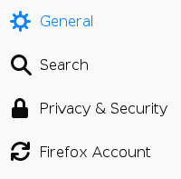
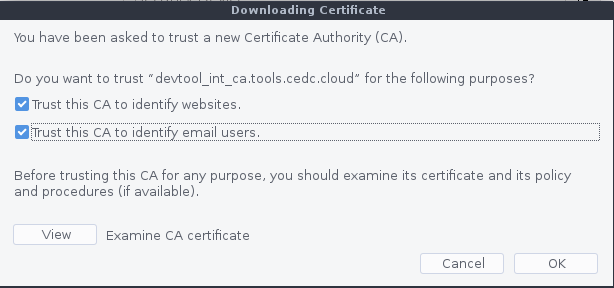
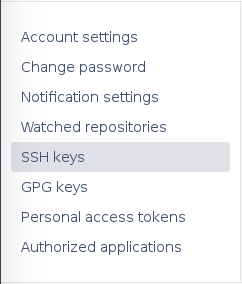
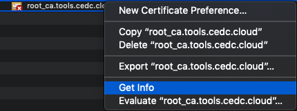

[<< Pathways](README.md)

# First Time WorkSpace Setup

<!-- START doctoc generated TOC please keep comment here to allow auto update -->
<!-- DON'T EDIT THIS SECTION, INSTEAD RE-RUN doctoc TO UPDATE -->
**Table of Contents**

- [Introduction](#markdown-header-introduction)
- [Changing your Account SSO Password](#markdown-header-changing-your-account-sso-password)
- [Importing Intermediate Certificate](#markdown-header-importing-intermediate-certificate)
- [SSH Keys](#markdown-header-ssh-keys)
    - [Generating SSH Key Pairs](#markdown-header-generating-ssh-key-pairs)
    - [Adding SSH Key to Bitbucket](#markdown-header-adding-ssh-key-to-bitbucket)
- [Secure Workspaces](#markdown-header-secure-workspaces)
    - [Restrict Clipboard Access](#markdown-header-restrict-clipboard-access)
    - [Secure Access](#markdown-header-secure-access)
        - [MacOS](#markdown-header-macos)
        - [Windows](#markdown-header-windows)
- [Setting up the WorkSpaces for development Manually](#markdown-header-setting-up-the-workspaces-for-development-manually)
    - [Installing Development Apps](#markdown-header-installing-development-apps)
        - [Docker](#markdown-header-docker)
        - [IntelliJ Community Edition](#markdown-header-intellij-community-edition)
        - [Visual Studio Code](#markdown-header-visual-studio-code)
    - [Adding the Vault Environmental Variable](#markdown-header-adding-the-vault-environmental-variable)
- [Pathways](#markdown-header-pathways)

<!-- END doctoc generated TOC please keep comment here to allow auto update -->

# Introduction

Whether you have used the manual or automatic steps to set up WorkSpaces you will still need to perform some extra steps to get your WorkSpaces full up and running. However, there are some steps in this section you can skip only if you have set up the environment using the automated scripts.

# Changing your Account SSO Password

When your administrator sets up your WorkSpace account they set the default password to `Changeit1!`. This needs to be changed ASAP to ensure your WorkSpace remain secure, and you're the only one able to log into it. To do this please follow the following steps:

1. Open terminal on your workspace
2. Run the following command:

```
passwd
```

3. This should display a few prompts.

   a. Enter your current password (Changeit1!)

   b. Enter your new password. This needs to have at least 7 characters, can't be any of your last 12 passwords, must have a capital letter, must have a number, must have a punctuation character, and cannot contain your name or email address

   c. Repeat this password

That's is. Your SSO password should now have changed and you can now use this to log into all the tools and workspace.

# Importing Intermediate Certificate

There are two new certificate authorities required to be imported in the browser manually so that browser can trust the tools we have deployed through Ansible automation script and also trust the proxy server's SSL layer. When these tools are accessed in the browser without importing the required certificate authorities then browser will show warning and may stop you from accessing these tools.

If you have used the automated Ansible scripts to set up your environment, then required certificate files must be downloaded from the Amazon S3 bucket. You are required to download following two certificate files. 

- intermediate_cert.crt
- root_cert_squid.der

Follow the steps below to import these certificates into your browser:

1. Open Firefox
2. Click on the three line icon located on the right of the address bar


3. Click on "Privacy & Security"



4. Locate at the bottom of the page the section labeled "Certificates"
5. Click on "View Certificates"
6. Click on "Import"
7. Click on "+ Other Locations"
8. Click on "Computer"
9. Click on the folder "etc"
10. Locate the file "intermediate_cert.crt"
11. Click "Open"
12. A window will now open asking you if you would like to trust the CA. Check both of the boxes and click "OK"



Repeat the same steps above to import the second certificate authority.

That is it. Your certificates should have now been imported into the trust store for your browser and you should now be able to access the tools securely.

# SSH Keys

## Generating SSH Key Pairs

For you to be able to pull and push to Bitbucket you will need to generate a SSH key and add it to Bitbucket. Follow the steps below to do this:

1. Open Terminal
2. Run the following command which will generate a new SSH key pair. Make sure to change `{your_email_address}` to your email address

```
ssh-keygen -t rsa -b 4096 -C "{your_email_address}"
```

3. On all the prompts just hit enter as this will place the SSH keys in the default location without adding a passphrase.
4. Add the Private key to the ssh-agent by running the following commands

```
eval "$(ssh-agent -s)"
```

```
ssh-add ~/.ssh/id_rsa
```

5. Now run the following command to get the public key so that you can put it into BitBucket. Remember to change `{you}` to your WorkSpace username. This command will print out your public key to the terminal window

```
cat /home/{you}/.ssh/id_rsa.pub
```

6. Copy the key and only the key from the terminal window

## Adding SSH Key to Bitbucket

1. Open Bitbucket and login
2. From the top right-hand side click on your profile image


3. From the drop-down select "Manage account"
4. From the left-hand side menu select "SSH keys"



5. Click on "Add key"
6. In the windows which opens up paste in your public SSH key
7. Click Done

That's it. You should now be able to use git commands and clone repos using ssh.

# Secure Workspaces

## Restrict Clipboard Access

This is a step you can skip if your environment was creating using the automated scripts. However, if done manually then please follow the steps below to restrict copying and pasting in or out of the workspaces:

1. Open terminal
2. Run the following commands:

```
cd /etc/pcoip-agent/
```

```
vi pcoip-agent.conf
```

3. Press `i`
4. Go to the bottom of the file
5. Paste in the following line

```
pcoip.server_clipboard_state = 0
```

6. restart your workspace

That’s it. Clipboard should now be restricted.

## Secure Access

As an additional layer of security, all WorkSpaces have been secured via certificates and key pairs. Upon the creation of the WorkSpaces and tools several .p12 files should have been created and placed in an S3 Bucket. These .p12 files are one per team member and are used as a security layer to secure workspaces. In order to access your WorkSpace, you will first have to follow the steps below. Please note these steps differ slightly for Windows and MacOS.

### MacOS

1. Download the CA_cert.crt, intermediate_cert.crt, and your .p12 file from the S3 Bucket
2. Open KeyChain Access on your mac
3. Under "Category" select "Certificates"
4. Drag all three files into keychain access
5. When importing the .p12 file you will be asked for a passphrase which by default is Password1! but may have been changed by your environment creator.
6. Starting with the root_ca, right click and select "Get Info"



7. Expand the "Trust" section
8. For the item "When using this certificate" use the drop down to change the value to "Always Trust"
9. Close the window
10. You will be asked to enter your MacOS user account password.
11. This should automatically trust the other certificates you imported. If not then follow the same steps to trust the other two certificates

### Windows

# Setting up the WorkSpaces for development Manually

## Installing Development Apps

1. Using the Amazon WorkSpaces client, log in to your desired Workspace.

2. Open the Terminal application

3. Run the following commands:

### Docker

```sudo
yum install docker
```

### IntelliJ Community Edition

[Check for the latest version of IntelliJ and substitute the below URL](https://www.jetbrains.com/idea/download/)

```
cd /tmp/
```

```
wget https://download.jetbrains.com/idea/ideaIC-version:2018.2.7.tar.gz
```

```
sudo mv 2018.2.7.tar.gz /opt/
```

```
cd /opt/
```

```
sudo tar -xvzf 2018.2.7.tar.gz
```

```
rm 2018.2.7.tar.gz
```

### Visual Studio Code

```
sudo rpm --import https://packages.microsoft.com/keys/microsoft.asc
```

```
sudo sh -c 'echo -e "[code]\nname=Visual Studio Code\nbaseurl=https://packages.microsoft.com/yumrepos/vscode\nenabled=1\ngpgcheck=1\ngpgkey=https://packages.microsoft.com/keys/microsoft.asc" > /etc/yum.repos.d/vscode.repo'

```

```
sudo yum install code
```

## Adding the Vault Environmental Variable

Run the following command but remember to change `{your_vault_domain_name}` to what your vault domain name is:

```
echo "export VAULT_ADDR=http://{your_vault_domain_name}:8200" >> ~/.bashrc
```

<h1>Pathways</h1>

|         |  |  |
| :-------------: |:--:|:-------------:|
||[Before you begin](before-you-begin.md) | |
||[Conventions Guide](conventions-guide.md) | |
||[Quick Reference](quick-reference.md) | |
||[AWS Overview](aws-overview.md) | |
| **Manual** |  | **Auto** |
|**&#8595;**| |**&#8595;**
| [AWS Manual Setup](aws-manual-infrastructure.md) | | [AWS Automatic Setup](aws-automatic-infrastructure.md)
| [Create a WorkSpace (AD setup)](create-a-workspace.md) | | [Create a WorkSpace (AD setup)](create-a-workspace.md) 
| [Setup Single Sign on](setup-single-sign-on.md) | | [Setup Single Sign on](setup-single-sign-on.md) <br> [ - Import Users](setup-single-sign-on.md#Import-Users-and-Groups-to-the-Active-Directory) <br> [ - Configuring the AWS Management Console and AD](setup-single-sign-on.md#Configuring-the-AWS-Management-Console-and-AD)  
|[Tools Manual Installation](tools-manual-installation.md)   | | [Tools Automatic Install](tools-automatic-installation.md)
| [Create a WorkSpace (team workspaces)](create-a-workspace.md##create-additional-workspaces)  | | [Create a WorkSpace (team workspaces)](create-a-workspace.md##create-additional-workspaces)
||**&#8595;**
||[Additional AWS Setup](additional-aws-setup.md) | |
||[First time setup of tools](first-time-tools-setup.md)
||***First time setup of workspaces***

[<< First time setup of tools](first-time-tools-setup.md)
