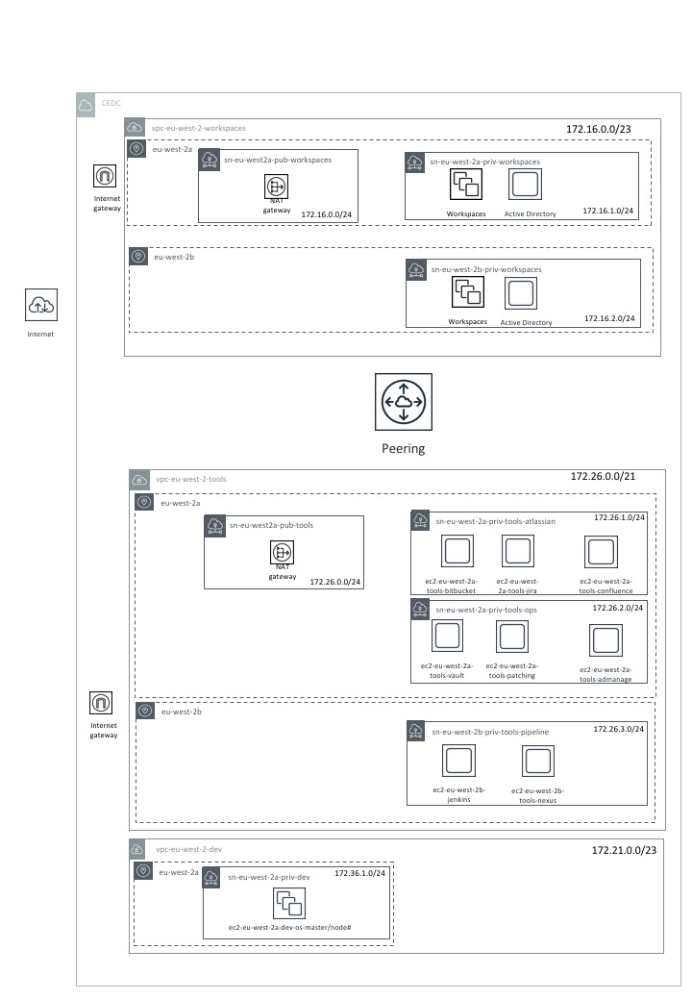

[<< Pathways](README.md)

# Pathway

<!-- START doctoc generated TOC please keep comment here to allow auto update -->
<!-- DON'T EDIT THIS SECTION, INSTEAD RE-RUN doctoc TO UPDATE -->
**Table of Contents**

- [Pathways](#markdown-header-pathways)
- [Pathways](#markdown-header-pathways_1)
    - [Manual Pathway](#markdown-header-manual-pathway)
    - [Automatic Pathway](#markdown-header-automatic-pathway)
- [First Time Setup](#markdown-header-first-time-setup)

<!-- END doctoc generated TOC please keep comment here to allow auto update -->

<h1>Pathways</h1>

By following this documentation, you have the choice of two pathways - each pathway describes how to build an AWS environment.

The pathways are split into **Manual Pathway** and **Automatic Pathway**. Each pathway will lead you to the **First Time Setup** section, where you will create WorkSpaces for users in your Active Directory, Configure CloudWatch and GuardDuty, Create EC2 Snapshot (backup) policies and configure WorkSpaces ready for secure development.

You must choose which path to follow to set up your AWS infrastructure.

The **Manual Pathway** contains instructions that provide guidance on how to create individual resources and connect them together. In addition, some technical background is included.

The **Automatic Pathway** contains instructions to execute Terraform, Ansible and PowerShell scripts. When configured, these scripts build the Environment pictured in the [Environment Diagram](#environment-diagram), install a suite of development tools and automatically import a set of users and groups into your Active Directory.

Each pathway must be followed in sequential order.

[Click here to go to the manual pathway](#manual-pathway)

[Click here to go to the automatic pathway](#automatic-pathway).

## Manual Pathway

[AWS Manual Infrastructure Setup](#aws-manual-infrastructure.md)

[Create your first WorkSpace](./create-a-workspace.md#create-your-first-workspace)

[Set up Single Sign On](./setup-single-sign-on.md#setting-up-sso-using-a-microsoft-active-directory)

[Configure Route 53](./setup-single-sign-on.md#enable-route-53-conditional-forwarding)

[Manual Installation of Tools](./tools-manual-installation.md)

[Create User WorkSpaces](./create-a-workspace.md#create-additional-workspaces)

[Go to First Time Setup](#first-time-setup)

## Automatic Pathway

The below diagram details the environment that the scripts accompanying this documentation will help you build.

Please be advised that the manual instructions _**do not**_ instruct the reader how fully build this environment. The manual instructions advise the user on how to build individual components and how they can be integrated.

[AWS Automatic Infrastructure Setup](#aws-automatic-infrastructure.md)

[Create your first WorkSpace](./create-a-workspace.md#create-your-first-workspace)

[Run AD Setup Scripts](./setup-single-sign-on.md/#import-users-and-groups-to-the-active-directory)

[Create User WorkSpaces](./create-a-workspace.md#create-additional-workspaces)

[Tools + WorkSpaces Setup via Ansible](./tools-automatic-installation.md)

[Go to First Time Setup](#first-time-setup)

# First Time Setup

[Configure CloudWatch](./aws-manual-infrastructure.md/#cloudwatch)

[Configure GuardDuty](./aws-manual-infrastructure.md/#guardduty)

[Create EC2 Snapshot policies](./first-time-tools-setup.md#backing-up-ec2-instance-volumes-via-snapshots)

[Secure WorkSpaces](./first-time-workspaces-setup.md#secure-workspaces)

- [Restrict Clipboard Access](./first-time-workspaces-setup.md#restrict-clipboard-access)

- [Import Certificates](./first-time-workspaces-setup.md#importing-intermediate-certificates)

- [Secure Access](./first-time-workspaces-setup.md#secure-access)

---

<h1>Pathways</h1>

|         |  |  |
| :-------------: |:--:|:-------------:|
||[Before you begin](before-you-begin.md) | |
||[Conventions Guide](conventions-guide.md) | |
||[Quick Reference](quick-reference.md) | |
||[AWS Overview](aws-overview.md) | |
| **Manual** |  | **Auto** |
|**&#8595;**| |**&#8595;**
| [AWS Manual Setup](aws-manual-infrastructure.md) | | [AWS Automatic Setup](aws-automatic-infrastructure.md)
| [Create a WorkSpace (AD setup)](create-a-workspace.md) | | [Create a WorkSpace (AD setup)](create-a-workspace.md) 
| [Setup Single Sign on](setup-single-sign-on.md) | | [Setup Single Sign on](setup-single-sign-on.md)   [ - Import Users](setup-single-sign-on.md#Import-Users-and-Groups-to-the-Active-Directory)   [ - Configuring the AWS Management Console and AD](setup-single-sign-on.md#Configuring-the-AWS-Management-Console-and-AD)  
| [Tools Manual Installation](tools-manual-installation.md)   | | [Tools Automatic Install](tools-automatic-installation.md)
| [Create a WorkSpace (team workspaces)](create-a-workspace.md##create-additional-workspaces)  | | [Create a WorkSpace (team workspaces)](create-a-workspace.md##create-additional-workspaces)
||**&#8595;**
||[Additional AWS Setup](additional-aws-setup.md) | |
||[First time setup of tools](first-time-tools-setup.md)
||[First time setup of workspaces](first-time-workspaces-setup.md)

[Automatic Installation of AWS Infrastructure >>](aws-automatic-infrastructure.md)

[Manual Installation of AWS Infrastructure >>](aws-manual-infrastructure.md)
