[<< Pathways](README.md)

# Quick Reference

<!-- START doctoc generated TOC please keep comment here to allow auto update -->
<!-- DON'T EDIT THIS SECTION, INSTEAD RE-RUN doctoc TO UPDATE -->
**Table of Contents**

- [VPC Peering Example](#markdown-header-vpc-peering-example)
    - [Background](#markdown-header-background)
- [Accessing an EC2 instance from a Workspace](#markdown-header-accessing-an-ec2-instance-from-a-workspace)
    - [Connecting to a Linux EC2 from a Linux Workspace](#markdown-header-connecting-to-a-linux-ec2-from-a-linux-workspace)
    - [Connecting to a Windows EC2 from a Linux WorkSpace](#markdown-header-connecting-to-a-windows-ec2-from-a-linux-workspace)
        - [Getting Windows Password](#markdown-header-getting-windows-password)
        - [Connecting to the EC2](#markdown-header-connecting-to-the-ec2)
    - [Connecting to a CentOS7 EC2 from a Linux WorkSpace](#markdown-header-connecting-to-a-centos7-ec2-from-a-linux-workspace)
    - [Connecting to a Linux EC2 from a Windows WorkSpace](#markdown-header-connecting-to-a-linux-ec2-from-a-windows-workspace)
        - [Downloading PuTTY](#markdown-header-downloading-putty)
        - [Turning the .pem key into Private Key file](#markdown-header-turning-the-pem-key-into-private-key-file)
        - [Connecting to the EC2](#markdown-header-connecting-to-the-ec2_1)
    - [Connecting to a Windows EC2 from a Windows WorkSpace](#markdown-header-connecting-to-a-windows-ec2-from-a-windows-workspace)
- [Allow Downloads on Windows](#markdown-header-allow-downloads-on-windows)
- [Authorization](#markdown-header-authorization)
    - [Terminology and Explanations](#markdown-header-terminology-and-explanations)
        - [Public Key Infrastructure (PKI)](#markdown-header-public-key-infrastructure-pki)
        - [Mutual Authentication](#markdown-header-mutual-authentication)
        - [Keys vs Certificates](#markdown-header-keys-vs-certificates)
        - [Certificate Authority (CA)](#markdown-header-certificate-authority-ca)
        - [Compromised keys](#markdown-header-compromised-keys)
        - [How certificates get signed](#markdown-header-how-certificates-get-signed)
- [Good Security Practices](#markdown-header-good-security-practices)
- [HashiCorp Vault Key Components](#markdown-header-hashicorp-vault-key-components)
    - [Authenticating into Vault](#markdown-header-authenticating-into-vault)
    - [Secrets Engines](#markdown-header-secrets-engines)
        - [PKI Secret Engine](#markdown-header-pki-secret-engine)
    - [Auth Methods](#markdown-header-auth-methods)
    - [Roles](#markdown-header-roles)
    - [Policies](#markdown-header-policies)
- [Creating SMTP User](#markdown-header-creating-smtp-user)
        - [Before you begin](#markdown-header-before-you-begin)
    - [Create a User](#markdown-header-create-a-user)
    - [Verify an email address](#markdown-header-verify-an-email-address)
- [Storing content in S3](#markdown-header-storing-content-in-s3)
- [Access Bitbucket Repos from Jenkins over SSH](#markdown-header-access-bitbucket-repos-from-jenkins-over-ssh)
    - [Prerequisites:](#markdown-header-prerequisites)
    - [Add a public access key to Bitbucket](#markdown-header-add-a-public-access-key-to-bitbucket)
    - [Add your SSL credentials to Jenkins](#markdown-header-add-your-ssl-credentials-to-jenkins)
- [Encrypted Root EBS Volume](#markdown-header-encrypted-root-ebs-volume)
    - [Create IAM KMS encryption key](#markdown-header-create-iam-kms-encryption-key)
    - [Create snapshot of the root volume](#markdown-header-create-snapshot-of-the-root-volume)
        - [Copy the snapshot and make it encrypted](#markdown-header-copy-the-snapshot-and-make-it-encrypted)
    - [Create a new Encrypted volume from the encrypted snapshot](#markdown-header-create-a-new-encrypted-volume-from-the-encrypted-snapshot)
    - [Detach the existing volume and attach the Encrypted Volume](#markdown-header-detach-the-existing-volume-and-attach-the-encrypted-volume)
    - [Verify volume is encrypted](#markdown-header-verify-volume-is-encrypted)
- [Pathways](#markdown-header-pathways)

<!-- END doctoc generated TOC please keep comment here to allow auto update -->

# VPC Peering Example

VPC peering allows two VPCs and the components within those VPCs to
communicate with each other. In this small example, we will explain how
to use a WorkSpace in one VPC to connect to an EC2 instance within
another VPC.

## Background

To achieve VPC Peering we will need at least the following:

- Two VPC's

- A private subnet in each VPC

- Correct routing and security groups for all of these components

## Example

This example relies on the user having already completed and understood
the basics of creating an AWS environment. By following the steps in the
sections above, you are shown how to create a VPC, associate subnets and route tables, a WorkSpace and an EC2 instance.

Please note, the IP addresses of the WorkSpace and EC2 might differ
as they are randomly chosen from the subnet's available addresses.

The additional load balancing private subnet in **Dev Test VPC** has not
been drawn as it is un-needed in the context of this section.

This configuration **will not allow the EC2 to access the
internet!** A public subnet with an Internet gateway and
Nat gateway is required, and the route tables and security groups **must** be set up accordingly.

This is simply an example demonstrating how to allow communication across different VPCs.

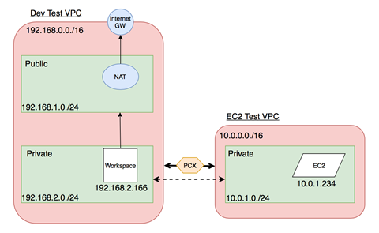

_Figure - VPC Peering Example Diagram_

The Dev Test VPC shown above should already be set up. We now need to
repeat the steps in sections 4 - 13 to create another VPC with a single
private subnet and an EC2 instance within.

Below are images showing all the components of the environment you
should have for VPC Peering to work:

VPC:

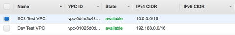

Subnets:

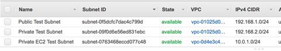

Routes:

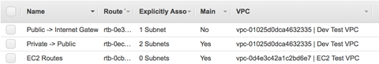

WorkSpaces:

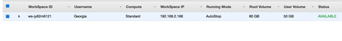

EC2:


**NB: when asked to configure security group settings for the EC2, you
must allow Custom ICMP (Echo Request) inbound connections from the IP address range of the subnet you wish to connect to. e.g. Dev Test VPC subnet. This will
allow you to test the peering connection later on.**

# Accessing an EC2 instance from a Workspace

## Connecting to a Linux EC2 from a Linux Workspace

To connect to a Linux EC2 you need to either have the DNS name of the
EC2 or its IP address. By default, the Linux EC2's will be using the
username "ec2-user" and will use the pem key created when launching the
EC2.

1.  Log onto the Linux WorkSpace as explained in section [Loging into workspace](./create-a-workspace.md#logging-into-the-workspace)

2.  Open MATE Terminal

3.  Type in the following command:

```
vi key.pem
```

4.  This will open the VI editor and create a new file called "key.pem"

5.  Open the key you downloaded earlier using TextEdit or a similar app
    on your local machine

6.  Copy the **ALL** the contents of the file

7.  Go back to your WorkSpace and press "i". This will enter VI into
    "insert" mode

8.  Right click on the terminal window and select paste

9.  Press esc

10. Type

```
:wq
```

11. Type in the following command:

```
chmod 600 key.pem
```

12. Type in the following command. Change **private_ip_address_of_EC2** with the private IP address of your EC2

```
ssh -i key.pem ec2-user@[private_ip_address_of_EC2]
```

a. You will be required to authenticate the host server by typing in
"yes" and pressing enter.

<!-- -->

13. If everything is successful then you should have logged in and
    the terminal should look similar to the image below:


## Connecting to a Windows EC2 from a Linux WorkSpace

To connect to a Windows EC2 then you will need to get your login
credentials for that instance in order to connect via the Remote Desktop
Protocol (RDP).

### Getting Windows Password

1.  From the services menu on AWS select "EC2"

2.  Click on "Instances" from the left-hand navigation panel

3.  Tick the instance you want to access and click the "Actions" button

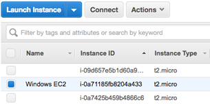

4.  Select "Get Windows Password"

5.  Click the "Browse" button and upload your pem key pair file for that
    instance for it to generate your login credentials

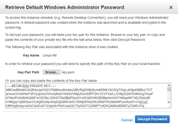

6.  Copy these credentials down

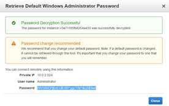

### Connecting to the EC2

1.  Login to your Linux workstation as outlined in section [Loging into workspace](./create-a-workspace.md#logging-into-the-workspace)

2.  Open MATE Terminal and run the following command to install freeRDP.
    It may already be installed, in which case this command will tell
    you so.

```
sudo yum -y install freerdp
```

3.  Once freeRDP is installed successfully, run the following command to
    make an RDP connection. Replace your IP address.

```
xfreerdp \--sec tls \<ip-of-EC2-instance\> -u Adminstrator
```

4.  You should then get a window pop up like below. Enter your password
    to login

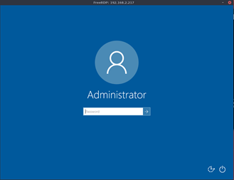

## Connecting to a CentOS7 EC2 from a Linux WorkSpace

Connecting to a CentOS7 EC2 is the same process as Connecting to a Linux
EC2 from a Linux Workspace, however, the username is not "ec2-user" but
"centos"

## Connecting to a Linux EC2 from a Windows WorkSpace

### Downloading PuTTY

1.  Find out if you are working on a 32-bit or a 64-bit operating system

    a. On some systems, you can find this out by going to
    Start-\>Computer and selecting "Computer Properties" tab

    b. Windows 10 GUI: Start -\> System

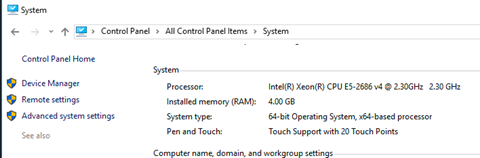

2.  Install PuTTY. Go to the following link and download the appropriate
    installer for your operating system:

<https://www.chiark.greenend.org.uk/~sgtatham/putty/latest.html>

3.  Double click the installer in your Downloads folder and click "Run"

**NB: When asked to change the installation directory. By default, the
installation wizard will try and place the executable in the
"C:\\Program Files" directory which we do not have access to. You will
need to change this to another location e.g.
"D:\\Users\\yourUserName\\"**

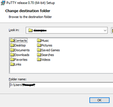

4.  Click "OK" and then "Next"

5.  Enable the option to "Add shortcut to PuTTY on the Desktop" and
    click "Install"

### Turning the .pem key into Private Key file

PuTTY needs the key to be in a .ppk file format to use it.

1.  Run PuttyGen.exe from where you installed PuTTY


2.  Click "Load" to retrieve your .pem file. By default, PuTTYgen
    displays only file with the extension .ppk so to locate your .pem
    file, select the option to display all files. Once you have the file
    click "Open" and "Ok"

3.  Choose "Save private key" to save the key in a format that PuTTY can
    use. PuTTYgen will display a warning about saving the key without a
    passphrase. Choose yes to not set a passphrase or set a passphrase
    if desired.

### Connecting to the EC2

1.  Run "putty.exe" from the Directory where you installed putty

2.  In the hostname box enter the following (replace UserName with the
    correct username for your EC2. A list can be found in section [Default AMI Usernames](./aws-overview.md#default-ami-usernames), and
    ip address with the private IP address of your EC2).

```
UserName\@ipaddress
```

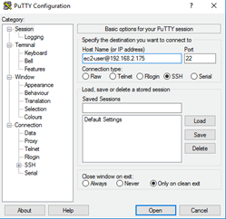

3.  In the left menu go to Connection -\> SSH -\> Auth

4.  Click the "Browse" button, locate the .ppk file you have just
    created using PuTTYgen and press "Open"


5.  If this is the first time you have connected to this instance, PuTTY
    displays a security alert that asks whether you trust the host you
    are connecting to.

6.  Choose "Yes" to proceed

You should now have a new terminal window opening up connecting to your
EC2 instance.

## Connecting to a Windows EC2 from a Windows WorkSpace

1.  Login to your WorkSpace as shown in section 11.2

2.  Get your Windows EC2 login credentials. You can find these if you
    haven't got them already in section 15.2.1

3.  Search for "Remote Desktop Connection" and select the application

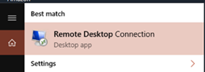

4.  You will be prompted to enter your EC2 instances IP address,
    obtainable from the AWS Console.

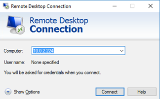

5.  Click \"Show Options" and then you will have to enter your username
    which you can find in section 3

6.  Click "Connect" and you will need to add your password.

7.  If a warning pops up to verify that you would like to connect anyway.

You will now be connected to the EC2.

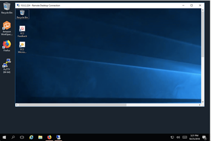

# Allow Downloads on Windows

Internet Explorer is the only browser by default on a Windows EC2
instance. This browser has very high-security settings that can cause
some web pages not to display correctly and can restrict any downloads
you wish to get.

**NB: This section shows how to lighten the security through the Internet
Explorer but we would highly recommend turning the security back on
after you have finished getting any necessary downloads.**

1.  Log onto either your Windows WorkSpace or EC2 Instance

2.  From the "Start Menu" search for "Server Manager" and open the
    application

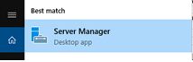

3.  When the application opens click "Local Server" in the left-hand bar

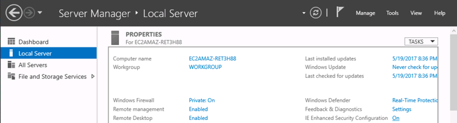

4.  You can see that the IE Enhanced Security Configuration is set to
    "On". Click on "On" to open up the settings for this feature.

5.  In the new window turn the feature off for both Administrator and
    Users

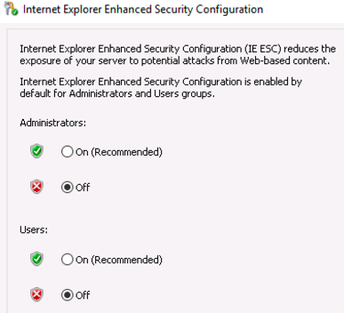

6.  Click "OK"

7.  Open Internet Explorer and you should get this message showing that
    the security is disabled

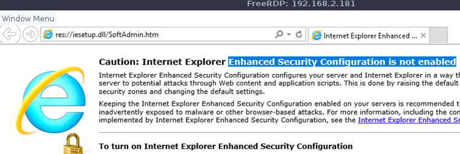

8.  You should now be able to access all websites and download any
    applications needed

# Authorization

## Terminology and Explanations

### Public Key Infrastructure (PKI)

Used to manage keys and certificates, and to ascertain the identity of
people, devices and services. Some examples of usages are digitally
signed documents, verifying source code integrity and supporting
authentication.

Using a PKI is more secure than giving out username and passwords as the
certificates and signatures can be validated beyond a reasonable doubt on
a mass scale. This structure basically wants to make sure only
authorised people can gain access to the data/system.

### Mutual Authentication

Also known as two-way authentication is a security process where two
parties authenticate each other before they can communicate. One way to
perform mutual authentication in a PKI is by using public and private
keys to authenticate each other.

Public keys are granted to people whom we want to be able to access an
entity. The Private key is kept secret and only used by the entity to
which it belongs. Public Keys encrypt data being passed to the entity
and private keys are used by the entity to decrypt and use this data.

### Keys vs Certificates

Keys are used to encrypting and decrypting data between two entities. They do
not identify the person using the key and if used by themselves would
just give access to anyone who held them.

A certificate is an additional wrapper around a public key which also
contains some additional information to help identify the user. This
provides better security through tighter authentication and supplies
details including:

- The name of the entity who owns the private key

- The name of the entity who issues this certificate

- The period of time in which the certificate is valid

Certificates are either issued by a Certificate Authority (a trusted
third party) or self-signed by yourself.

### Certificate Authority (CA)

Part of the PKI which manages the lifecycle of certificates. It is a
party trusted by the owner of the certificate and the party using the
certificate. It issues, verifies and revokes certificates and key-pairs.
Most big entities have their own CA and there can be a hierarchy of CA's
known as a certificate chain.

In a certificate chain of CA's the root CA contains a self-signed
certificate and every intermediate CA in the chain has a certificate
signed by the next highest CA right up to the root CA. This structure
provides scalability, flexibility and it also protects against
compromised keys. It provides additional security by letting you have
multiple CA's coming from the root and if one of the certificate keys
becomes compromised then you can shut it down and use another CA.

Note -- intermediate CA's must have shorter TTL times for their
certificates and expiry/revocation times than their parent CA.

### Compromised keys

A key is compromised when an _unauthorized_ person obtains the private
key or determines what the key is and uses it to encrypt/decrypt
information. This compromised key can be used to decrypt encrypted data
without the knowledge of the sender of the data.

### How certificates get signed

1.  Create a private key locally

2.  Create a certificate signing request (CSR) which is signed using
    your private key

3.  Send the CSR to the Certificate Authority to sign

4.  Receive back a signed certificate

    a. This verifies your identity and contains the public key

5.  Give the certificate to the entity that needs to communicate with
    you

# Good Security Practices

THESE HAVE NOT ALL BEEN INCLUDED IN THE REST OF THE DOCUMENTATION OR
LOOKED INTO YET. STILL, NEED TO BE DONE

- TLS Protocol: TLS v1.2

- Encryption: AES with the 128bit key in GCM mode

- Authentication: X.509 certificates with ECDSA-256 with SHA-256 on
  P-256 curve

- Key exchange ECDH using P-256 curve

- Private key generation needs to follow the following: ECDSA-256 with
  SHA256 on the P-256 curve

Some of these settings can be set through Vault (e.g.
https://www.vaultproject.io/api/secret/pki/index.html\#create-update-role)
and others need to be set when setting up the various components

# HashiCorp Vault Key Components

## Authenticating into Vault

Authentication is the process by which user or machine-supplied
information is verified and converted into a Vault token with matching
policies attached, which is given to the user. Vault has pluggable auth
methods, making it easy to authenticate using whatever form works best
for you

Vault Token -- like websites session cookies. The token stays with you
whilst you are still authenticated. Can expire before you are finished
depending on the time-to-live (TTL) which will log you out of whatever
you were accessing.

The Root token is created by default. From this, you can create child
tokens which inherit by default the same policies as its parent (vault
token create). Tokens always have a parent, and when the parent is
revoked all of the children are too (vault token revoke tokenID)

## Secrets Engines

Vault behaves similarly to a virtual filesystem. The
read/write/delete/list operations are forwarded to the corresponding
secrets engine and the secrets engine decide how to react to those
operations.

This abstraction enables Vault to interface directly with physical
systems, databases, HSMs, etc, and with more unique environments like
AWS IAM, dynamic SQL user creation, etc. all while using the same
read/write interface.

Can use multiple secrets engines at the same time and they cannot access
each other's data or configurations as they are mounted/made available
at different locations.

### PKI Secret Engine

- x509 certificate management tool

- Allows mutual internal TLS authentication, revocation of
  certificates and can be integrated into existing workflows

- PKI Process:

  - If using Vault's PKI Secret Engine as the Root CA

    - Create roles

    - Create CA directly in Vault

    - Create intermediates and sign with the CA

    - Issue certificate

  - If you need an external CA and want to use Vault as the
    Intermediate CA

    - You need to generate/store root CA outside of vault

    - Create roles and CSRs for the Intermediates in Vault

    - Sign the CSR outside Vault and import intermediate

    - Create Roles

    - Issue leaf certificates

## Auth Methods

These are similar to secret engines but with additional security
methods? When an auth method is enabled it is similar to a Secrets
Engine, when it is disabled, however, all users authenticated via that
method are automatically logged out.

- AWS, Kubernetes, LDAP, TLS Certificates and Tokens

In practice, operators should not use the token create command to
generate Vault tokens for users or machines. Instead, those users or
machines should authenticate to Vault using any of these configured auth
methods

Use the vault path-help system with your auth method to determine how
the mapping is done since it is specific to each auth method.

## Roles

Human-friendly identifier or symlink. They map your configuration
options to other API calls.

## Policies

These control the behaviour of clients by enforcing Role-Based Access
Control (RBAC) through specifying access privileges i.e. authorization.
Vault uses secure by default standard so empty policies grant no
permissions and so must be declared. Policies are attached to tokens and
roles to enforce the client permissions.

The Root policy is a special policy created by default which gives
superuser access to everything.

A Default policy is also created by default and is attached to all
tokens. It provides common permissions.

Policies are written in HashiCorp Configuration Language (HCL) which is
JSON compatible and is akin to Access Control List (ACL) policies.

Policy commands:

```
vault policy read my-policy
```

```
vault policy list
```

```
vault policy write policyName -\<\<EOF ..... EOF
```

# Creating SMTP User

### Before you begin

Go here (https://docs.aws.amazon.com/ses/latest/DeveloperGuide/smtp-connect.html) to find SMTP endpoint you will need to connect to. For London, the closest would be Ireland (`email-smtp.eu-west-1.amazonaws.com`). These can be used in any region.

## Create a User

1. In AWS console select a supported region in the top right e.g. Ireland


2. Click “SMTP Settings” in the left-hand menu
3. Click “Create My SMTP Credentials”

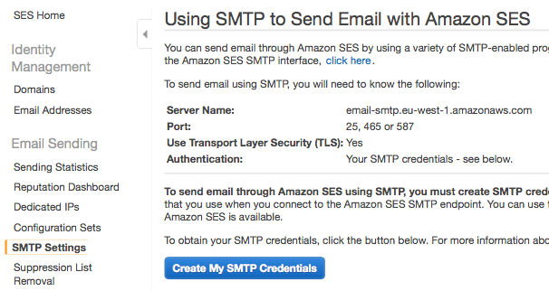

4. Enter a name for the IAMs user which will be created for the SMTP authentication.
5. Click “Create”.

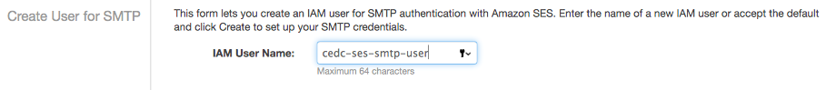

6. Your user credentials will be created. Click “Download Credentials”. This will be the only time you will receive them so make sure to put them somewhere secure.

## Verify an email address

1. Select “Email addresses” in the left-hand menu
2. Click “Verify a New Email Address”

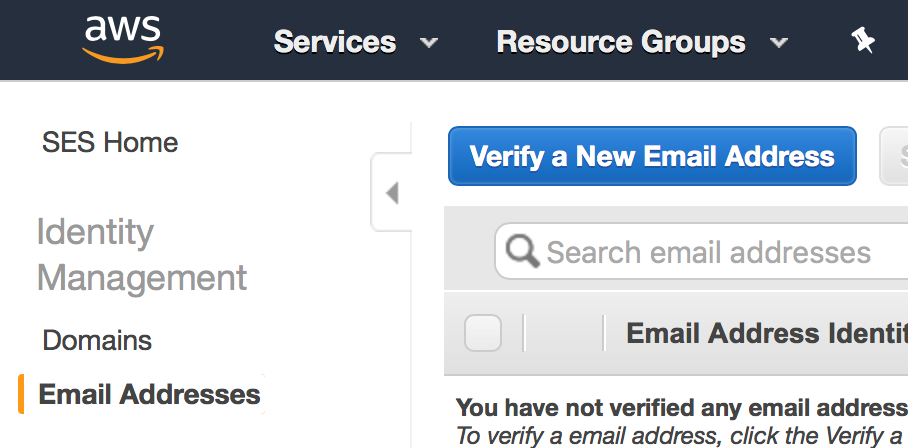
)

3. Enter the email address you would like to send emails from e.g. smtp-user@example.com
4. Click “Verify This Email Address”

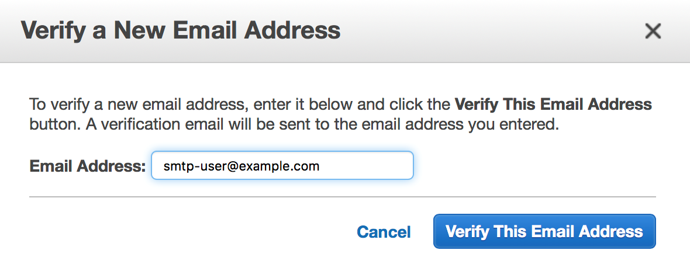

5. Click “Verify This Email Address”. An email will be sent to that account. Click “Close”

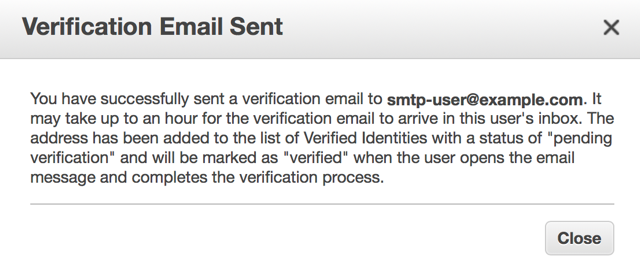

6. Check your email account and you should have received an email regarding verifying an email to use with Amazon SES. Click on the verification link sent


7. You should then get a confirmation message that your email address has been verified.

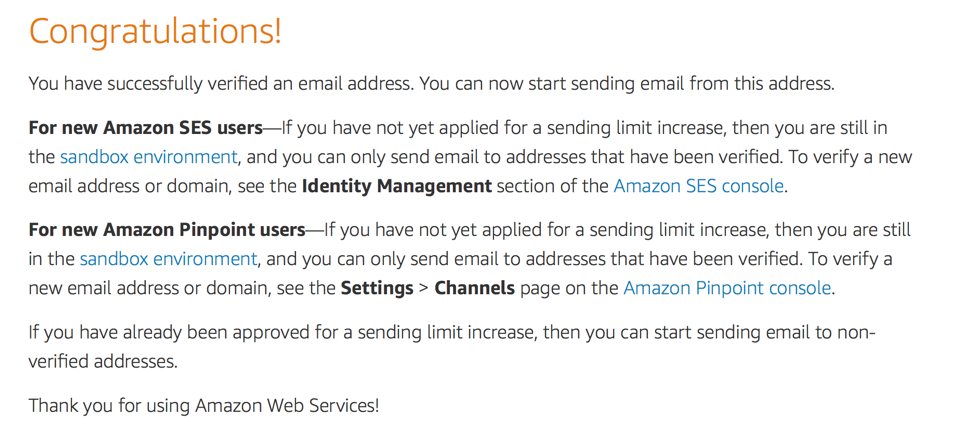

8. There are certain limits imposed on new SES accounts. Below is a snippet of the limitations and you can read more about how to remove or lessen these limitations here: https://docs.aws.amazon.com/ses/latest/DeveloperGuide/request-production-access.html

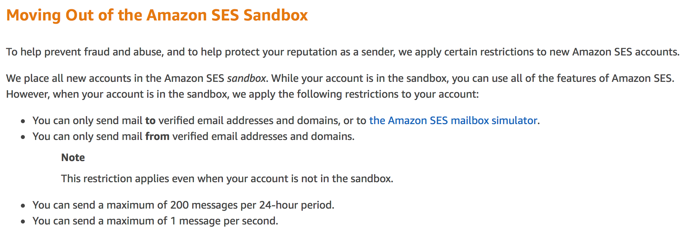

# Storing content in S3

To access your EC2 instance from a WorkSpace you will need to have the pem keypair locally used to create that instance and have an AWS account with “Console Management Access” permissions”.

The easiest way to get a pem key pair on a new machine is to store the pem key pair securely in a S3 bucket and then download it from a bucket.

Storing the Pem key pair in S3

1. Services -> S3
2. Click the “Create Bucket” button
3. Enter a bucket name (this is the name of your file storage directory)
   • Note: as Bucket’s can be public facing, they must have a unique name
   • Select region to match your chosen region/availability zone (you can set but buckets can be accessed from any region)

4) Click “Next” if you want to customise the Bucket’s properties further or you can click “Create” to use the default settings
5) Upload the pem key pair
   • Click “Upload”
   • Select your pem key pair you downloaded when creating the EC2 instance
   • Click “Upload”

Downloading your pem key pair into your Workspace

1. Open up an internet browser
2. Go to this link-> https://s3.console.aws.amazon.com/s3/
3. You will be prompted for your account number. Enter the number without any spaces or hyphens.
   • You will need to get this from your Administrator if you do not know it (or another employee who is already logged in as it is listed at the top of the AWS Console when signed it.)

4. Type in your IAMS credentials to access the AWS Console. These are the credentials you added in Section 9
5. Services -> S3
6. Go to the bucket you stored your Pem key-pair in and select it
7. In the popup window click “Download”


1.  Clear the cookies in your browser. Old cookies related to your
    previous accesses to the confluence site may cause issues if left so
    remove them.

    a.  This is achieved through different methods, depending on the
        browser.

    b.  In Firefox you enter [about:preferences\#privacy]{.underline} in
        the URL search field and then scroll down to the *Cookies and
        Site Data* section.

        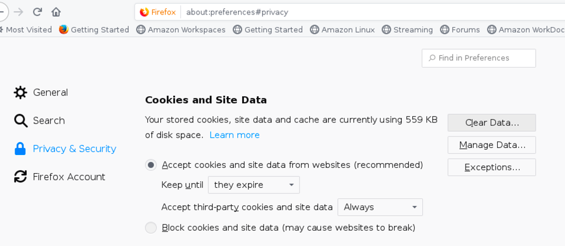

    c.  Click "Clear Data" and then in the new Window select the
        available options and click "Clear"

        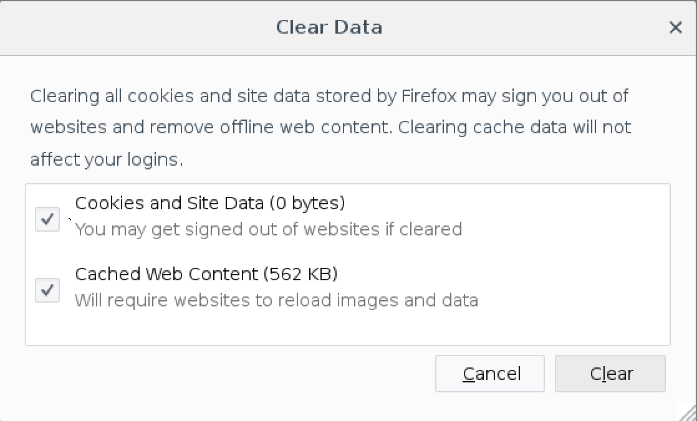

2.  We need to tell our browser that we trust this server and to
    establish a secure connection. We can do this by adding our
    Intermediate Certificate Authority's PEM file that we downloaded
    earlier to the list of trusted Authorities. This differs between
    browsers but on Mozilla FireFox you can use the following steps: 

    d.  Open the settings in the top-right (click the 3 bars on top of
        each other) and click "Preferences"

    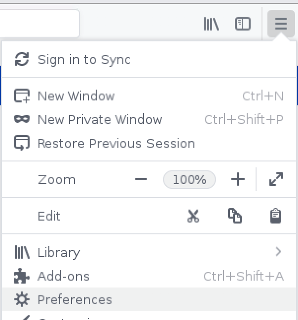

    a.  Click "Privacy & Security" in the left-hand menu. Then click on
        the "Certificates" tab and "View Certificates" 

    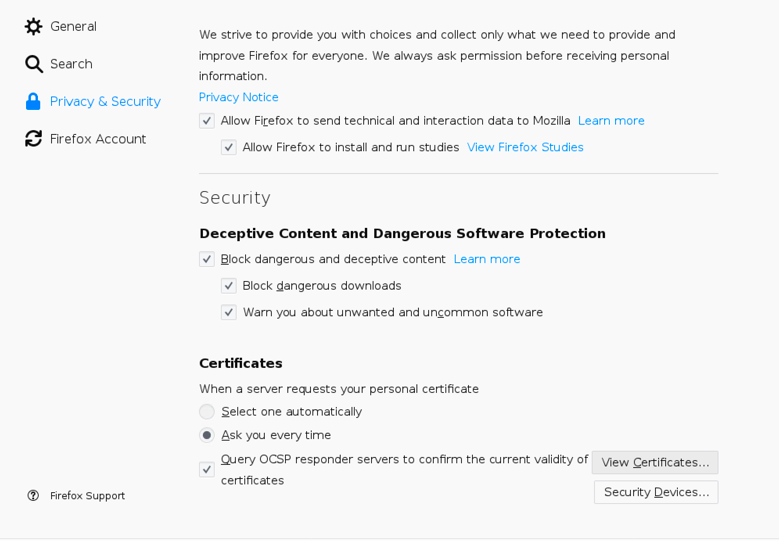
    b.  In the new Window click "Authorities" and then "Import..." 

    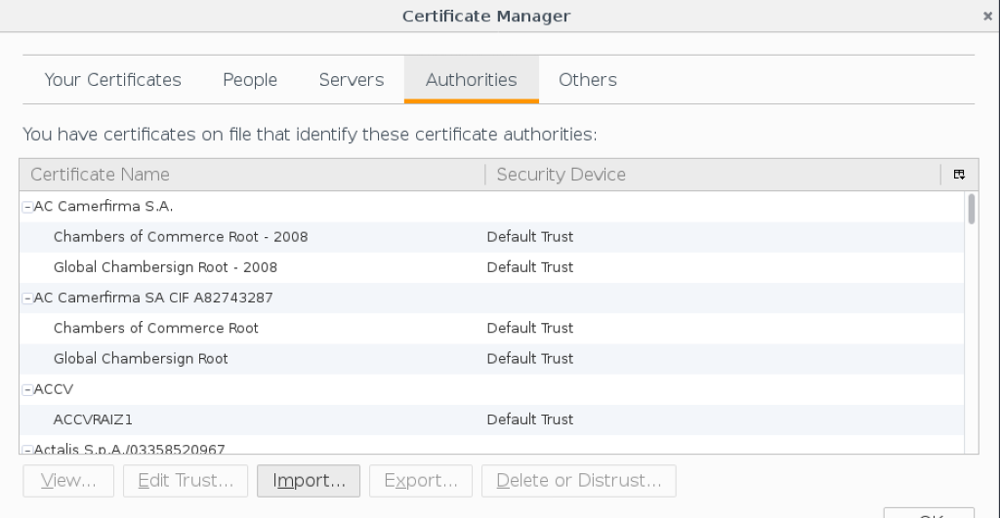

    c.  Choose the PEM file you downloaded previously from the
        Intermediate CA and tick all the boxes saying you "Trust this CA
        to...". 

    d.  Click "OK" 

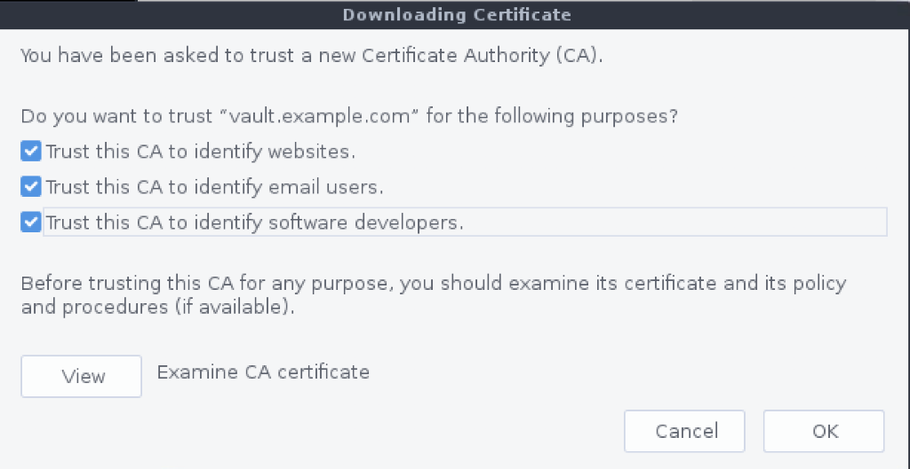

3.  Load a tool <https://confluence.cedc.local:8443> and the page should
    now load correctly, and a green padlock icon should show next to the
    URL.


Access Bitbucket Repos from Jenkins over SSH
============================================

Prerequisites:
---------------

1.  You must have generated a private/public key pair before proceeding.

Add a public access key to Bitbucket
------------------------------------

1.  From the Bitbucket dashboard, select the repository you wish to
    access.

2.  Select "Repository Settings:

 

3.  From the left-hand side menu, select "Access Keys"

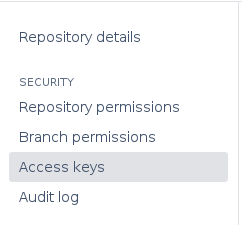

4.  Click "Add key"

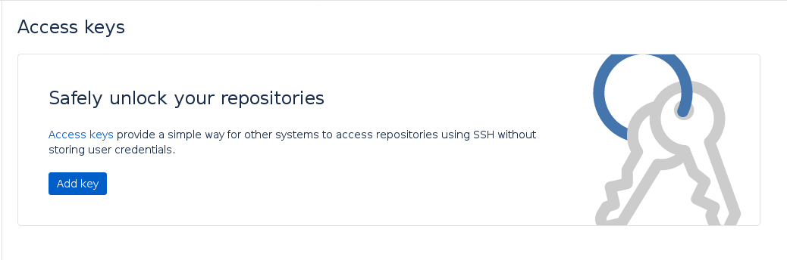

5.  Copy and paste your signed public key into the Key field (it should
    begin with ssh-rsa and be on one line only). Click "Add key" when
    complete

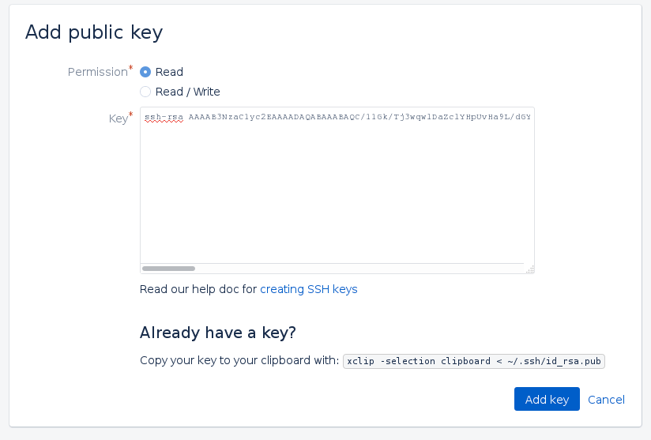

6.  You will now be able to see your key in the Access keys dashboard.

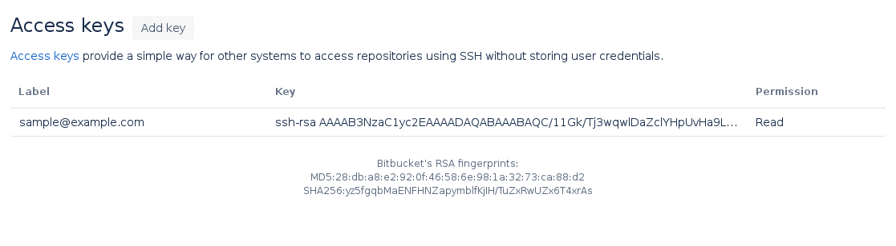

Add your SSL credentials to Jenkins
-----------------------------------

1.  From the Jenkins dashboard, select a project

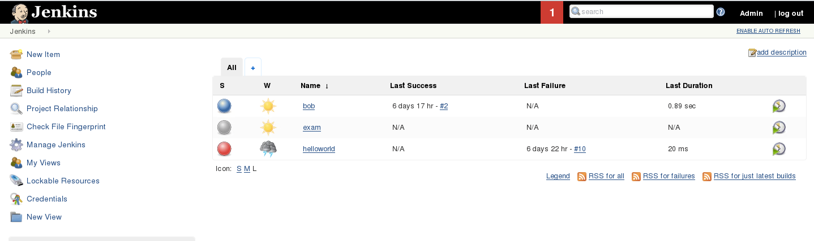

2.  Select "Configure" from the left-hand side menu

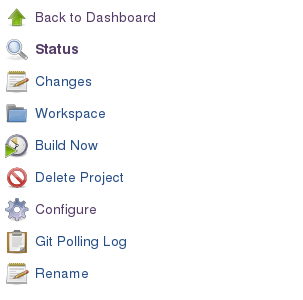

3.  Under "South Code Management" enter your Repository URL that begins
    with ssh://

**NB:** **you can obtain this URL by going to your Bitbucket repository
and clicking the "Clone" icon, select the SSH dropdown option.**

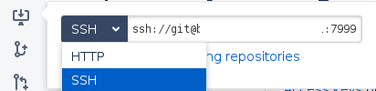

4.  Select "Add" next to Credentials

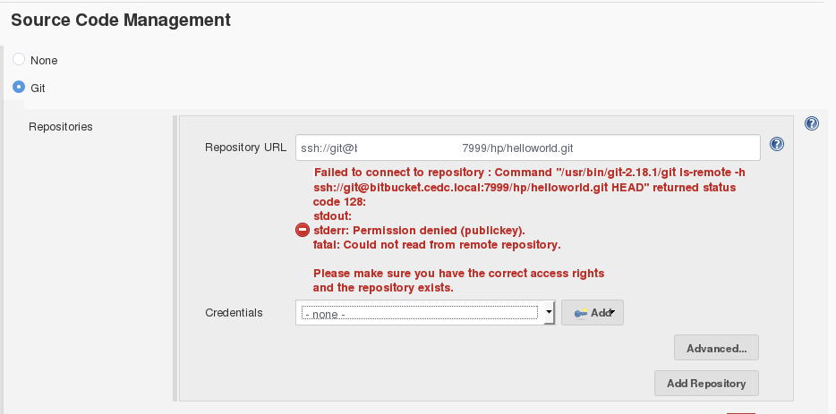

5.  Select "SSH Username with private key" from the "Kind" drop-down
    menu.

6.  Enter your username, select the "Enter directly" radio button and
    paste in your private key. Be sure to check there are no terminating
    next line characters.

7.  Enter the passphrase for the SSL certificate if a passphrase is set.

8.  Enter a description for the account (e.g.
    jenkins\_bitbucket\_polling\_user)

9.  Scroll down and click add when complete

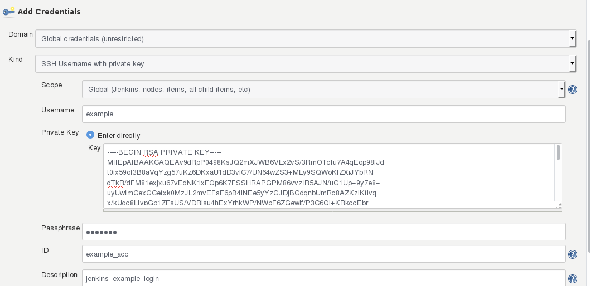

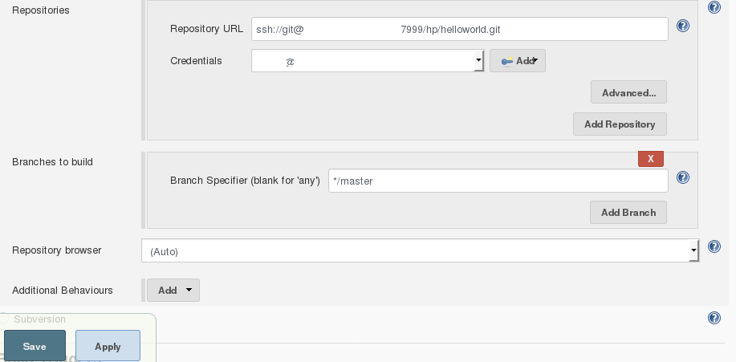

10. Continue adding build triggers and build commands and click save
    when complete.

#Storing/retrieving Secrets

Administrative username and passwords for the various servers and tools need to be kept in case the LDAP server goes down 
or escalated permissions are needed to fix issues. Storing these in plain-text and in an insecure place is dangerous, so 
instead you can store these username and passwords inside one of Vaults key-value (KV) pair secret engines. 

The KV secret engine you choose to use should only be used for storing your admin usernames and passwords 
and locked down so only certain users/groups can interact with it e.g. create, list, and delete secrets. Any user 
given access to that secret engine will be able to access any secret in there. 

The following example uses Vault's default KV Secret Engine (secret/) and allows any group with the password-access 
privilege to list, create, update, delete and read secrets in that particular engine

#### Create a new policy to access the secret Secrets engine

1. Select "Policies"

    

2. Select "Create ACL policy"

    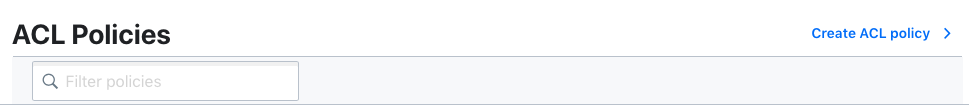

3. Enter Name as "password manager" and put the policy and a rule for the 

    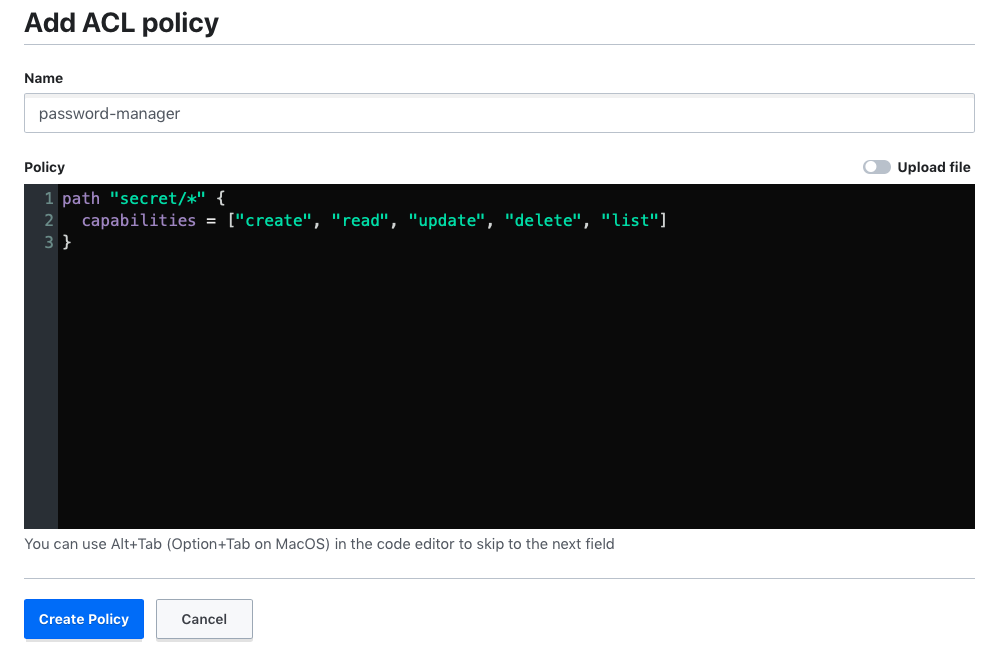

4. Click "Create Policy"


#### Store the necessary secrets

1. Click "Secrets"

    

2. Click "secret/"

    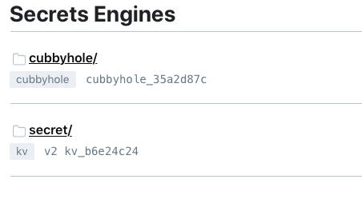

3. Click "Create Secret"

    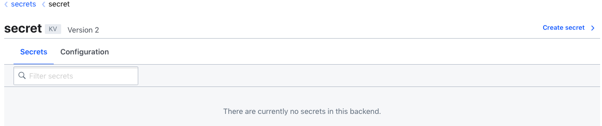

4. Fill in the details. For the path put something descriptive e.g. "tools/admin/jira". Then in the Version data add your secrets. 
The key should describe what is stored in the value column. e.g. you can have adminUser:admin and adminPass:Password1!

5. When you have added all the necessary secrets for that path click "Save"

6. Your secrets will now be stored and can be viewed at the path secret/tools/admin/jira
    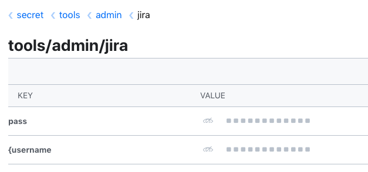

#### Attach the policy to the necessary groups

1. Click "Access"

    

2. Click "Groups"

    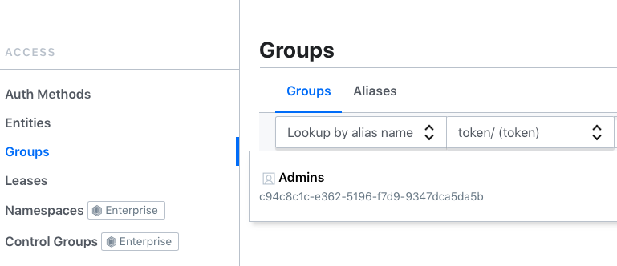

3. Select the Group(s) you wish to be able to interact with that Secrets Engine and click "Edit Group"

    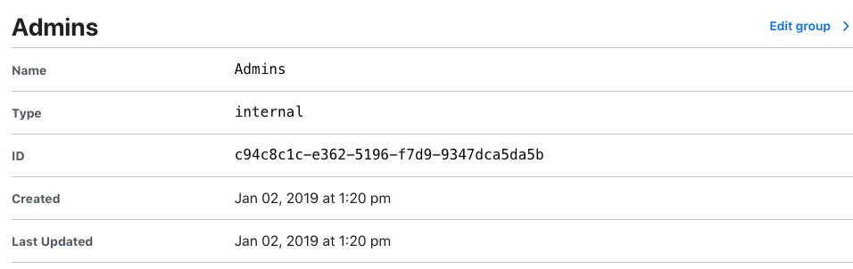
    
4. In the Policies section put "password-manager" and click "Add"
    
    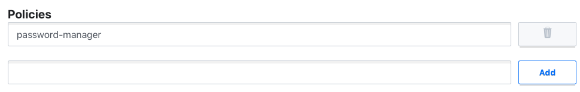

5. Click "Save"


#### Test the configuration

Now you can test the configuration is correct by logging into the Vault GUI and seeing if you can perform the necessary 
actions on the secret. Only users which belong to the Admins group should be able to see/access the "secret/" Secret Engine
and others will get an error if they try and access it through entering the same URL. If the user hasn't got viewing 
permissions for that Secret Engine either then it will not appear for them to see.

#### Adding secrets through the Vault CLI

You can work with secrets through the CLI too if you have the Vault Client installed. It is recommended that if you do
send data through the command line that you store the secrets in a file as we do in the following example, as data entered
into the shell will be available in the shell's history

1. Create a file containing the necessary secrets
    ```
    vi secrets.txt
    ```
    Enter your secrets as a string in your chosen file e.g. "adminUser=admin adminPass=Changeit1!"
    
2. Login to Vault  
    ```
    vault login -method=ldap username={userName}  
    //enter password when prompted
    ```

3. Create a new version of the secrets at this path
    ```
    vault kv put secret/tools/admin/jira $(<secrets.txt)
    ```

4. Remove the file and the plain text secrets
    ```
    rm secrets.txt
    ```

# Encrypted Root EBS Volume

## Create IAM KMS encryption key

Access your IAM Console and create Encryption Key for your AWS Region, by selecting the default options in IAM console.

* Select 'IAM' from amazon AWS Console
* Click on 'Create key'
* Go through multiple screens and provide the details as necessary

## Create snapshot of the root volume
* Locate the volume used as a root device by your EC2 instance
* Select the volume and select 'Create Snapshot' option from 'Actions' menu

    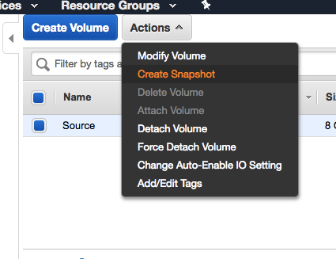

* Provide a description and a 'Name' tag to make it easier to identify. We would call it 'snap-non-enc'.
* Click on 'Create Snapshot'

### Copy the snapshot and make it encrypted
* Click on (non-encrypted) snapshot we created earlier and create a copy of it. 
    * Copy option is available within 'Actions' menu
* During the copy process, you can provide any name e.g. 'snap-enc'. Make sure that “Encrypt this snapshot” is selected during the process. Against the Master Key enter the ARN value of the encryption key testkey-1.

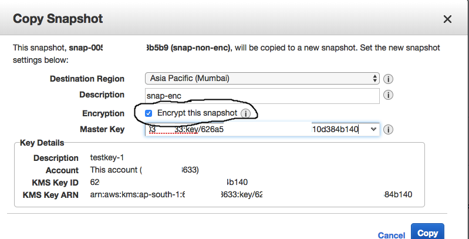

## Create a new Encrypted volume from the encrypted snapshot

Select the encrypted snapshot snap-enc and create volume out of it. Let us call it as “DestVolume”.

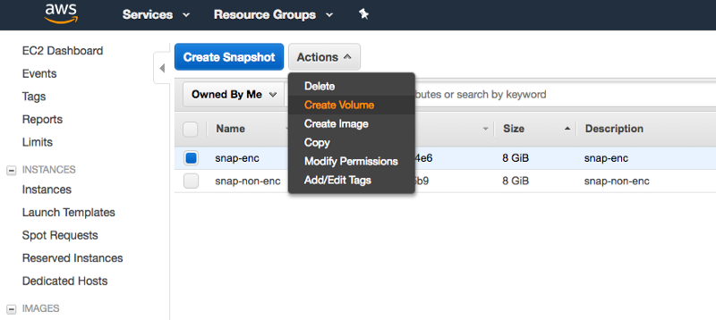

## Detach the existing volume and attach the Encrypted Volume
* Stop the EC2 instance of which the root volume is being changed
* Locate the root volume used by this EC2 instance and detach that volume. 
* Navigate to 'Volumes' page and find the encrypted volume created in previous step.
* Select this encrypted volume and click 'Attach Volume' 
    * On 'Attach Volume' form, select the correct instance
    * For device enter '/dev/sda1' (this volume represents root volume)
* Click attach button
* Turn on the EC2 instance 

## Verify volume is encrypted

To verify the volume attached is encrypted. Go to Volume's page. Locate the volume used by the EC2 instance and withing the description tab at the bottom, verify the encrypted status as shown below.

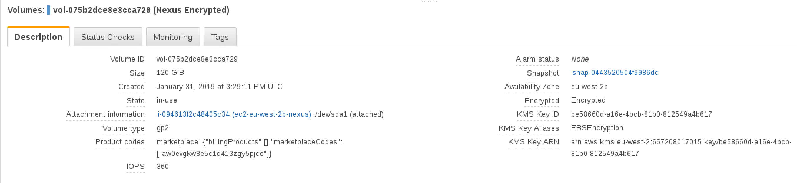

# Openshift Client Tools Installation

[Download the OC Tools here](https://www.okd.io/download.html)

### Mac / Linux Installation

`wget https://github.com/openshift/origin/releases/download/v3.11.0/openshift-origin-client-tools-v3.11.0-0cbc58b-linux-64bit.tar.gz`


1. Using the terminal, navigate (`cd`) to the directory that contains the oc zip/tar.gz file.

`unzip v3.11.0-0cbc58b-mac.zip`

or

`tar -xzvf v3.11.0-0cbc58b-linux-64bit.tar.gz`

3. Enter the directory.

`cd openshift-origin-client-tools-version-x-x-x-distribution`

4. We need to add the `oc` binary to our path, if you want to add a custom path to `oc` do that now. We will move `oc` to `/usr/local/bin`

`mv oc /usr/local/bin`

5. Test the installation by entering in the console

`oc`

You should see this:

```
$ oc
OpenShift Client 

This client helps you develop, build, deploy, and run your applications on any
OpenShift or Kubernetes compatible platform. It also includes the administrative
commands for managing a cluster under the 'adm' subcommand.

To create a new application, login to your server and then run new-app: 

  oc login https://mycluster.mycompany.com
  oc new-app centos/ruby-25-centos7~https://github.com/sclorg/ruby-ex.git
  oc logs -f bc/ruby-ex
  
This will create an application based on the Docker image
'centos/ruby-25-centos7' that builds the source code from GitHub. A build will
start automatically, push the resulting image to the registry, and a deployment
will roll that change out in your project. 

Once your application is deployed, use the status, describe, and get commands to
see more about the created components: 

  oc status
  oc describe deploymentconfig ruby-ex
  oc get pods
  
To make this application visible outside of the cluster, use the expose command
on the service we just created to create a 'route' (which will connect your
application over the HTTP port to a public domain name). 

  oc expose svc/ruby-ex
  oc status
  
You should now see the URL the application can be reached at. 

To see the full list of commands supported, run 'oc --help'.
```


<h1>Pathways</h1>

|         |  |  |
| :-------------: |:--:|:-------------:|
||[Before you begin](before-you-begin.md) | |
||[Conventions Guide](conventions-guide.md) | |
||***Quick Reference*** | |
||[AWS Overview](aws-overview.md) | |
| **Manual** |  | **Auto** |
|**&#8595;**| |**&#8595;**
| [AWS Manual Setup](aws-manual-infrastructure.md) | | [AWS Automatic Setup](aws-automatic-infrastructure.md)
| [Create a WorkSpace (AD setup)](create-a-workspace.md) | | [Create a WorkSpace (AD setup)](create-a-workspace.md) 
| [Setup Single Sign on](setup-single-sign-on.md) | | [Setup Single Sign on](setup-single-sign-on.md) <br> [ - Import Users](setup-single-sign-on.md#Import-Users-and-Groups-to-the-Active-Directory) <br> [ - Configuring the AWS Management Console and AD](setup-single-sign-on.md#Configuring-the-AWS-Management-Console-and-AD)   
|[Tools Manual Installation](tools-manual-installation.md)   | | [Tools Automatic Install](tools-automatic-installation.md)
| [Create a WorkSpace (team workspaces)](create-a-workspace.md##create-additional-workspaces)  | | [Create a WorkSpace (team workspaces)](create-a-workspace.md##create-additional-workspaces)
||**&#8595;**
||[Additional AWS Setup](additional-aws-setup.md) | |
||[First time setup of tools](first-time-tools-setup.md)
||[First time setup of workspaces](first-time-workspaces-setup.md)


[<< Conventions Guide](conventions-guide.md)

[AWS Overview >>](aws-overview.md)
