[<< Pathways](README.md)

# Setup Single Sign-On (SSO)

[Contents Page](contents.md)

<!-- START doctoc generated TOC please keep comment here to allow auto update -->
<!-- DON'T EDIT THIS SECTION, INSTEAD RE-RUN doctoc TO UPDATE -->
**Table of Contents**

- [Import Users and Groups to the Active Directory](#markdown-header-import-users-and-groups-to-the-active-directory)
    - [Setup](#markdown-header-setup)
        - [UserAccounts.xlsx (Spreadsheet)](#markdown-header-useraccountsxlsx-spreadsheet)
    - [GroupAccounts.xlsx (Spreadsheet)](#markdown-header-groupaccountsxlsx-spreadsheet)
        - [ADSetup.ps1 (Powershell script)](#markdown-header-adsetupps1-powershell-script)
    - [Run 'ADSetup.ps1' to import your users and groups.](#markdown-header-run-adsetupps1-to-import-your-users-and-groups)
- [Setting up SSO using a Microsoft Active Directory](#markdown-header-setting-up-sso-using-a-microsoft-active-directory)
    - [Prerequisites](#markdown-header-prerequisites)
    - [Creating a DHCP Option set for your directory](#markdown-header-creating-a-dhcp-option-set-for-your-directory)
    - [Creating a Role to Join Windows instances to an AD Domain](#markdown-header-creating-a-role-to-join-windows-instances-to-an-ad-domain)
    - [Creating an EC2 Instance and automatically join the AD](#markdown-header-creating-an-ec2-instance-and-automatically-join-the-ad)
    - [Installing the Active Directory Tools on your EC2 Instance](#markdown-header-installing-the-active-directory-tools-on-your-ec2-instance)
    - [Checking access to the AD using the AD 'Admin' account](#markdown-header-checking-access-to-the-ad-using-the-ad-admin-account)
    - [Creating Organisational Units](#markdown-header-creating-organisational-units)
    - [Creating Groups and Users](#markdown-header-creating-groups-and-users)
        - [Creating Groups](#markdown-header-creating-groups)
        - [Creating Users](#markdown-header-creating-users)
    - [Assigning Users to Groups](#markdown-header-assigning-users-to-groups)
- [Enable Route 53 Conditional Forwarding](#markdown-header-enable-route-53-conditional-forwarding)
- [Configuring the AWS Management Console and AD](#markdown-header-configuring-the-aws-management-console-and-ad)
    - [Enable the Active Directory to use the AWS Management Console](#markdown-header-enable-the-active-directory-to-use-the-aws-management-console)
    - [Creating IAM Groups for AWS Management Console users](#markdown-header-creating-iam-groups-for-aws-management-console-users)
    - [Creating IAM Roles for AWS Management Console users](#markdown-header-creating-iam-roles-for-aws-management-console-users)
    - [Setting up Directory to allow LDAP users to access project specific AWS console](#markdown-header-setting-up-directory-to-allow-ldap-users-to-access-project-specific-aws-console)
- [Key Occurrences](#markdown-header-key-occurrences)
        - [Ensure your Active Directory and Active Directory Manager server are associated](#markdown-header-ensure-your-active-directory-and-active-directory-manager-server-are-associated)
- [Pathways](#markdown-header-pathways)

<!-- END doctoc generated TOC please keep comment here to allow auto update -->

# Import Users and Groups to the Active Directory


If you have already created a spreadsheet of users and groups in the [AWS Automatic Setup section][./aws-automatic-section.md], before proceeding you must [upload these files to an S3 bucket](./quick-reference.md#storing-content-in-s3), [allow downloads on your Windows AD Manager EC2](./quick-reference.md#allow-downloads-on-windows), then download the files to your AD Manager EC2.

If you are following the manual setup process and wish to import users and groups from a spreadsheet, as opposed to manually adding users and groups, follow the below section.

## Setup

Items you should have:

- UserAccounts.xlsx
- GroupAccounts.xlsx
- ADSetup.ps1

You will need to edit these files as follows

### UserAccounts.xlsx (Spreadsheet)

| Column             | Comment                                                                                |
| ------------------ | -------------------------------------------------------------------------------------- |
| **sAMAccountName** | Usernames that your users will log on with.                                            |
| **FirstName**    | First name of the user.                                                                |
| **LastName**       | Surname / Last Name of the user.                                                       |
| **DisplayName**    | Do not change, should be exactly equal to the sAMAccountName.                          |
| **Email**          | User's email address.                                                                  |
| **Description**    | An appropriate description.                                                            |
| **Password**       | The first password for the user, this should be changed by the user at the next login. |

Once complete, save the file as UserAccounts.csv

## GroupAccounts.xlsx (Spreadsheet)

| Column             | Comment                                                                                                                                                                                                                                                          |
| ------------------ | ---------------------------------------------------------------------------------------------------------------------------------------------------------------------------------------------------------------------------------------------------------------- |
| **sAMAccountName** | The explicit name of the group you are creating, this name must be unique.                                                                                                                                                                                       |
| **Member**         | The **sAMAccountName** of the **user** you wish to add to the group. One user per column. If you wish to add more members than there are Member columns, feel free to create new columns with the heading Member# (with no space between Member and the Number). |

### ADSetup.ps1 (Powershell script)

In the next steps, you will need to enter your AD domain in component form.

The domain **hello.world.com**, when split into its components looks like:

```txt
dc=hello,dc=world,dc=com
```

Note how the full stop '.' has been removed.

Open `ADSetup.ps1` in a text editor of your choice, scroll to the bottom of the file where you will see these two lines:

```powershell
Create-ADAccountsFromCSV -CSVPath "C:\Users\admin\Desktop\ADSetup\UserAccounts.csv" -ADName "ad" -TeamName "cedc" -Type "User" -Domain "DC=ad,DC=cedc,DC=cloud"

Create-ADAccountsFromCSV -CSVPath "C:\Users\admin\Desktop\ADSetup\GroupAccounts.csv" -ADName "ad" -TeamName "cedc" -Type "Group" -Domain "DC=ad,DC=cedc,DC=cloud"
```

Change the following to suit your needs:

- ADName (should be 'ad')
- TeamName
- Domain **(in component form)**

    If your domain of choice is team.com, ensure you add 'ad' - so your active directory domain is `dc=ad,dc=team,dc=com`

Save these files on your local machine. Before proceeding to the next section, you must [upload these files to an S3 bucket](./quick-reference.md#storing-content-in-s3), [allow downloads on your Windows AD Manager EC2](./quick-reference.md#allow-downloads-on-windows), then download the files to your AD Manager EC2.
 
## Run 'ADSetup.ps1' to import your users and groups.

The below section applies **only** if you have pre-configured the [User Account Credentials](#prepare-user-account-credentials) script to import Users and Groups into the active directory.

If you do not wish to import users and groups into your Active Directory, please proceed with the manual instructions in the remainder of this chapter.

Refer to this section once Terraform as successfully provisioned the AWS environment.

1. RDP in to your Windows AD Manager server. Please refer section - [Connecting to a Windows EC2 from a Linux WorkSpace](./quick-reference.md#connecting-to-a-windows-ec2-from-a-linux-workspace)
 or [Connecting to a Windows EC2 from a Windows WorkSpace](./quick-reference.md#connecting-to-a-windows-ec2-from-a-windows-workspace)


2. Open cmd. Navigate to C:\Users\admin\Desktop\ADSetup

```cmd
cd C:\Users\admin\Desktop\ADSetup
```

3. Enter PowerShell by entering in the console:

```cmd
PowerShell
```

4. Run the script:

```powershell
.\script.ps1
```

5. Your users and groups are now created, and the users have been assigned to the groups you set earlier.

Once complete, jump to [Configuring the AWS Management Console and AD](#Configuring-the-AWS-Management-Console-and-AD)

# Setting up SSO using a Microsoft Active Directory

---

Single Sign-On (SSO) is a useful feature to have in your environment.
It allows a single point of entry into the environment and centralises user and permission management. SSO also makes it easier and safer to
revoke access to any user at any time.

## Prerequisites

1.  AWS infrastructure fully set up by following: AWS-Manual-Infrastructure or AWS-Automatic-Infrastructure.

2.  A Microsoft Active Directory (AD). Please refer Section [Setting up a Microsoft Active Directory](./aws-manual-infrastructure.md#setting-up-a-microsoft-active-directory)

## Creating a DHCP Option set for your directory

To allow your EC2 instance in your VPC to automatically join the AD in
your environment is important to have DHCP Options set.

1.  Open the Amazon VPC Console -- <https://console.aws.amazon.com/vpc/>

2.  Choose *"*DHCP Options Sets*"* from the navigation panel on the left

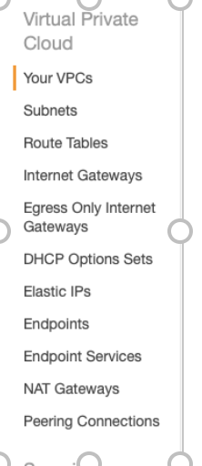

3.  Click on "**Create DHCP options set**" at the top of the page

4.  A window should now open allowing you to enter the details for the
    Options Set.

    a. For the Name tag option enter what you would like to call your
    Options Set. Ensure the name follows the [Conventions guide](./conventions-guide.md).

    b. For the Domain Name enter the domain for your AD. For this
    example, we are going to use the following domain name but
    change it to match yours: "test.ibm.local".

    c. The Domain name servers are the IP address of your domain. You
    can find this under your Directories in the Directories Services
    Console and are labeled as DNS address. You need to separate
    your

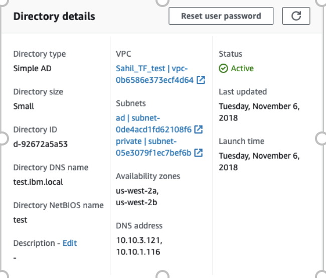

d. The rest of the fields can remain empty. Your final set up should be
similar to the image below:

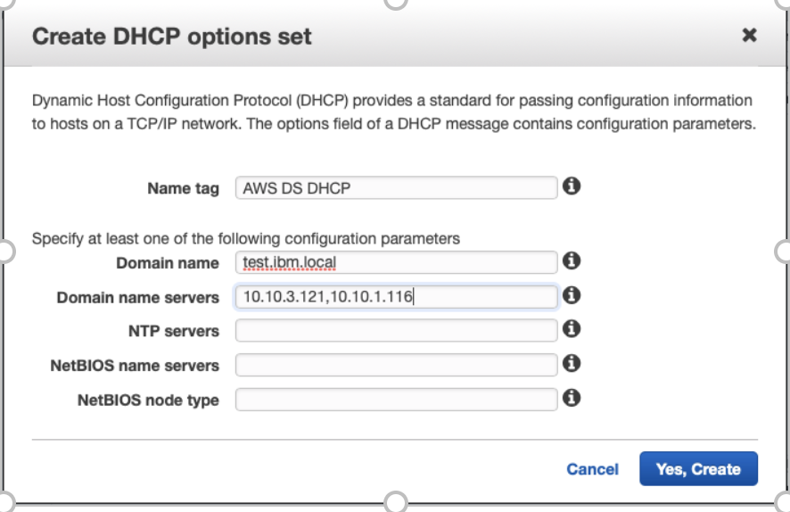

5.  Click "Yes, Create"

6.  Now using the navigation panel on the let select "Your VPCs" and
    select your VPC which has the AD.

7.  Select the Actions dropdown from the top of the page

8.  Select "Edit DHCP Options Set"

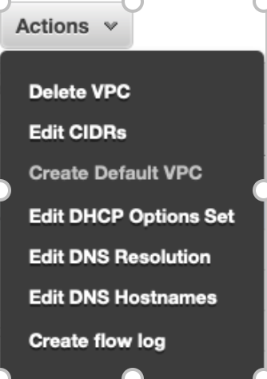

9.  A window should now open allowing you to select your DHCP Options
    Set you just created. Select this from the list and click "Save"

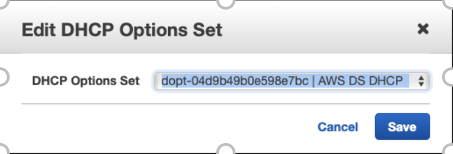

## Creating a Role to Join Windows instances to an AD Domain

These steps allow your Windows EC2 instances to access you AD Domain and
its services automatically.

1.  From the AWS services console to search for and select IAM. Or use the
    following link: <https://console.aws.amazon.com/aim>

2.  From the navigation panel on the left side select "Roles"

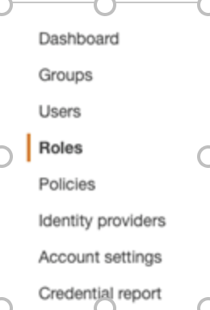

3.  From the top of the page select the "Create role" button

4.  From the list select "EC2" and click "Next: Permissions"


5.  In the search filed search for "AmazonEC2RoleforSSM" and check the
    checkbox to the left.

6.  Click "Next: Review"

7.  On this page give the role a name that describes what your role is
    doing. Good names would be "EC2DomainJoin" or "EC2DomainAttach"

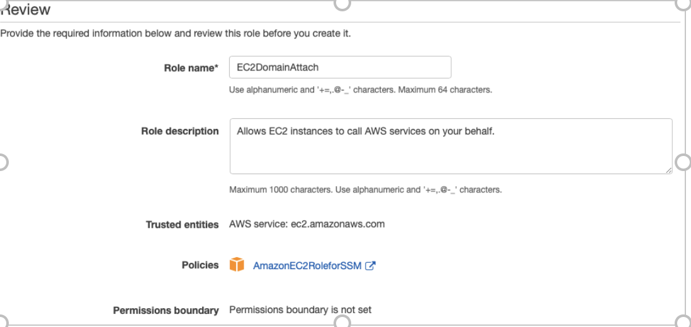

8.  Click "Create role"

## Creating an EC2 Instance and automatically join the AD

Creating an EC2 instance is the same as documented earlier in this
document however a few extra steps have to be taken to allow this EC2
instance to become an active directory manager.

1.  From the AWS console search for and navigate to the EC2 dashboard or
    use this link: <https://console.aws.amazon.com/ec2>

2.  Click "Launch Instance"

3.  In the search box search for "Windows"

4.  From the list select your preferred version of windows server. A
    good option and the one used for this guide is: "Microsoft Windows
    Server 2016 Base - ami-0f5f78829606035fc"

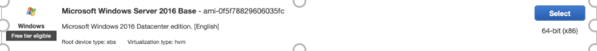

5.  Click "Select"

6.  For the instance type, it is recommended that a micro type is not
    chosen as this instance type will struggle with the workload of
    managing the AD. It is recommended that a medium or higher type of
    instance is used. For this guide, a t2.medum, general purpose
    instance type is used.

7.  Click "Next: Configure Instance Details"

8.  On this page, you can set up where you would like the EC2 to be set
    up and how.

    a. For network select the name of your VPC

    b. For the subnets choose one of your private subnets

    c. For "Domain join directory" choose your directory you set up
    previously

    d. For the "IAM role" select the role you set up previously

    e. For the rest of the options, you can leave them as their default
    values


9.  Click "Next: Add Storage"

10. Configure how much storage you would like your EC2 to have. The
    default values are good enough for the purpose of this task and
    therefore have been left as default.

11. Click "Next: Add Tags"

12. Click "Next: Configure Security Group"

13. For this step either leave the values as default which will allow
    all IP's to access the instance via RDP or select an existing group
    from the drop down. However please note if using your own security
    group, you much ensure that RDP access has been granted else you
    will not be able to connect to the windows instance.

14. Click "Review and Launch

15. Check through all the configuration and if you are happy with it all
    click on "Launch"

16. Another window will now appear allowing you to either generate a new
    key pair or allowing you to select an existing key pair.

**NB:** **Please ensure you keep this key safe. After this step, you will
not be able to change the key pair and if the key is lost then a new EC2
instance will need to be recreated.**

## Installing the Active Directory Tools on your EC2 Instance

1.  RDP into your windows EC2. Follow the steps in section [Connecting to a Windows EC2 from a Linux WorkSpace](./quick-reference.md#connecting-to-a-windows-ec2-from-a-linux-workspace)

2.  From the start menu search for "Server Manager" and select it

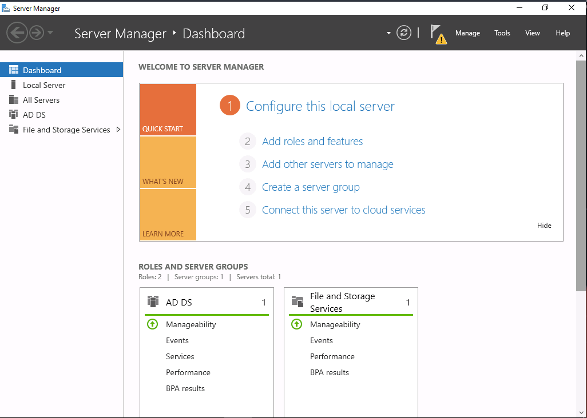

3.  From the top navigation bar select "Manage"


4.  From this drop-down select "Add Roles and Features"

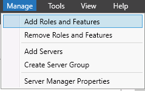

5.  Click "Next" in the window which opens

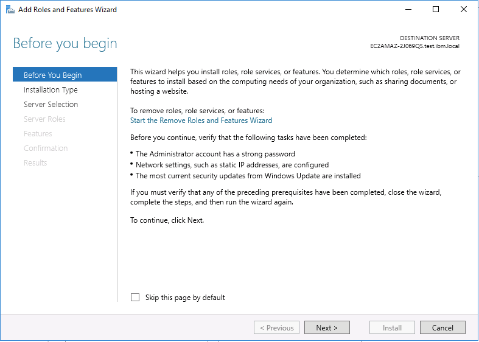

6.  Select "Role-based or feature-based installation" option and click
    "Next"

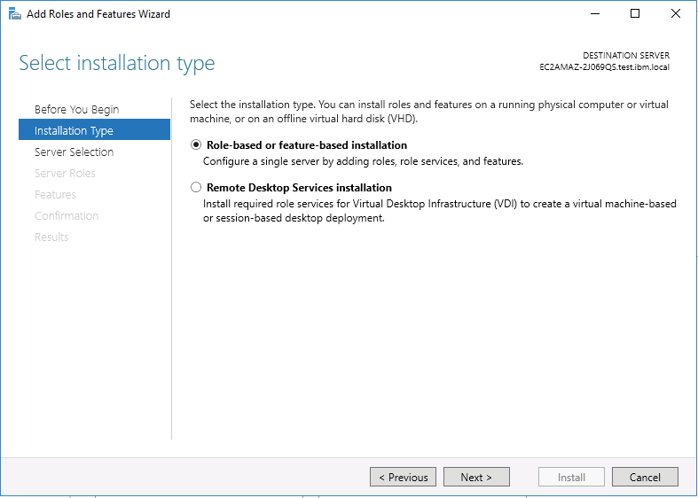

7.  On the page which appears ensure that the server selected IP address
    is the same as the IP address of your Windows EC2 instance. Click
    "Next"

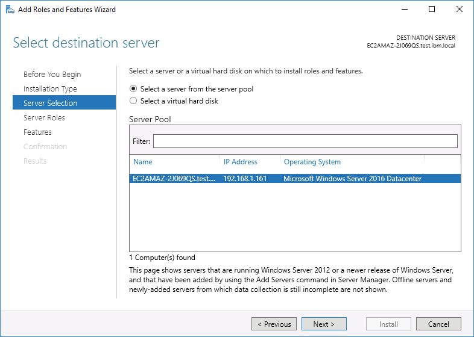

8.  On the "Select server roles" click "Next "

9.  On the "Select features" page the following features need to be
    checked:

    a. Group Policy Management

    b. Expand "Remote Server Administration Tools", then expand "Role
    Administration Tools"

    c. Select "AD DS and AD LDS Tools" checkbox

    d. Select "DNS Server Tools" checkbox

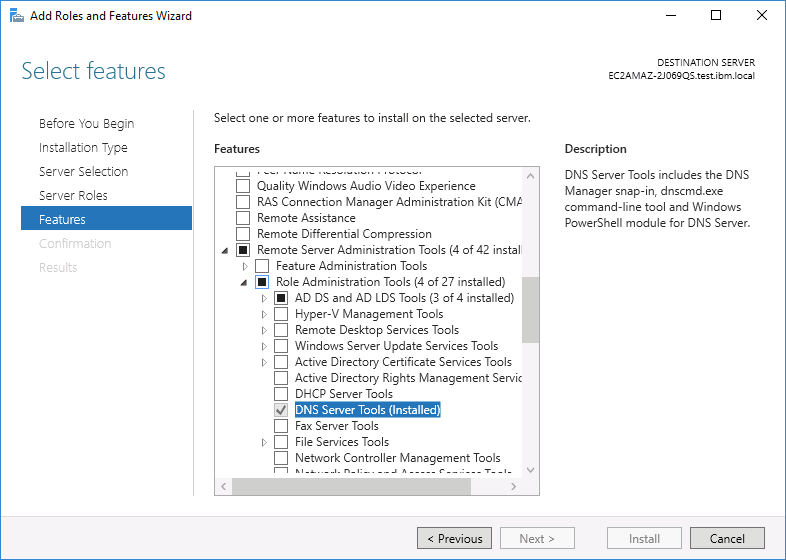

1.  Click "Next"

2.  On the next page confirm everything is correct and then Select
    "Install"

3.  Once the installation has completed click "Close"

4.  Now check everything has installed correctly by navigating to
    "Start" and there now should be a folder called "Windows
    Administrative Tools". If this is there then everything has
    installed correctly

## Checking access to the AD using the AD 'Admin' account

Now that we have connected our AD to the windows server and its being
managed by this server, we need to ensure that we can log in to the windows
EC2 instance using the AD username and password, or any user which has
AD rights.

1.  If you're still logged in as the windows Administrator, then log out.
    You will need to rerun the xfreerdp command you ran earlier to
    restart freeRDP

2.  Once freeRDP has opened use domainName\\admin and the password you
    set when creating the AD

**NB: Change domainName to your domain name. This can be found under the
Directory details page and is labeled as Directory NetBIOS name.**

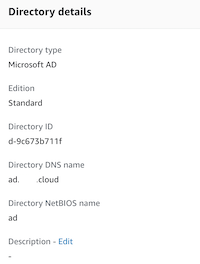

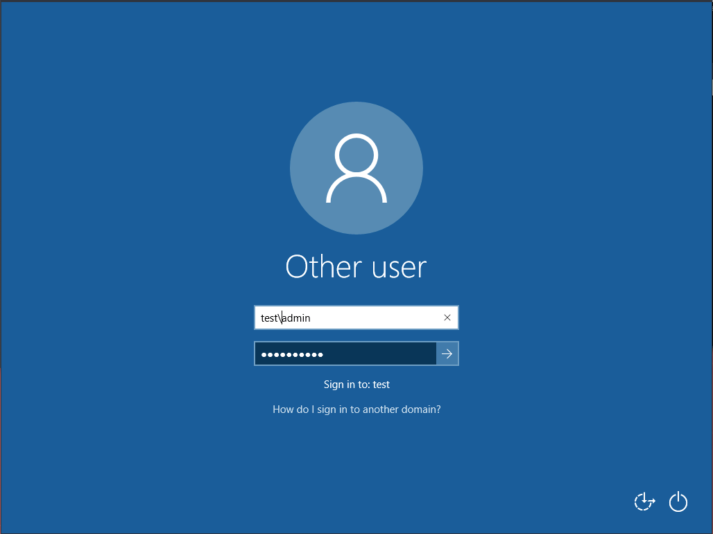

3.  Once you have logged in, using start navigate to "Windows
    Administrative Tools" and select "Active Directory Users and
    Computers"

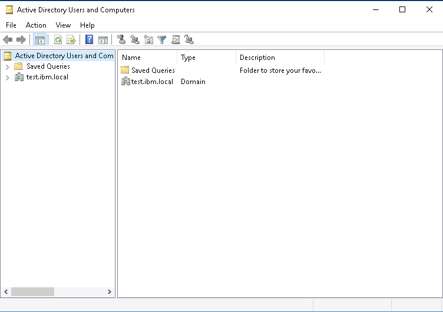

4.  If your system has connected correctly to the AD then you should see your domain name.

## Creating Organisational Units

Organisational Units are a great way of organising your AD. You can and
split up your users with your groups and computer to make it easier to
manage the structure of the AD.

1.  Select your Directory DNS name from the list on the left side and
    expand it

2.  You should now see a list of folders. One of them will be your
    NetBIOS name. Expand this. This is the first OU that you will
    encounter. **IT IS VITAL YOU DO NOT DELETE THIS OU.**

3.  If you now expand this you may see two more OU's named "Computers"
    and "Users". "Computers will house all the computer currently
    attached to the AD and what groups they belong to. "Users" contains
    all the user which have been defined for the AD.

4.  If these folders do not exist then right click on your NetBIOS name
    and select "New" then "Organizational Unit"

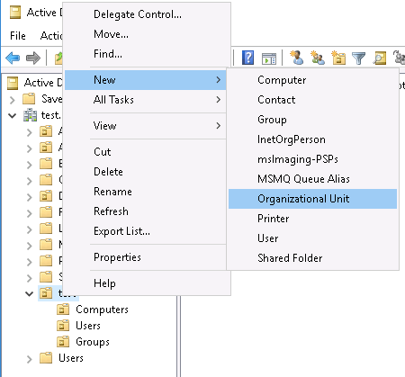

5.  Enter the name for the OU and click "OK"

## Creating Groups and Users

Once you have your Windows EC2 connect and managing your AD you can now create Groups and Users. Groups enable you to create multiple permissions levels and assign users to them.

This way a user can be part of multiple groups allowing them access to certain things on your network but at a click of a button, they can be removed from any group and therefore their access revoked.

### Creating Groups

1.  Under your Groups OU right click and select "New" and then "Groups"

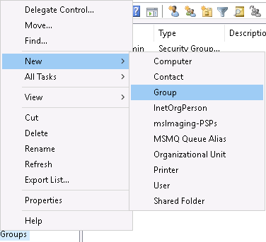

2.  Enter the name of the group and click "OK". That's a group created

### Creating Users

1.  Under your Users OU right click and select "New" and then "Users:

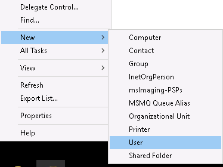

2.  Fill out all the fields on the form

    a. First name of the user

    b. Last name of the user

    c. What you would like their username to be

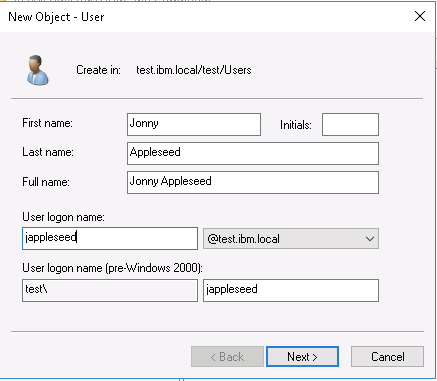

3.  Click "Next \>"

4.  Enter the password the user will use for SSO

5.  Click "Next \>"

6.  Right click on the user you have just created and select
    "Properties"

7.  In the email field enter the user's email address. This is vital as
    AWS WorkSpaces require an email address of the user to create the
    workspace

## Assigning Users to Groups

1. Open 'Active Directory Users and Groups' on the AD Manager EC2.

2. Go to your users OU. Right click on the user you want to modify. Click "Add to a group..."

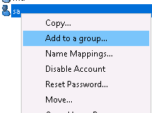

3. A pop-up window with the title "Select Groups" will appear. In the "Enter the object names to select" field, type in the group name, then click "Check Names".

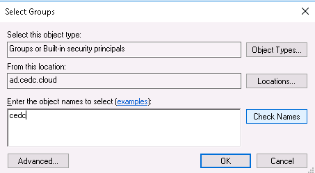

4. Select the groups you wish to add the user to, then click 'Ok'.

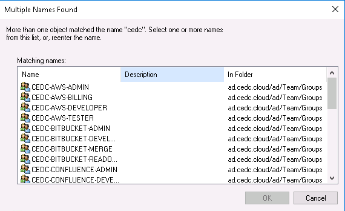

5. Confirm the groups are correct, then click 'OK'.

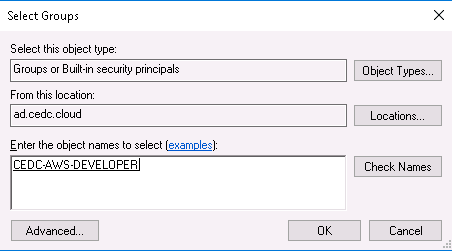

6. You should see an 'operation successfully completed' window like the below.


# Enable Route 53 Conditional Forwarding

If you are following the Manual Pathway, you must complete this section to enable Route 53.

1. On the Windows AD Manager EC2, go to command prompt. Type "dnsmgmt.msc"

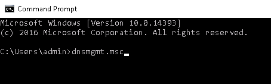

2. You'll be prompted to connect to the local machine or remote machine. Select 'remote machine' and enter the ip address of the AD.


3. You'll see an icon (that looks like a computer) appear underneath DNS. Double click on it.

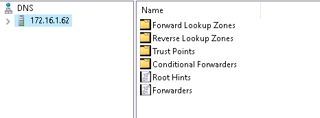


4. Right-click "Conditional Forwarders"
5. Select "Add New Conditional Forwarder" 0 If greyed out you may need to expand the section under the IP and then try again.

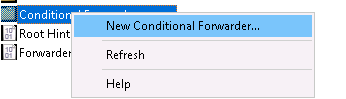


6. In the DNS Domain field, enter your tools domain e.g. "tools.cedc.cloud"
 In the IP address box, enter the Route 53 address of your WorkSpaces VPC which will be at your WorkSpaces '**.2**' ip address e.g. x.x.0.2 or "172.16.0.2"
  
    Press "enter"

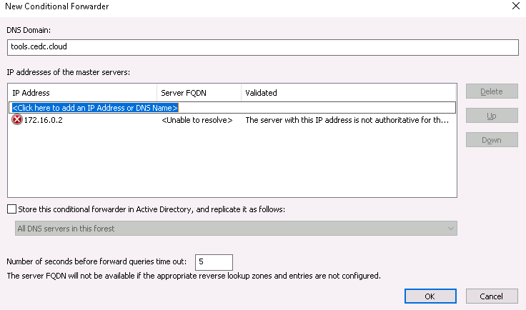


7. You may see a red X that may say the IP has not been validated.
  Ignore this and press "OK"

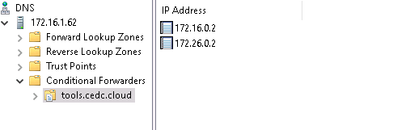
  
8. Right click on "DNS", click "Connect to DNS Server..."


9. Enter the second IP address of the Active Directory

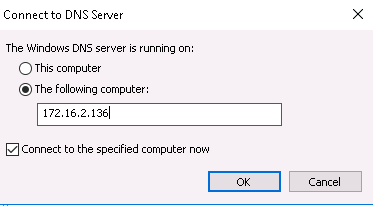


10.  Repeat steps above and create conditional forwarders for the second Active Directory IP address.


Your result will look something like the below. Your Route 53 will now be configured and working.

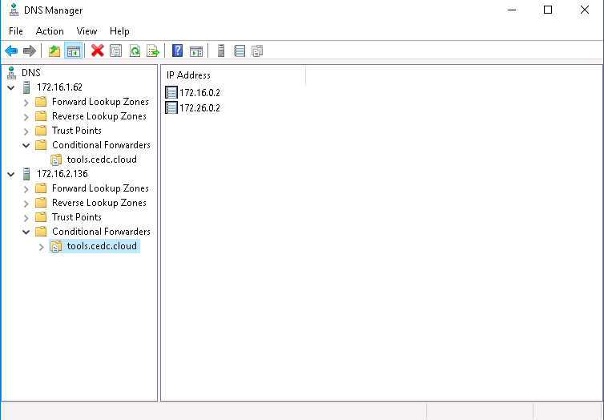

    
    
# Configuring the AWS Management Console and AD

## Enable the Active Directory to use the AWS Management Console

1. From the AWS Dashboard, search "Directory Service"

2. Select the ID of your directory from the Directory Services Dashboard.

3. Scroll down to the "AWS Management Console" section, select the "Enable" button on the right-hand side.


## Creating IAM Groups for AWS Management Console users

You will need to identify  Privileges for your user for this section. Eg of AWS polices:
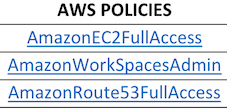

1. From the AWS Management Console, select "IAM"

2. Select "Groups" from the left-hand side menu
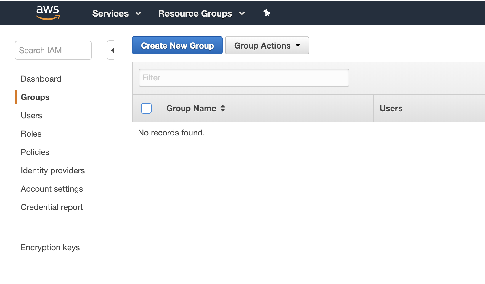

3. Click "Create New Group"

4. Enter a group name.

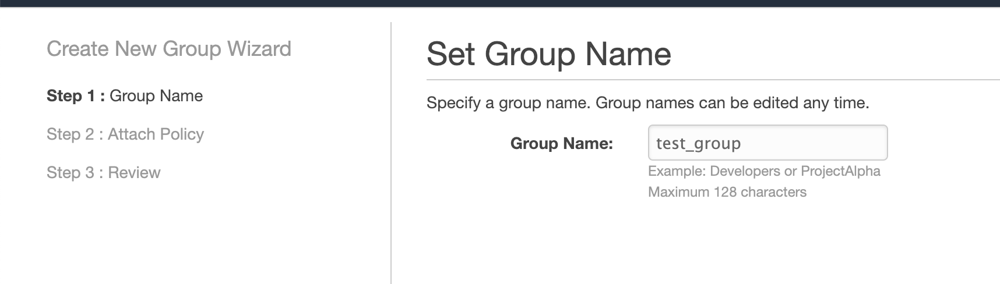

5. Attach appropriate policies for this group.

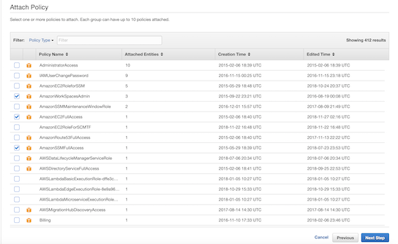

6. Click "Next Step"

7. Review the information and click "Create Group" when complete.

## Creating IAM Roles for AWS Management Console users

1. Select "Roles" from the left-hand side menu

2. Click "Create Role"

3. Select "Directory Service" under "Choose the service that will use this role" - click Next
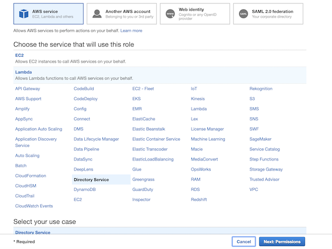

4. Select the policies associated with the role you are creating. Click next.
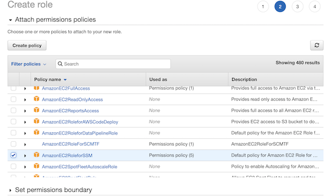

5. OPTIONAL: Add tags. CLick Next: Review
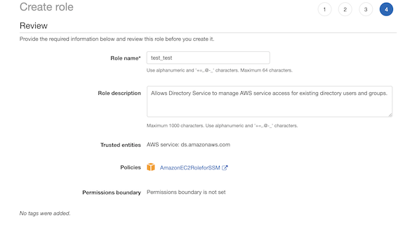

6. Review your settings and select "Create Role"

## Setting up Directory to allow LDAP users to access project specific AWS console

1. From the services menu at the top of the page search for and select Directory Service

2. Click on your directory

3. At the bottom of the page find the section labeled "AWS Management Console"

4. Click enable on the right side if it is not already enabled


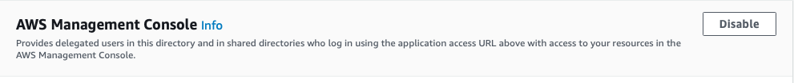

5. The IAM Roles you made should now be showing and clickable

6. Click on one of the roles

7. In the section labeled "Manage users and groups for this role" click "Add"


8. Make sure the "Find by group" radio button is selected

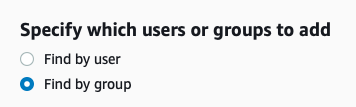

9. In the search field start typing in your groups which you made in the AD. As you type all the groups in the AD that match your search will start to appear

10. Select the group/groups you wish to add to the IAM role and click "Add" at the bottom

11. Your group should now be added to the role and users of that group should now be able to log into the AWS console using their LDAP credentials and your project URL.

# Key Occurrences

### Ensure your Active Directory and Active Directory Manager server are associated

1. From the AWS Management Console, search for "WorkSpaces"

2. From the left-hand side menu, select "Directories"

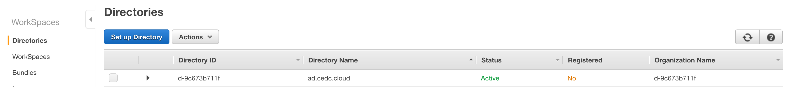


3. Select the directory you wish to register, then click "Actions" then "Register"

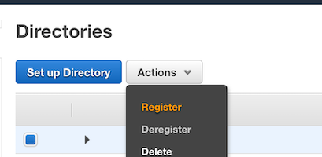


Ensure your Active Directory and Active Directory Manager server are associated
>>>>>>> 5ba5179e640ce9753876aac62aadab19ec7e5e0e

1. From the AWS Management Console, search "SSM" - select "Systems Manager"

2. On the left-hand side menu, select "State Manager"

3. You should see a list of Associations, for any associations that display "Failed", select the radio button or that association and click the "Apply association now" button.

4. This may take a few minutes to associate your AD and AD Manager servers.

We should be logging in originally as admin as shown in this section
Checking access to the AD using the admin account rather than as windows
administrator account


<h1>Pathways</h1>

|         |  |  |
| :-------------: |:--:|:-------------:|
||[Before you begin](before-you-begin.md) | |
||[Conventions Guide](conventions-guide.md) | |
||[Quick Reference](quick-reference.md) | |
||[AWS Overview](aws-overview.md) | |
| **Manual** |  | **Auto** |
|**&#8595;**| |**&#8595;**
| [AWS Manual Setup](aws-manual-infrastructure.md) | | [AWS Automatic Setup](aws-automatic-infrastructure.md)
| [Create a WorkSpace (AD setup)](create-a-workspace.md) | | [Create a WorkSpace (AD setup)](create-a-workspace.md) 
|***Setup Single Sign on*** | | ***Setup Single Sign On*** <br> ***- Import Users*** <br>  ***- Configuring the AWS Management Console and AD***
| [Tools Manual Installation](tools-manual-installation.md)   | | [Tools Automatic Install](tools-automatic-installation.md)
| [Create a WorkSpace (Additional workspaces)](create-a-workspace.md##create-additional-workspaces)  | | [Create a WorkSpace (Additional workspaces)](create-a-workspace.md##create-additional-workspaces)
||**&#8595;**
||[Additional AWS Setup](additional-aws-setup.md) | |
||[First time setup of tools](first-time-tools-setup.md)
||[First time setup of workspaces](first-time-workspaces-setup.md)


[<< Creating your first WorkSpace](create-a-workspace.md)

[Automatic Installation of Tools >>](tools-automatic-installation.md)

[Manual Installation of Tools >>](tools-manual-installation.md)
